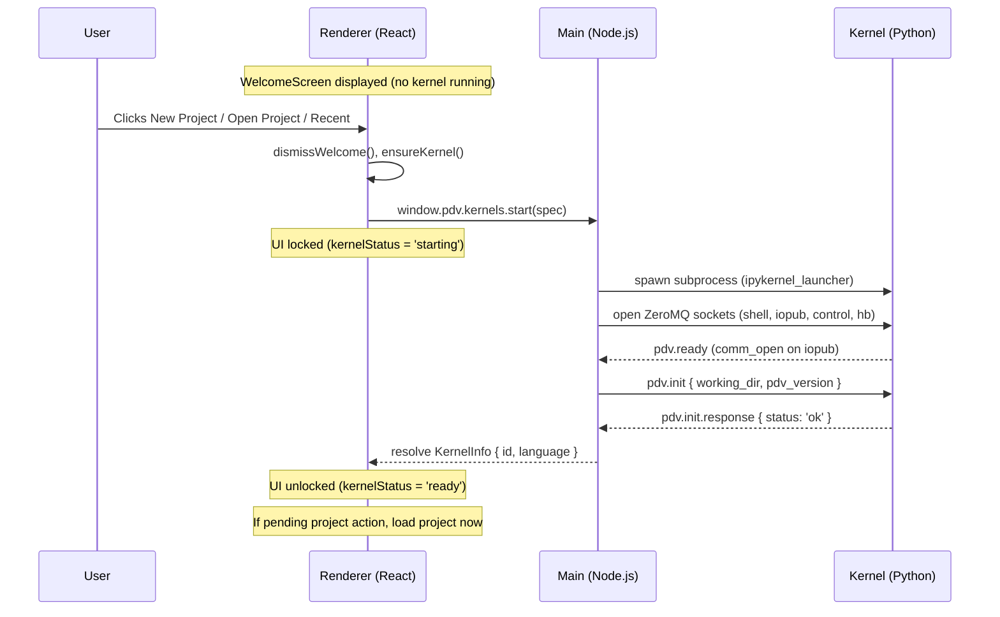
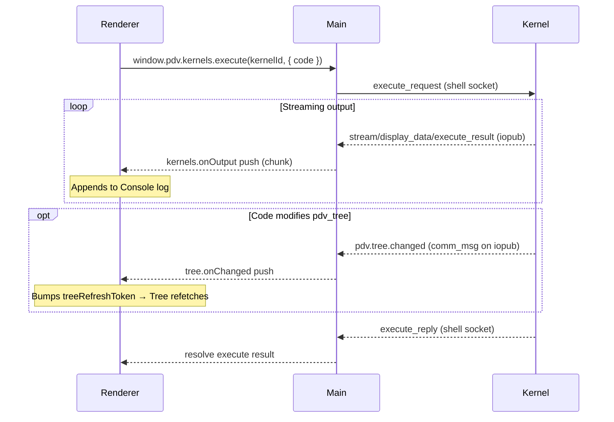
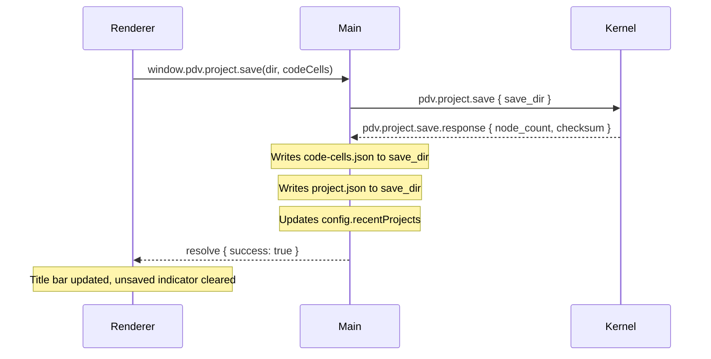
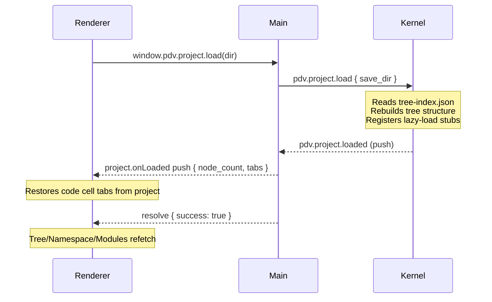

# PDV Architecture Document
**Version**: 0.0.11
**Date**: 2026-04-07
**Status**: Authoritative design specification. All new code must conform to this document. Deviations require updating this document first.

> **New to PDV?** Start with [QUICK_START.md](QUICK_START.md) for setup instructions and a guided tour. This document is the comprehensive reference.

---

## Table of Contents

1. [Project Overview](#1-project-overview)
2. [Process Model](#2-process-model)
3. [The PDV Communication Protocol](#3-the-pdv-communication-protocol)
4. [Kernel Startup and Lifecycle](#4-kernel-startup-and-lifecycle)
5. [The pdv-python Package](#5-the-pdv-python-package)
6. [The Working Directory and Project Save Directory](#6-the-working-directory-and-project-save-directory)
7. [The Tree: Data Model and Authority](#7-the-tree-data-model-and-authority)
8. [Project Save and Load](#8-project-save-and-load)
9. [User Code Execution and the Console](#9-user-code-execution-and-the-console)
10. [Environment Detection and Package Installation](#10-environment-detection-and-package-installation)
11. [Electron Architecture: Main, Preload, Renderer](#11-electron-architecture-main-preload-renderer)
12. [File and Module Structure](#12-file-and-module-structure)
13. [TypeScript Documentation Standard](#13-typescript-documentation-standard)
14. [Testing Strategy](#14-testing-strategy)
15. [What is Explicitly Out of Scope (Alpha)](#15-what-is-explicitly-out-of-scope-alpha)

---

## 1. Project Overview

PDV is an Electron desktop application for computational and experimental physics analysis. It combines:

- A **command workflow** (tabbed code editor + execution console)
- A **persistent project data model** (the Tree — a live, hierarchical data object in a language kernel)
- **Scripted, reusable analysis workflows** (scripts stored as tree nodes)
- **Markdown notes** (first-class tree nodes with KaTeX math preview, edited in a dedicated Write tab)
- **Multi-language backend support** (Python first; Julia deferred to beta)

The defining characteristic that separates PDV from a Jupyter notebook is the **Tree**: a persistent, navigable, typed data hierarchy that lives in the kernel namespace and is the single authority on all project data. Users explore it via a graphical tree panel, store analysis results in it, attach scripts to it, and save/load it as part of a project.

---

## 2. Process Model

PDV uses the standard Electron three-process architecture:

```
┌─────────────────────────────────────────────────────┐
│                   Electron App                      │
│                                                     │
│  ┌──────────────┐        ┌────────────────────────┐ │
│  │ Main Process │◄──IPC─►│ Renderer Process       │ │
│  │ (Node.js)    │        │ (React / TypeScript)   │ │
│  │              │        │                        │ │
│  │ - Kernel mgmt│        │ - Tree panel           │ │
│  │ - IPC handlers        │ - Code Cell            │ │
│  │ - Filesystem │        │ - Console              │ │
│  │ - Config     │        │ - Namespace panel      │ │
│  │ - Comm router│        │ - Settings / dialogs   │ │
│  └──────┬───────┘        └────────────────────────┘ │
│         │ ZeroMQ                                    │
│         ▼                                           │
│  ┌──────────────┐                                   │
│  │ Kernel       │                                   │
│  │ (subprocess) │                                   │
│  │              │                                   │
│  │ ipykernel +  │                                   │
│  │ pdv-python   │                                   │
│  └──────────────┘                                   │
└─────────────────────────────────────────────────────┘
```

### 2.1 Main Process Responsibilities
- Spawn and manage kernel subprocess(es) via ZeroMQ (Jupyter Messaging Protocol)
- Route PDV comm messages between kernel and renderer
- Create and manage the working directory
- Coordinate project save and load
- Own app configuration and theme persistence
- Enforce all filesystem security (path traversal checks, sandboxing)

### 2.2 Renderer Process Responsibilities
- Display and interact with the Tree panel
- Display and interact with the Code Cell (Monaco editor tabs)
- Display and interact with the Write tab (markdown note editor with KaTeX math preview)
- Display the Console (chronological execution output log)
- Display the Namespace panel
- All UI state (expansion, selection, scroll position) lives here and is ephemeral unless saved as part of a project

### 2.3 Kernel Process Responsibilities
- Maintain the `pdv_tree` object as the sole authority on all project data
- Handle PDV comm messages and emit push notifications
- Execute user code
- Manage lazy loading of tree node data from the save directory

### 2.4 What the Main Process Does NOT Do
- The main process does not construct arbitrary Python or Julia business logic and send it via `execute_request`. All structured data exchange between the main process and the kernel happens via the PDV comm protocol (see Section 3). There are two well-defined exceptions: (1) the **bootstrap snippet** in `kernel-session.ts` that initializes `pdv_kernel` at startup (a one-time init, not business logic), and (2) the **script invocation string** built by the `script:run` IPC handler, which constructs a minimal `pdv_tree["path"].run(kwargs)` call so that script output flows through the standard Jupyter iopub stream and appears in the console.
- The main process does not scan the filesystem to build the tree. The kernel is the sole tree authority.

---

## 3. The PDV Communication Protocol

### 3.1 Transport

PDV uses two complementary ZeroMQ channels:

1. **Jupyter comm channel** — The standard Jupyter comm mechanism over the existing `iopub` and `shell` sockets. A comm with target name `pdv.kernel` is opened by the kernel at startup. The main process listens for `comm_open`, `comm_msg`, and `comm_close` messages on `iopub`, and sends requests on `shell`. All write operations (script execution, project save/load, tree mutations) go through this channel.

2. **Query channel** — A dedicated ZeroMQ REQ/REP socket for read-only tree and namespace queries. The main process allocates a `query_port` alongside the standard Jupyter ports and passes it to the kernel in the `pdv.init` payload. The kernel starts a daemon thread (`QueryServer`) that serves requests on this port. Because the query thread runs independently of the main execution thread, tree browsing and namespace inspection work even while user code is executing. The query channel uses raw JSON (not the Jupyter wire protocol) and does not require HMAC signing. Only these message types are accepted on the query channel: `pdv.tree.list`, `pdv.tree.get`, `pdv.tree.resolve_file`, `pdv.namespace.query`, `pdv.namespace.inspect`.

The main process's `QueryRouter` tries the query channel first; if it fails (e.g. during startup before the query server is ready), it falls back to the comm channel transparently.

### 3.2 Message Envelope

Every PDV message — whether sent by the app or by the kernel — has the following JSON structure:

```json
{
  "pdv_version": "0.0.11",
  "msg_id": "<uuid-v4>",
  "in_reply_to": "<uuid-v4-or-null>",
  "type": "<message-type-string>",
  "status": "ok | error",
  "payload": { }
}
```

| Field | Type | Description |
|---|---|---|
| `pdv_version` | string | App/package version (e.g. `"0.0.11"`). Both the Electron app and `pdv-python` use their installed version as this value. The app rejects messages with an incompatible major version. |
| `msg_id` | string | UUID v4. Unique identifier for this message. |
| `in_reply_to` | string \| null | The `msg_id` of the request this is responding to. `null` for unsolicited push messages. |
| `type` | string | Dot-namespaced message type (see Section 3.4). |
| `status` | string | `"ok"` or `"error"`. Always present on responses; omitted on requests. |
| `payload` | object | Message-specific data. On error responses, always contains `{ "code": string, "message": string }`. |

### 3.3 Request/Response Correlation

The app maintains an internal registry of pending requests, keyed by `msg_id`. When a response arrives with a matching `in_reply_to`, the pending promise is resolved or rejected. Requests that receive no response within a configurable timeout (default: 30 seconds) are rejected with a timeout error and the pending entry is removed.

Multiple requests may be in-flight simultaneously. The protocol does not guarantee response ordering.

### 3.4 Message Type Catalogue

All type strings are namespaced with `pdv.`. The convention is `pdv.<domain>.<action>` for requests and `pdv.<domain>.<action>.response` for responses. Push notifications (kernel → app, no prior request) use `pdv.<domain>.<event>`.

#### Lifecycle Messages

| Type | Direction | Description |
|---|---|---|
| `pdv.ready` | kernel → app | Sent once when the `pdv-python` package has fully initialized and the comm channel is open. No `in_reply_to`. |
| `pdv.init` | app → kernel | Sent by the app immediately after receiving `pdv.ready`. Contains the working directory path, protocol version, and `query_port` (TCP port for the read-only query socket). The kernel starts the QueryServer daemon thread on this port. |
| `pdv.init.response` | kernel → app | Confirms working directory was accepted and the kernel is fully operational. |

#### Project Messages

| Type | Direction | Description |
|---|---|---|
| `pdv.project.load` | app → kernel | Instructs the kernel to load a project from a save directory. |
| `pdv.project.loaded` | kernel → app | Sent after the tree is fully populated from a project load. No `in_reply_to` (push notification). |
| `pdv.project.save` | app → kernel | Instructs the kernel to serialize the tree to the save directory. |
| `pdv.project.save.response` | kernel → app | Confirms save completed. Payload: `{ node_count, checksum, module_owned_files, module_manifests }`. `module_owned_files` lists every file-backed node that belongs to a `PDVModule` (see §5.9) so the main process can mirror working-dir edits into `<saveDir>/modules/<id>/<source_rel_path>`. `module_manifests` carries per-module metadata + module-root-relative node descriptors for writing `pdv-module.json` and `module-index.json` under each module dir. Both fields are empty arrays when the tree contains no `PDVModule` nodes. |

#### Tree Messages

| Type | Direction | Description |
|---|---|---|
| `pdv.tree.list` | app → kernel | Request tree nodes at a given path. |
| `pdv.tree.list.response` | kernel → app | Returns array of node metadata objects. |
| `pdv.tree.get` | app → kernel | Request data value for a specific node. |
| `pdv.tree.get.response` | kernel → app | Returns node value (may be lazy-loaded from save directory). |
| `pdv.tree.resolve_file` | app → kernel | Resolve a file-backed tree node (PDVFile subclass) to its absolute filesystem path. Payload: `{ path }`. |
| `pdv.tree.resolve_file.response` | kernel → app | Returns `{ path, file_path }` where `file_path` is the absolute path on disk. |
| `pdv.tree.changed` | kernel → app | Push notification. Sent when tree structure changes. Payload: `{ changed_paths: string[], change_type: "added" \| "removed" \| "updated" \| "batch" }`. Notifications are **debounced** (100ms): rapid mutations are batched into a single notification with `change_type: "batch"` and all affected paths. No `in_reply_to`. |

#### Namespace Messages

| Type | Direction | Description |
|---|---|---|
| `pdv.namespace.query` | app → kernel | Request a snapshot of the kernel namespace (excluding internal PDV names). |
| `pdv.namespace.query.response` | kernel → app | Returns array of variable descriptors. |
| `pdv.namespace.inspect` | app → kernel | Lazily inspect one namespace value. Payload: `{ root_name, path }` where `path` is an array of selector segments. |
| `pdv.namespace.inspect.response` | kernel → app | Returns one level of child descriptors for the requested namespace value, plus truncation metadata. |

#### Script Messages

| Type | Direction | Description |
|---|---|---|
| `pdv.script.register` | app → kernel | Register a newly created script file as a node in the tree. Payload: `{ parent_path, name, relative_path, language?, module_id?, source_rel_path? }`. `source_rel_path` is set when the script lives inside a known module alias (workflow A/B, §5.13). |
| `pdv.script.register.response` | kernel → app | Confirms registration. |
| `pdv.script.params` | app → kernel | Extract `run()` function parameters from a script file. Payload: `{ tree_path }`. |
| `pdv.script.params.response` | kernel → app | Returns `ScriptParameter[]` array built from the script's `run()` signature. |

#### Note Messages

| Type | Direction | Description |
|---|---|---|
| `pdv.note.register` | app → kernel | Register a newly created markdown note file as a node in the tree. Payload: `{ parent_path, name, relative_path }`. |
| `pdv.note.register.response` | kernel → app | Confirms registration. |

#### Module Registration Messages

| Type | Direction | Description |
|---|---|---|
| `pdv.module.register` | app → kernel | Register a `PDVModule` node at a tree path. Payload: `{ path, module_id, name, version, dependencies?, module_index? }`. v4-only: if `module_index` is absent the kernel rejects the request. Child nodes (scripts, GUIs, namelists, libs) are mounted from the index using the same two-pass logic as project load, with each file-backed entry carrying its module-root-relative `source_rel_path` (see §5.13). |
| `pdv.module.register.response` | kernel → app | Confirms module registration. |
| `pdv.module.create_empty` | app → kernel | Create a brand-new empty `PDVModule` with seeded `scripts` / `lib` / `plots` subtrees. Payload: `{ id, name, version, description?, language? }`. Used by workflow B (authoring a new module from scratch inside the app) — see the §5.9 and #140 workflow plan. |
| `pdv.module.create_empty.response` | kernel → app | Confirms creation. Payload: `{ path }`. |
| `pdv.module.update` | app → kernel | Patch mutable metadata on an existing `PDVModule`. Payload: `{ alias, name?, version?, description? }`. Omitted fields are left unchanged. `module_id` and `language` are immutable. |
| `pdv.module.update.response` | kernel → app | Echoes the post-update metadata. |
| `pdv.module.reload_libs` | app → kernel | Fired as a preflight before `script:run` on a module-owned script. Payload: `{ alias }`. Walks `sys.modules` and `importlib.reload()`s every module whose `__file__` sits under `<workdir>/<alias>/lib/` so edits to module libs take effect on the next run without restarting the kernel. Short-circuits when `alias` is not a `PDVModule`. |
| `pdv.module.reload_libs.response` | kernel → app | Returns `{ reloaded: string[], errors: { [name]: string } }`. Per-module reload failures are captured rather than thrown so a broken lib surfaces at script-run time with a proper traceback. |
| `pdv.gui.register` | app → kernel | Register a `PDVGui` node at a tree path. Payload: `{ parent_path, name, relative_path, module_id?, source_rel_path? }`. |
| `pdv.gui.register.response` | kernel → app | Confirms GUI registration. |
| `pdv.modules.setup` | app → kernel | Add lib file parent directories to `sys.path` and import entry points. Payload: `{ modules: [{ lib_paths: string[], lib_dir?: string, entry_point?: string }] }`. Sent after module import and on kernel start/restart. |
| `pdv.modules.setup.response` | kernel → app | Confirms module setup with handler registry. |
| `pdv.handler.invoke` | app → kernel | Dispatch a registered handler for a tree node. Payload: `{ path }`. |
| `pdv.handler.invoke.response` | kernel → app | Returns handler dispatch result. |

#### Namelist Messages

| Type | Direction | Description |
|---|---|---|
| `pdv.namelist.read` | app → kernel | Parse a `PDVNamelist` backing file. Payload: `{ tree_path }`. Returns groups, hints, types, format. |
| `pdv.namelist.read.response` | kernel → app | Parsed namelist data. |
| `pdv.namelist.write` | app → kernel | Write structured data back to a `PDVNamelist` backing file. Payload: `{ tree_path, data }`. |
| `pdv.namelist.write.response` | kernel → app | Confirms write success. |
| `pdv.file.register` | app → kernel | Register a file-backed tree node (`PDVNamelist`, `PDVLib`, or `PDVFile`). Payload: `{ tree_path, filename, node_type, name?, module_id?, source_rel_path? }`. When `node_type` is `"lib"`, creates a `PDVLib` node. `source_rel_path` is set by the module bind path and by `tree:createLib` / `tree:createScript` / `tree:createGui` when the target lives inside a known module alias; see §5.13. |
| `pdv.file.register.response` | kernel → app | Confirms file registration with resulting path. |

#### Progress Messages

| Type | Direction | Description |
|---|---|---|
| `pdv.progress` | kernel → app | Push notification sent during long-running save/load operations. Payload: `{ operation, phase, current, total }`. Also resets the comm-router timeout clock to prevent timeout during lengthy operations. |

### 3.5 Error Payload

When `status` is `"error"`, the payload always has this shape:

```json
{
  "code": "tree.path_not_found",
  "message": "No node exists at path: data.waveforms.xyz"
}
```

`code` is a machine-readable dot-namespaced string. `message` is a human-readable string suitable for display in the UI. The app must never display raw `code` to the user.

### 3.6 Version Compatibility

When the app receives a `pdv.ready` message with a `pdv_version` that differs in major version from the app's own version, the app must:
1. Display a clear error dialog: "The PDV kernel package installed in your environment is incompatible with this version of PDV. Please update `pdv-python`."
2. Not unlock the UI.
3. Not send `pdv.init`.

Minor version differences are tolerated with a logged warning.

---

## 4. Kernel Startup and Lifecycle

### 4.1 Startup Sequence

The kernel is **not** started when the app launches. On startup, the renderer loads configuration and displays the WelcomeScreen. The kernel is started only when the user picks an action (New Project, Open Project, or a recent project).

```
User selects action on WelcomeScreen
    │
    ├─► Environment detection (see Section 10)
    │       Is pdv-python installed in the selected environment?
    │       No → prompt user (EnvironmentSelector) → install → retry
    │
    ├─► App creates working directory (see Section 6.1)
    │
    ├─► App spawns kernel subprocess
    │       argv: [python, -m, ipykernel_launcher, -f, <connection-file>]
    │       env:  standard env (no PDV env vars — config comes via pdv.init)
    │
    ├─► App opens ZeroMQ sockets (shell, iopub, control, hb, query)
    │
    ├─► App waits for pdv.ready comm (timeout: 15 seconds)
    │       Timeout → display error: "Kernel did not start. Is pdv-python installed?"
    │
    ├─► App sends pdv.init comm:
    │       payload: { working_dir: "/tmp/pdv-<uuid>", pdv_version: "<app-version>",
    │                  query_port: <allocated-port> }
    │       The kernel starts the QueryServer daemon thread on the given port.
    │
    ├─► App waits for pdv.init.response (timeout: 30 seconds, the comm default)
    │       status: error → display error with message
    │
    ├─► App attaches QueryRouter to kernel's query socket
    │
    └─► Kernel is ready. UI unlocks.
            If a project was selected, it is loaded now.
            Code Cell: active
            Tree panel: empty (or populated from loaded project)
            Namespace panel: active
```

### 4.2 Project Load Sequence (separate from startup)

Triggered when the user opens a saved project (File → Open Project, or recent projects list).

```
User selects a save directory
    │
    ├─► App sends pdv.project.load comm:
    │       payload: { save_dir: "/path/to/project" }
    │
    ├─► Kernel:
    │       1. Reads project.json manifest
    │       2. Reads tree-index.json, rebuilds full tree structure in memory
    │          (node metadata only — data files are NOT loaded yet)
    │       3. Registers lazy-load stubs for all file-backed nodes
    │       4. Sends pdv.project.loaded push notification
    │
    ├─► App receives pdv.project.loaded:
    │       payload: { node_count: N }
    │
    └─► App loads code-cells.json from save directory
            Populates Code Cell tabs with saved code
            Console: empty (output history is ephemeral)
            Tree panel: refreshes via pdv.tree.list
```

### 4.3 Kernel Shutdown

On app quit (`before-quit` event):
1. App sends interrupt signal to kernel (control socket)
2. App sends `kernel_shutdown_request` on control socket
3. App waits up to 3 seconds for clean exit
4. App force-kills the subprocess if it has not exited
5. App deletes working directory

On kernel crash (process exits unexpectedly):
1. App detects subprocess exit
2. App displays error: "The kernel has crashed. Your work in the tree has been lost."
3. Working directory is deleted
4. App offers to restart the kernel (new session, empty tree)

### 4.4 Renderer Startup Behavior

On launch, the renderer loads configuration and displays the WelcomeScreen overlay. No kernel is started at this point — the WelcomeScreen buttons are immediately interactive.

When the user picks an action (New Project, Open Project, or a recent project), the renderer dismisses the WelcomeScreen and starts the kernel. If the user chose to open a project, the project path is stored in a pending-action ref and executed automatically once the kernel becomes ready.

The renderer is never aware of the low-level `pdv.ready → pdv.init → pdv.init.response` handshake. That exchange is entirely encapsulated inside the main process's `kernels.start()` IPC handler: the handler spawns the subprocess, runs the full handshake sequence, and only resolves its promise once `pdv.init.response` has been received with `status: 'ok'`.

From the renderer's perspective, kernel startup is simply:

```tsx
// Renderer (app/index.tsx) — triggered by WelcomeScreen action, not on mount
setKernelStatus('starting'); // locks UI — code cell, tree, namespace all disabled
const info = await window.pdv.kernels.start(spec);
setCurrentKernelId(info.id);
setKernelStatus('ready');   // unlocks UI
// If a pending project action exists, it executes now
```

The renderer shows a loading / disabled state for all panels while `start()` is pending. On rejection (timeout or init error), the renderer displays the error string from the rejected promise.

There is no separate push notification for "kernel ready" that the renderer must subscribe to. The resolved `KernelInfo` value IS the ready signal.

### 4.5 Sequence Diagrams

#### Kernel Startup



#### Code Execution



#### Project Save



#### Project Load



---

## 5. The pdv-python Package

### 5.1 Purpose

`pdv-python` is a Python package (installable via `pip install pdv-python`) that implements the kernel side of the PDV comm protocol, the `PDVTree`, `PDVScript`, `PDVModule`, `PDVGui`, and `PDVNamelist` data structures, the protected kernel namespace, and lazy data loading. It replaces the monolithic `python-init.py` file.

### 5.2 Package Structure

```
pdv_kernel/
    __init__.py          # Public API: bootstrap(), PDVTree, PDVScript, PDVFile, PDVNote, PDVGui, PDVNamelist, PDVModule, PDVLib, PDVError, handle(), log, __version__
    comms.py             # Comm channel: register target, send/receive, dispatch, thread-local response sink
    tree.py              # PDVTree (debounced _emit_changed), PDVScript, PDVFile, PDVNote, PDVModule, PDVGui, PDVNamelist, PDVLib
    query_server.py      # QueryServer: ZMQ REP daemon thread for read-only queries during execution
    namespace.py         # PDVNamespace (protected dict), PDVApp, pdv_namespace()
    serialization.py     # Type detection, format writers (npy, parquet, json, module, gui, namelist, lib)
    environment.py       # Path utilities, working dir management, project root logic
    errors.py            # PDVError, PDVPathError, PDVKeyError, PDVProtectedNameError, PDVSerializationError, PDVScriptError, PDVVersionError
    modules.py           # Custom type handler registry and dispatch (@pdv.handle() decorator)
    namelist_utils.py    # Fortran namelist and TOML parsing utilities
    checksum.py          # Content-based XXH3-128 Merkle-tree checksum for PDVTree (tree_checksum())
    tree_loader.py       # Shared two-pass tree-index loader used by project.load and module.register handlers
    handlers/
        __init__.py
        _helpers.py      # Shared register-validation, namelist resolution, and gui-attach helpers
        lifecycle.py     # pdv.init, pdv.ready handlers
        project.py       # pdv.project.load, pdv.project.save handlers
        tree.py          # pdv.tree.list, pdv.tree.get, pdv.tree.resolve_file handlers
        namespace.py     # pdv.namespace.query handler
        script.py        # pdv.script.register handler
        note.py          # pdv.note.register handler
        modules.py       # pdv.module.register, pdv.modules.setup, pdv.handler.invoke handlers
        gui.py           # pdv.gui.register handler
        namelist.py      # pdv.namelist.read, pdv.namelist.write, pdv.file.register handlers
```

### 5.3 Bootstrap

`pdv_kernel.bootstrap()` is called by a bootstrap snippet that the main process sends via `execute_request` (silent mode) from `kernel-session.ts` immediately after the kernel subprocess starts. It:
1. Registers the `pdv.kernel` comm target with IPython
2. Injects `pdv_tree` and `pdv` into the IPython user namespace via a custom namespace class that blocks reassignment
3. Sends the `pdv.ready` comm message

`bootstrap()` must be idempotent — calling it twice must not open a second comm or re-inject variables.

### 5.4 Protected Namespace

The IPython user namespace is replaced with a subclass of `dict` that overrides `__setitem__`:

```python
class PDVNamespace(dict):
    _PROTECTED = frozenset({'pdv_tree', 'pdv'})

    def __setitem__(self, key, value):
        if key in self._PROTECTED:
            raise PDVError(
                f"'{key}' is a protected PDV object and cannot be reassigned. "
                f"Use pdv_tree['key'] = value to store data in the tree."
            )
        super().__setitem__(key, value)
```

This is set via `IPython.get_ipython().user_ns = PDVNamespace(...)` during bootstrap.

### 5.5 User-Facing Names in the Kernel Namespace

After bootstrap, exactly two names are injected into the user namespace:

| Name | Type | Description |
|---|---|---|
| `pdv_tree` | `PDVTree` instance | The live project data tree. The sole data authority. |
| `pdv` | `PDVApp` instance | App-control object. Exposes `pdv.save()`, `pdv.help()`, etc. |

All other `pdv_*` names in the namespace are an error. Internal implementation functions must be unreachable from the user namespace.

### 5.6 PDVTree Class

`PDVTree` is a `dict` subclass with the following additions:

- **`__getitem__(key)`**: If key is not in the in-memory dict, consults the lazy-load registry. If the key exists in the registry (i.e., it was populated from a save directory), fetches the data file from the save directory into the working directory and loads it into memory. Then returns the value. If neither in-memory nor in the registry, raises `KeyError`.
- **`__setitem__(key, value)`**: Sets the value in the in-memory dict. Emits `pdv.tree.changed` push notification.
- **`__delitem__(key)`**: Removes from in-memory dict and from the lazy-load registry. Emits `pdv.tree.changed`.
- **`set_quiet(key, value)`**: Same dot-path traversal as `__setitem__` (creating intermediate `PDVTree` containers as needed) but bypasses the change notification. Used by bulk loaders (`pdv.project.load`, `pdv.module.register`) to populate the tree without flooding the comm channel — callers typically emit a single `pdv.project.loaded` push when bulk load completes.
- **Path notation**: Both `pdv_tree['key']` and `pdv_tree['parent.child.grandchild']` are supported as a convenience. Dot-separated paths are resolved recursively.
- **`run_script(path, **kwargs)`**: Loads and executes the script at `path`, passing `pdv_tree` and `**kwargs` to its `run()` function.

`PDVTree` does **not** handle serialization or filesystem layout directly. Those concerns live in `serialization.py` and `environment.py`.

### 5.7 PDVScript Class

A lightweight wrapper stored as a tree node value. Attributes:
- `relative_path`: path of the script file relative to the project root
- `language`: `'python'` (Julia deferred)
- `doc`: first line of the script's module docstring (for preview display)

Note: `params` (the `ScriptParameter` array) is **not** stored as a class attribute. It is computed on-demand by `_extract_script_params()` at registration time and via the `pdv.script.params` comm handler, and included in `pdv.tree.list` responses. See below for the descriptor shape.

`PDVScript.run(tree, **kwargs)` loads the module fresh (no import cache), calls `module.run(tree, **kwargs)`, and returns the result dict.

#### Script File Format

Every PDV script is a plain Python file with a module-level docstring and a single `run()` function:

```python
"""
fit_model.py
created by user on host at 14:32
Description: Fit a Gaussian to the waveform data.
"""
def run(pdv_tree: dict, amplitude: float = 1.0, sigma: float = 0.1) -> dict:
    # pdv_tree is injected by PDVScript.run() — never supplied by the caller
    data = pdv_tree["waveforms.ch1"]
    # ... analysis ...
    return {"fit_amplitude": amplitude}
```

Rules:
- The function **must** be named `run`.
- The **first parameter must be `pdv_tree`** (type hint `dict` is recommended so the language server does not flag tree references as errors). This argument is always injected by `PDVScript.run()` and is never supplied by the user.
- All remaining parameters become the user-facing script parameters surfaced in the `ScriptDialog`. They may have default values and type hints.
- The return value must be a `dict` (or `None`). Non-dict returns are ignored.

#### ScriptParameter Descriptor

When a `PDVScript` is constructed (at registration time), `pdv_kernel` inspects the `run()` function's signature via `inspect.signature` and extracts all parameters except `pdv_tree`. Each becomes a `ScriptParameter` descriptor stored on the `PDVScript` and included in the `NodeDescriptor` returned by `pdv.tree.list.response`:

```json
{
  "name": "amplitude",
  "type": "float",
  "default": 1.0,
  "required": false
}
```

A parameter is `required` if it has no default value. `type` is the string representation of the annotation (e.g. `"float"`, `"int"`, `"str"`), or `"any"` if unannotated. If the script file cannot be parsed (syntax error, `run()` missing), registration still succeeds but `params` is an empty list.

`PDVScript.run(tree, **kwargs)` loads the module fresh (no cache), calls `module.run(tree, **kwargs)`, and returns the result.

### 5.8 PDVFile and PDVNote Classes

`PDVFile` is a base class for tree nodes backed by on-disk files that are not data or scripts. `PDVNote` is its subclass for markdown notes.

**PDVNote** attributes:
- `relative_path`: path of the `.md` file relative to the working directory
- `title`: optional display title
- `preview()`: returns the title, or the first non-empty line of the file, or `"Markdown note"` as fallback

Notes are created via `pdv.note.register` (app → kernel) which creates a `PDVNote` instance and attaches it to the tree. The `.md` file itself lives in `<workingDir>/tree/<path>/` and is read/written directly by the main process via `note:read` / `note:save` IPC channels — no kernel round-trip is needed for content editing. On project save, the kernel serializes the note entry to `tree-index.json` and the main process copies the `.md` file into the save directory. On project load, the `.md` file is copied back from the save directory to the working directory and re-registered as a `PDVNote` in the tree.

### 5.9 PDVModule Class

`PDVModule` is a subclass of `PDVTree` (i.e. a dict subclass). It represents a module in the tree — either imported from the global store or authored in-session via workflow B (#140). Because it inherits from `PDVTree`, it holds children naturally — a module's sub-nodes (GUI, scripts, libs, namelists, plots) are direct dict entries.

Attributes:
- `module_id` (read-only): unique identifier string (e.g. `"n_pendulum"`). Immutable identity — changing it would require rebinding the subtree.
- `name` (read-write): human-readable display name (e.g. `"N-Pendulum"`). Mutable via `pdv.module.update`.
- `version` (read-write): semantic version string (e.g. `"2.0.0"`). Mutable via `pdv.module.update`.
- `description` (read-write): longer human-readable description, or empty string. Persisted into `pdv-module.json` at save time.
- `language` (read-only): kernel language (`"python"` or `"julia"`). Also persisted into `pdv-module.json`.
- `gui` (read-write): optional reference to the child `PDVGui` node, or `None`.
- `dependencies` (read-only): list of dependency dicts (e.g. `[{"name": "numpy"}]`), or empty list.

`preview()` returns `"{name} v{version}"`.

Two creation paths:

- `pdv.module.register` — used by the module bind path after the main process copies an imported module's v4 `module-index.json` entries into the working directory. Receives `path`, `module_id`, `name`, `version`, optional `dependencies`, and optional `module_index` and inserts the `PDVModule` into the tree at the given path. If a `PDVModule` already exists at that path (e.g. from project load), the handler updates it in place to preserve existing children.
- `pdv.module.create_empty` — used by **workflow B** (authoring a new module from scratch inside the app). Takes `{ id, name, version, description?, language? }`, constructs a `PDVModule` at the top of the tree, and seeds it with three empty `PDVTree` children (`scripts`, `lib`, `plots`). Consumers then populate content via the existing `tree:createScript` / `tree:createLib` / `tree:createGui` handlers. The project-local module directory (`<saveDir>/modules/<id>/`) doesn't exist yet for in-session modules — it is created on first `project:save` via §5.13's save-time sync.

Projects track in-session modules via an `origin: "in_session"` field on the `ProjectModuleImport` manifest entry, distinct from the default `"imported"` origin. On project load, in-session modules are rebound via the same v4 bind path used for imported modules — the `<saveDir>/modules/<id>/` directory functions as the authoritative source.

### 5.10 PDVGui Class

`PDVGui` is a subclass of `PDVFile`. It represents a GUI definition file (`.gui.json`) that describes a module's user interface — inputs, actions, and layout.

Attributes:
- `relative_path` (inherited from `PDVFile`): path to the `.gui.json` file relative to the working directory
- `module_id` (read-only): the owning module's ID, or `None` for standalone project GUIs

`preview()` returns `"GUI"`.

Created by the `pdv.gui.register` handler. For module GUIs, the `.gui.json` file is copied from the installed module directory into the working directory at import time. If the parent node is a `PDVModule`, the handler also sets the module's `.gui` attribute to point to this node.

### 5.11 PDVNamelist Class

`PDVNamelist` is a subclass of `PDVFile`. It represents a simulation namelist file that can be parsed and edited through the namelist editor widget.

Attributes:
- `relative_path` (inherited from `PDVFile`): path to the namelist file relative to the working directory
- `format` (read-only): one of `"fortran"`, `"toml"`, or `"auto"` (auto-detected from file content)
- `module_id` (read-only): the owning module's ID, or `None` for standalone namelists

`preview()` returns `"Namelist ({format})"`.

The namelist file is parsed and written by dedicated comm handlers (`pdv.namelist.read`, `pdv.namelist.write`) that run in the kernel, keeping all format-specific logic in Python. The renderer requests parsed data and sends structured edits back; it never reads or writes the raw namelist file directly.

### 5.12 PDVLib Class

`PDVLib` is a subclass of `PDVFile`. It represents a Python library file provided by a module's `lib/` directory that is importable by scripts and entry points.

Attributes:
- `relative_path` (inherited from `PDVFile`): path to the `.py` file relative to the working directory
- `source_rel_path` (inherited from `PDVFile`): path relative to the owning module's root, e.g. `"lib/helpers.py"`. Set for module-owned libs; `None` for project-level libs. Used by §5.13's save-time sync.
- `module_id` (read-only): the owning module's ID, or `None`

`preview()` returns `"Library (<filename>)"`.

**Module lib/ convention**: Module developers place importable `.py` files in `<module-root>/lib/`. When a v4 module is imported into a project, the main process:
1. Reads `module-index.json` and copies each `local_file`-backed entry (including libs under `lib/`) into the working directory under `<alias>/<relative_path>`.
2. Sends `pdv.module.register` with the remapped `module_index` so the kernel reconstructs the subtree and creates `PDVLib` nodes via `load_tree_index`.
3. Sends `pdv.modules.setup` with `lib_dir: "<workdir>/<alias>/lib"`. The kernel adds that directory to `sys.path` so scripts can `import helpers` etc.

In-session modules (workflow B) follow the same convention: `tree:createLib` writes new `.py` files under `<workdir>/<alias>/lib/`, sets `source_rel_path = "lib/<filename>"`, and §7's `pdv-module.json` writer stamps `lib_dir: "lib"` so the next project load's `setupModuleNamespaces` injects the path automatically.

**Live lib reload**: Before every `script:run` on a module-owned script, the main process fires a `pdv.module.reload_libs` preflight (§3.4). The kernel walks `sys.modules`, finds modules whose `__file__` sits under `<workdir>/<alias>/lib/`, and `importlib.reload()`s them so edits take effect without restarting the kernel. Reload failures are captured per-module and never block the script run itself — broken libs surface at import time inside the user's own traceback. The handler uses `os.path.realpath` on both sides of the prefix comparison so macOS's `/var` → `/private/var` symlink doesn't defeat the path match.

On project load (deserialization), the `lib` node type is restored as a `PDVLib` and its `source_rel_path` is re-injected from the stored descriptor.

### 5.13 Module Storage and Resolution

PDV has three tiers of module storage:

1. **Project-local** (`<saveDir>/modules/<module-id>/`): Every module — imported or in-session — has an authoritative copy here. On import, the main process copies the installed module's content into this directory. For in-session modules (workflow B) the directory is created on first `project:save` by §7's manifest writer. This makes projects fully portable — zip a project folder and send it to someone who has never seen the module.
2. **Global store** (`~/.PDV/modules/packages/`): A catalog of installed modules. Modules can be installed from local directories, GitHub URLs, or **exported back from an active project** via `modules:exportFromProject` (workflow A/B §9). The global store determines what is available to import, but projects never read from it at runtime.
3. **Bundled examples** (`examples/modules/` in the app resources): Read-only example modules shipped with the application (e.g. N-Pendulum for Python and Julia). Surfaced in the module library with a "Bundled" badge, filtered by active kernel language. Cannot be uninstalled.

**v4-only**: As of the #140 module editing workflow pass, the legacy (v1/v2/v3) module bind paths are gone. Every module must ship a `module-index.json`; attempts to import non-v4 modules fail with a clear error and a prompt to reinstall from an updated source. Bundled example modules were updated to v4 before the legacy removal.

**Resolution order**: When the main process needs to resolve a module's on-disk directory, it checks project-local `modules/` first, then the global store, then bundled examples. The first match wins.

**`source_rel_path`**: Every module-owned `PDVFile` node (script, lib, gui, namelist) carries a `source_rel_path` attribute recording its location relative to the module root (e.g. `"scripts/run.py"`, `"lib/helpers.py"`). The field is:
- Set at bind time by the v4 `bindImportedModule` remap loop for imported modules.
- Set by `tree:createScript` / `tree:createLib` / `tree:createGui` when the target is inside a known module alias.
- Round-tripped through `tree-index.json` (for project-level save/load) and `module-index.json` (for module-level save/load and export).
- Consumed by §7's save-time sync (below) to know where each file belongs inside `<saveDir>/modules/<id>/`.

**Save-time sync** (ARCHITECTURE §8.1 step 4): After `_collect_nodes` writes each node's data files into `<saveDir>/tree/`, the kernel's `project:save` handler also emits a `module_owned_files` list. The main process iterates this list and `fs.copyFile`s each entry from the working-dir location to `<saveDir>/modules/<module_id>/<source_rel_path>`, overwriting whatever was there. This is how edits (whether made via the external editor on an imported module's scripts, or via `tree:create*` for authored content on an in-session module) end up mirrored into the project-local copy so they survive a save → reopen cycle. Deletion propagation is tracked under #182.

**Per-module manifest writer**: At the tail of `project:save`, the main process also writes `pdv-module.json` (v4 schema) and `module-index.json` into each `<saveDir>/modules/<id>/` directory, built from the `module_manifests` payload the kernel emits. The manifest carries `id`, `name`, `version`, `description`, `language`, and `lib_dir: "lib"`; the index carries module-root-relative node descriptors so a fresh `bindImportedModule` at project-load time can re-prefix them with the chosen alias. This is what makes in-session modules (workflow B) reloadable at all.

**Installation sources**: Modules can be installed from:
- **Local directory**: User selects a directory containing a `pdv-module.json` manifest.
- **GitHub URL**: User pastes a git-cloneable URL. The module is shallow-cloned (`git clone --depth 1`) into the global store.
- **Export from active project**: `modules:exportFromProject` copies `<activeProjectDir>/modules/<id>/` to `~/.PDV/modules/packages/<id>/`, prompting to overwrite when a global-store entry already exists. Used by workflow A (publish edits to an imported module) and workflow B (publish a newly-authored module). A TODO(#182) in the handler tracks the follow-up "commit and push to upstream GitHub" flow for modules with an `upstream` URL.

**`upstream` field**: An optional git-cloneable URL in `pdv-module.json`. Automatically set when installing from GitHub, or declared manually. Enables update checks via `git ls-remote --tags` (no clone needed) and one-click re-install from upstream.

**Uninstall**: Removes a module from the global store. Bundled modules cannot be uninstalled. Existing projects are unaffected since they carry their own local copies.

**Update**: Modules with an `upstream` URL can check for newer tags and re-install from upstream. Users must re-import into a project to pick up changes.

**Dependency pre-flight**: Before executing a module action, the main process reads the module's `dependencies` list from `pdv-module.json` and sends them to the kernel for validation. Missing dependencies are reported to the user before execution proceeds.

---

## 6. The Working Directory and Project Save Directory

### 6.1 Working Directory

The working directory is a temporary directory created by the Electron main process at kernel startup. It is the live filesystem backing for the current session.

**Creation**: The main process calls `fs.mkdtemp()` (or equivalent) to create a uniquely named directory in the OS temporary directory. The path is passed to the kernel in the `pdv.init` message.

**Structure**:
```
/tmp/pdv-<uuid>/
    tree/
        data/         ← data files written during the session (npy, parquet, etc.)
        scripts/      ← script .py files for the current session
        results/      ← result files produced by scripts
    .pdv-work/
        autosave/     ← reserved for future autosave feature
```

**Lifecycle**: Created at kernel startup. Deleted on clean shutdown. If the app crashes, the directory is left on disk but is not recovered (crash recovery is out of scope for alpha).

**Ownership**: The main process creates it. The kernel writes to it (data files). The main process deletes it.

### 6.2 Project Save Directory

A persistent, user-chosen directory that stores a complete saved snapshot of a PDV project.

**Created when**: The user explicitly performs File → Save Project (or Save As). Never created automatically.

**Structure** (human-readable, mirrors tree hierarchy):
```
my-project/
    project.json              ← project manifest (owned by Electron main process)
    tree-index.json           ← tree node registry (owned by kernel, written at save time)
    code-cells.json           ← code cell tab state (owned by Electron main process)
    modules/                  ← project-local module copies (one subdir per module_id)
        n_pendulum/
            pdv-module.json       ← v4 manifest (written by main process, §5.13)
            module-index.json     ← module-root-relative node descriptors
            scripts/
                solve.py
                animate.py
            lib/
                n_pendulum.py
            gui.json
    tree/
        data/
            waveforms/
                ch1.npy
                ch2.npy
        scripts/
            analysis/
                fit_model.py
        results/
            fit_output.parquet
```

Each `modules/<id>/` subdirectory is maintained authoritatively by `project:save`: §5.13's save-time sync copies edited files from the working directory into it, then the manifest writer stamps `pdv-module.json` and `module-index.json` from the current in-memory `PDVModule` state. In-session modules (workflow B, origin `"in_session"` in the manifest) get their directory created on first save; imported modules get it at import time and updated on every subsequent save.

**`project.json` schema**:
```json
{
  "schema_version": "1.1",
  "saved_at": "<iso8601>",
  "pdv_version": "<app-version>",
  "project_name": "My Project",
  "language": "python",
  "interpreter_path": "/path/to/python3",
  "tree_checksum": "<sha256 of tree-index.json>",
  "modules": [
    {
      "module_id": "n_pendulum",
      "alias": "n_pendulum",
      "version": "2.0.0",
      "revision": "<optional hash>"
    }
  ],
  "module_settings": {
    "n_pendulum": { "key": "value" }
  }
}
```

| Field | Type | Description |
|---|---|---|
| `schema_version` | string | Semantic version of the project.json format. The app rejects manifests with an incompatible major version. Currently `"1.1"`. |
| `saved_at` | string | ISO 8601 timestamp of last save. |
| `pdv_version` | string | PDV app version used when saving (e.g. `"0.0.11"`). |
| `project_name` | string? | Optional human-readable project name chosen by the user. Displayed in the title bar and recent projects list. Falls back to the directory name when absent (backward compat). |
| `language` | string | Kernel language: `"python"` or `"julia"`. |
| `interpreter_path` | string? | Optional path to the interpreter used at save time. |
| `tree_checksum` | string | SHA-256 checksum of `tree-index.json` for integrity verification. |
| `modules` | array | Modules active in this project. Each entry has `module_id`, `alias`, `version`, optional `revision`, and optional `origin` (`"imported"` default, or `"in_session"` for modules authored via workflow B — see §5.9). |
| `module_settings` | object | Persisted per-module user settings keyed by module alias. |

`tree-index.json` and `code-cells.json` are always stored alongside `project.json` with those exact filenames (not configurable).
```

**`tree-index.json` schema**: Written by the kernel during save. Contains an array of node descriptors — one per tree node — with enough information to reconstruct the full tree structure and lazy-load registry without opening any data files. See Section 7.3 for node descriptor fields.

**`code-cells.json` schema**: Written by the Electron main process during save. Contains tab code and active tab ID.

### 6.3 Lazy Loading from Save to Working Directory

When a user accesses a tree node whose data is in the save directory but not yet in the working directory, the kernel:
1. Reads the appropriate file from the save directory
2. Loads it into memory (e.g., `numpy.load`, `pandas.read_parquet`)
3. Stores the result in the in-memory `PDVTree`
4. Removes the entry from the lazy-load registry
5. Does **not** copy the file to the working directory unless the data is subsequently modified

Files are only written to the working directory when data is newly created or modified in the current session.

### 6.4 User Preferences Directory (`~/.PDV`)

Renderer-facing preferences and UI persistence are stored in a dedicated user
directory managed by the main process:

```
~/.PDV/
    preferences.json        ← global app preferences (`config.get/set`)
    themes/
        *.json              ← custom themes (including user-dropped files)
    state/
        code-cells.json     ← renderer code-cell tab persistence (between sessions)
```

Both `themes/` and `state/` directories are created by the main process on startup if they do not exist.

Rules:
- `preferences.json` is authoritative for user configuration (`pythonPath`,
  settings, shortcut overrides, appearance choices, etc.). Migrated automatically from legacy `config.json` if present.
- Theme files are loaded from `~/.PDV/themes/*.json`; malformed files are
  ignored (non-fatal).
- Code-cell persistence in `~/.PDV/state/code-cells.json` is separate from
  project save snapshots (`<project>/code-cells.json`). The `state/` directory stores session-level renderer state that is not tied to any project.

---

## 7. The Tree: Data Model and Authority

### 7.1 Single Authority Rule

**The `PDVTree` object in the kernel is the sole authority on all project data.** No other component — not the Electron main process, not the renderer, not the filesystem — may be treated as a source of truth for what nodes exist or what their values are.

- The renderer always fetches tree state via `pdv.tree.list` / `pdv.tree.get` (routed through the query channel when available)
- The main process never caches tree state
- The filesystem layout is a persistence artifact, not an authority

### 7.1.1 Tree Panel Rendering

The tree panel uses **virtualized rendering** (`react-window` `List` component) to efficiently handle trees with thousands of nodes. Only the visible rows (~30-40) are rendered as DOM elements regardless of total tree size. Key design decisions:

- `TreeNodeRow` is wrapped in `React.memo` with stable props to prevent unnecessary re-renders
- Expand/collapse discards children (no expansion state persistence across sessions). Re-expanding a node always fetches fresh children from the kernel.
- After code cell or script execution completes, the tree does a full refresh via `refreshToken` bump
- Incremental updates from `pdv.tree.changed` push notifications update only affected subtrees (selective parent re-fetch)

### 7.1.2 Change Notification Debouncing

`PDVTree._emit_changed()` uses a **100ms debounce timer**. Rapid mutations (e.g. a script adding 1000 nodes in a loop) are batched into a single `pdv.tree.changed` notification with `change_type: "batch"` and all affected paths. This prevents flooding the ZeroMQ comm channel with thousands of individual notifications.

All mutating `dict` methods are overridden to emit notifications: `__setitem__`, `__delitem__`, `pop`, `update`, `clear`, `setdefault`, `popitem`, `__ior__` (the `|=` operator). The standard `dict.fromkeys()` classmethod is not overridden because new instances have no comm attached.

**Nested dict limitation**: Only the root `PDVTree` (which has `_send_fn` attached) emits notifications. Sub-dicts accessed via `pdv_tree['path']` are `PDVTree` instances without a comm. Mutations on sub-dicts are silent. The recommended pattern is dot-path access through the root: `pdv_tree.pop('parent.child')` rather than `pdv_tree['parent'].pop('child')`.

### 7.2 Node Types

The following node types are supported:

| Type | Description | Backed by |
|---|---|---|
| `folder` | A `PDVTree` sub-dict with no associated file | In-memory only |
| `module` | A `PDVModule` dict subclass carrying module metadata | Inline metadata in tree-index.json |
| `gui` | A `PDVGui` file-backed GUI definition node | `.gui.json` file in working or save directory |
| `namelist` | A `PDVNamelist` file-backed namelist definition | Namelist file in working or save directory |
| `lib` | A `PDVLib` file-backed Python library provided by a module | `.py` file in working or save directory |
| `file` | A generic `PDVFile` subclass (fallback for file-backed nodes that don't match a more specific type) | File in working or save directory |
| `script` | A `PDVScript` object | `.py` file in working or save directory |
| `markdown` | A `PDVNote` object | `.md` file in working or save directory |
| `ndarray` | NumPy array | `.npy` file |
| `dataframe` | Pandas DataFrame | `.parquet` file |
| `series` | Pandas Series | `.parquet` file |
| `scalar` | Python int, float, bool, None | Inline in tree-index.json |
| `text` | Python string | `.txt` file (if large) or inline |
| `mapping` | Plain Python dict (not PDVTree) | Inline JSON |
| `sequence` | Python list or tuple | Inline JSON |
| `binary` | bytes / bytearray | `.bin` file |
| `unknown` | Unrecognized type | Custom serializer file (if a module registered one for the type), otherwise `.pickle` (only if `trusted=True`) |

**Custom serializer hook.** Module developers can register save/load
callbacks for a class via `pdv.register_serializer(MyClass, format="my_fmt",
extension=".h5", save=..., load=...)`. PDV chooses the on-disk filename and
passes the absolute path to the callbacks; the module just reads or writes
that file. Lookup walks `type(value).__mro__` so subclasses inherit. The
node's `type` field stays `"unknown"`, but `storage.format` carries the
registered name and `metadata` records `python_type` and `serializer`. Format
names must be unique and must not collide with builtin formats. The module
that registered the serializer must be imported before a project that
contains nodes of that format is loaded; otherwise load fails with a clear
error. Implementation lives in `pdv_kernel/serializers.py`.

### 7.3 Node Descriptors

There are two related but distinct descriptor formats: one for **`tree-index.json`** (written by `serialize_node` during project save) and one for **`pdv.tree.list` responses** (constructed at runtime by the tree list handler). Both share the same base fields but diverge on type-specific data.

#### 7.3.1 `tree-index.json` Entry (Serialized Descriptor)

Each node in `tree-index.json` is produced by `serialization.serialize_node()`. Type-specific data lives in a nested `metadata` dict, and a `storage` dict describes where the data lives on disk.

**Common fields (all types):**
```json
{
  "id": "data.waveforms.ch1",
  "path": "data.waveforms.ch1",
  "key": "ch1",
  "parent_path": "data.waveforms",
  "type": "ndarray",
  "has_children": false,
  "lazy": false,
  "created_at": "<iso8601>",
  "updated_at": "<iso8601>",
  "storage": { },
  "metadata": { "preview": "..." }
}
```

| Field | Type | Description |
|---|---|---|
| `id` / `path` | string | Dot-separated tree path (identical values). |
| `key` | string | The node's own key (last segment of the path). |
| `parent_path` | string | Dot-separated parent path. Empty string `""` for top-level nodes. |
| `type` | string | One of the kind strings from §7.2 (e.g. `"ndarray"`, `"script"`, `"module"`). |
| `has_children` | boolean | `true` for folder and module nodes that contain children. |
| `lazy` | boolean | `true` for data nodes (ndarray, dataframe, series, large text) that are loaded on-demand. |
| `created_at` | string | ISO 8601 timestamp of when the node was serialized. |
| `updated_at` | string | ISO 8601 timestamp (same as `created_at` on first save). |
| `storage` | object | Describes where the data lives. See below. |
| `metadata` | object | Type-specific metadata. Always contains at least `"preview"`. |

**Storage object** — one of two backends:
- File-backed: `{ "backend": "local_file", "relative_path": "tree/.../file.ext", "format": "<format>" }`
- Inline: `{ "backend": "inline", "format": "<format>", "value": <json-value> }`
- Folder: `{ "backend": "none", "format": "none" }`

Scalar and small inline values use `"backend": "inline"` and store the value directly in `"value"`.

**ndarray metadata:**
```json
{
  "metadata": {
    "shape": [1024, 4],
    "dtype": "float64",
    "size_bytes": 32768,
    "preview": "float64 array (1024 × 4)"
  }
}
```

**dataframe / series metadata:**
```json
{
  "metadata": {
    "shape": [100, 5],
    "preview": "DataFrame (100 × 5)"
  }
}
```

**Script metadata:**
```json
{
  "metadata": {
    "language": "python",
    "doc": "Fit a Gaussian to the waveform data.",
    "preview": "Fit a Gaussian to the waveform data."
  }
}
```

Note: `params` (the `ScriptParameter` array) is NOT stored in `tree-index.json` metadata. It is re-extracted from the script's `run()` signature at registration time and included only in `pdv.tree.list` responses. See §5.7 for the `ScriptParameter` descriptor shape.

**Markdown metadata:**
```json
{
  "metadata": {
    "language": "markdown",
    "title": "My Note Title",
    "preview": "My Note Title"
  }
}
```

**Module metadata:**
```json
{
  "metadata": {
    "module_id": "n_pendulum",
    "name": "N-Pendulum",
    "version": "2.0.0",
    "preview": "N-Pendulum v2.0.0"
  }
}
```

Module `storage` uses inline backend with `format: "module_meta"` and `value: { module_id, name, version }`.

**GUI metadata:**
```json
{
  "metadata": {
    "language": "json",
    "module_id": "n_pendulum",
    "preview": "GUI"
  }
}
```

**Namelist metadata:**
```json
{
  "metadata": {
    "module_id": "n_pendulum",
    "namelist_format": "fortran",
    "language": "namelist",
    "preview": "Namelist (fortran)"
  }
}
```

**Lib metadata:**
```json
{
  "metadata": {
    "language": "python",
    "module_id": "n_pendulum",
    "preview": "Library (n_pendulum.py)"
  }
}
```

#### 7.3.2 `pdv.tree.list` Response Descriptor (Runtime)

The `pdv.tree.list` handler builds descriptors on-the-fly from live tree state. These are simpler — no `storage`, `metadata`, `created_at`, or `updated_at`. Type-specific fields are at top level alongside common fields.

```json
{
  "id": "data.waveforms.ch1",
  "path": "data.waveforms.ch1",
  "key": "ch1",
  "parent_path": "data.waveforms",
  "type": "ndarray",
  "has_children": false,
  "lazy": false,
  "preview": "float64 array (1024 × 4)",
  "python_type": "numpy.ndarray",
  "has_handler": false
}
```

Additional fields present at top level for specific types:
- **Scripts**: `"params": [{ name, type, default, required }, ...]` — the `ScriptParameter` array built from `run()` signature inspection.
- **Modules**: `"module_id"`, `"module_name"`, `"module_version"` — module identity fields.
- **GUIs**: `"module_id"` — owning module identifier.

| Field | Type | Description |
|---|---|---|
| `preview` | string | Human-readable summary of the node value. |
| `python_type` | string | Fully-qualified Python type name (e.g. `"numpy.ndarray"`). |
| `has_handler` | boolean | `true` if a custom `@pdv.handle()` handler is registered for this node's type. |
```

### 7.4 Tree-Changed Push Notifications

Whenever the tree structure changes — a node is added, deleted, or its value updated — the kernel emits a `pdv.tree.changed` push notification:

```json
{
  "type": "pdv.tree.changed",
  "status": "ok",
  "payload": {
    "changed_paths": ["data.waveforms.ch1"],
    "change_type": "added | removed | updated"
  }
}
```

The renderer subscribes to these notifications and refreshes the relevant subtree of the tree panel. The renderer does **not** poll for tree changes.

---

## 8. Project Save and Load

### 8.1 Save Sequence

Triggered by user action (File → Save / Cmd+S). The app coordinates.

**Save As dialog**: When saving for the first time or via File → Save As (Cmd+Shift+S), a custom Save As dialog is shown. The user enters a project name and chooses a parent directory; the app creates `<parent>/<sanitized-name>/` and saves into it. The project name is stored in `project.json` as `project_name` and displayed in the title bar and recent projects list. Subsequent saves (Cmd+S) go directly to the same directory without a dialog.

**Open dialog**: File → Open (Cmd+O) opens a native directory picker defaulting to the parent of the current project directory.

```
User triggers save
    │
    ├─► App shows Save As dialog if no project directory set
    │       (user enters project name + picks parent location)
    │
    ├─► App sends pdv.project.save comm:
    │       payload: { save_dir: "/path/to/project" }
    │
    ├─► Kernel:
    │       1. Serializes all tree nodes to the save directory
    │          (data files + scripts, mirroring tree hierarchy)
    │       2. Writes tree-index.json (with `source_rel_path` on every
    │          module-owned PDVFile so load can re-inject it)
    │       3. Walks the tree collecting module_owned_files (every
    │          file-backed node under a PDVModule with source_rel_path)
    │          and module_manifests (per-module metadata + module-root-
    │          relative node descriptors for pdv-module.json /
    │          module-index.json writing)
    │       4. Responds with pdv.project.save.response:
    │              payload: {
    │                node_count, checksum,
    │                module_owned_files, module_manifests,
    │              }
    │
    ├─► App writes code-cells.json to save directory
    │
    ├─► App syncs module-owned file contents from the working dir
    │       into <saveDir>/modules/<id>/<source_rel_path> (§5.13).
    │       Missing source files are swallowed (ENOENT logged, not
    │       thrown) so a mid-save deletion doesn't abort the save.
    │
    ├─► App stamps pdv-module.json + module-index.json into each
    │       <saveDir>/modules/<id>/ from module_manifests (§7). This
    │       makes in-session modules reloadable on the next project
    │       load via the same v4 bind path used for imported modules.
    │
    ├─► App writes project.json to save directory
    │       (only after kernel serialization, code-cells, module sync,
    │        and manifest writing have all flushed)
    │
    └─► App updates title bar: "My Experiment"
```

If the kernel responds with `status: "error"`, the app aborts the save, does not write `project.json`, and displays the error message to the user.

The module-owned file sync and the per-module manifest writer are both best-effort: errors are logged but never thrown, because by the time they run the kernel-side serialization (the authoritative part) has already succeeded and aborting would leave the save dir in a confusing half-saved state. A follow-up pass (#182) will move deletion propagation and overall robustness into the same lock.

### 8.2 Load Sequence

See Section 4.2. Note that the console output history is **not** saved or restored — the console is always empty after a project load.

### 8.3 Save Directory Layout Invariant

Every file in `tree/` must have a corresponding entry in `tree-index.json`. Files in `tree/` without an index entry are ignored (treated as orphans). The kernel must not rely on filesystem traversal during load — it reads `tree-index.json` only and uses it to reconstruct the tree.

---

## 9. User Code Execution and the Console

### 9.1 Execution Channel

All user-initiated code execution goes through the standard Jupyter `execute_request` message on the shell socket. This includes:
- Code typed in the Code Cell and run via the execute button or Cmd+Enter
- Script `run()` calls triggered by context menu actions in the tree panel

This is the only code that the main process sends via `execute_request`. The main process never uses `execute_request` to call PDV internal functions.

### 9.2 Output Routing

The kernel streams output back on the `iopub` socket as standard Jupyter messages:
- `stream` (stdout / stderr) → displayed in Console
- `execute_result` (return value of last expression) → displayed in Console
- `error` (exception traceback) → displayed in Console
- `display_data` (images, HTML, LaTeX) → displayed in Console

The Console displays all output in chronological order, associated with the cell/command that produced it.

### 9.3 Tree Changes During Execution

When user code modifies `pdv_tree` (e.g., `pdv_tree['results.fit'] = fit_output`), `PDVTree.__setitem__` fires and the kernel emits a `pdv.tree.changed` push notification on the `iopub` socket. This arrives at the main process interleaved with the execution output stream. The main process forwards it to the renderer, which refreshes the tree panel. No polling is needed.

### 9.4 Code Completion and Inspection

PDV exposes Jupyter's code intelligence features to the Monaco editor via two IPC methods:

- `kernels.complete(kernelId, code, cursorPos)` — forwards a Jupyter `complete_request`. Returns matching completions and the cursor replacement span. Used by `monaco-providers.ts` for autocomplete.
- `kernels.inspect(kernelId, code, cursorPos)` — forwards a Jupyter `inspect_request`. Returns MIME-keyed documentation (e.g. `text/plain`). Used for hover documentation in the editor.

Both gracefully return empty/not-found results on error.

### 9.5 Console History

Console output is **ephemeral**. It is not saved to disk, not persisted across sessions, and not included in the project save. When a project is loaded, the console is empty. This is by design.

---

## 10. Environment Detection and Package Installation

### 10.1 Goal

Users (including students unfamiliar with Python environments) must be able to open PDV, select their Python environment, and have PDV install `pdv-python` automatically with a single confirmation prompt.

### 10.2 Detection

At startup, the app attempts to detect available Python environments in this order:
1. **Previously configured** (`pythonPath` in app config) — validate that `pdv-python` is still installed
2. **Active conda environment** — check `CONDA_PREFIX` environment variable
3. **Active virtualenv** — check `VIRTUAL_ENV` environment variable (covers venv, virtualenv, uv-managed `.venv`, etc.)
4. **Listed conda environments** — parse `conda env list --json` output (excludes already-added active conda)
5. **pyenv versions** — scan `~/.pyenv/versions/` for installed Python interpreters
6. **System Python fallback** — probe `python3` then `python` on PATH

Detected environments are presented in the Environment Selector UI. The user selects one.

### 10.3 Package Check and Installation

After an environment is selected:
1. App runs `<python> -c "import pdv_kernel; print(pdv_kernel.__version__)"` (non-interactive, timeout 5s)
2. If this fails (import error or timeout): app shows a dialog:
   > "PDV kernel support is not installed in this environment. Install it now?"
   > [Install] [Not now]
3. On [Install]: app runs `<python> -m pip install pdv-python` in a subprocess with visible progress output
4. On success: proceed to startup sequence (Section 4.1)
5. On failure: display pip output as a diagnostic and offer to select a different environment

### 10.4 Version Mismatch

If `pdv_kernel.__version__` is installed but incompatible with the app's expected protocol version (major version mismatch), the app shows:
> "Your pdv-python package is outdated. Please update it: `pip install --upgrade pdv-python`"

---

## 11. Electron Architecture: Main, Preload, Renderer

### 11.1 IPC Boundary

The renderer cannot access Node.js APIs directly. Communication between renderer and main process happens exclusively via Electron's `ipcRenderer.invoke` (renderer → main) and `ipcMain.handle` (main handles). The preload script exposes a typed `window.pdv` API to the renderer.

All IPC channel names are defined as constants in `electron/main/ipc.ts`. This file is the single source of truth for all IPC channel names and TypeScript types.

### 11.2 Preload API (`window.pdv`)

The preload bridge exposes exactly the operations the renderer needs. It never exposes raw Node.js or Electron APIs. The API is fully typed (see `ipc.ts`).

The API surface:
- `window.pdv.kernels.*` — kernel lifecycle/execution: `list`, `start`, `stop`, `execute`, `interrupt`, `restart`, `complete`, `inspect`, `validate`; push subscriptions: `onOutput(cb) → unsub` for streamed execute chunks (`stdout`, `stderr`, images, execute-result fragments), `onKernelStatus(cb) → unsub` for kernel status changes (e.g. crash detection)
- `window.pdv.tree.*` — tree operations: `list`, `get`, `createScript`, `createNote`, `createGui`, `addFile`, `invokeHandler`; push: `onChanged(cb) → unsub`
- `window.pdv.namespace.*` — namespace operations: `query`, `inspect` (lazy child inspection)
- `window.pdv.note.*` — markdown note I/O: `save(kernelId, treePath, content)`, `read(kernelId, treePath)` — reads/writes `.md` files directly on the main process without a kernel round-trip
- `window.pdv.namelist.*` — namelist I/O: `read(kernelId, treePath)`, `write(kernelId, treePath, data)` — reads/writes namelist files via kernel comm (parsing stays in Python)
- `window.pdv.script.*` — script tooling: `run`, `edit` (open in external editor), `getParams`
- `window.pdv.project.*` — project lifecycle: `save`, `load`, `new`; push: `onLoaded(cb) → unsub`, `onReloading(cb) → unsub` (for project reload overlay during kernel restart)
- `window.pdv.config.*` — app config: `get`, `set`
- `window.pdv.about.*` — app metadata: `getVersion`
- `window.pdv.themes.*` — theme persistence: `get`, `save`, `openDir` (open `~/.PDV/themes/` in OS file manager)
- `window.pdv.codeCells.*` — tab persistence: `load`, `save` (stored under `<kernelWorkingDir>/code-cells.json`; kernel-lifetime scope, mirrored into the project save dir on `project.save` and back out on `project.load`)
- `window.pdv.files.*` — native OS dialogs: `pickExecutable() → string | null` (wraps Electron `dialog.showOpenDialog` for executables); `pickFile() → string | null` (general file picker); `pickDirectory() → string | null` (wraps `dialog.showOpenDialog` with `properties: ['openDirectory', 'createDirectory']`, used for Save/Open project)
- `window.pdv.modules.*` — module management: `listInstalled`, `install`, `importToProject`, `listImported`, `removeImport`, `saveSettings`, `runAction`, `checkUpdates`, `uninstall`, `update`
- `window.pdv.moduleWindows.*` — module GUI windows: `open`, `close`, `context`, `executeInMain`; push: `onExecuteRequest(cb) → unsub`
- `window.pdv.guiEditor.*` — GUI editor and viewer windows: `open` (editor), `openViewer` (standalone GUI viewer), `context`, `read`, `save`
- `window.pdv.environment.*` — Python environment management: `list`, `check`, `install`, `refresh`; push: `onInstallOutput(cb) → unsub`
- `window.pdv.chrome.*` — window chrome controls: `getInfo`, `minimize`, `toggleMaximize`, `close`; push: `onStateChanged(cb) → unsub`
- `window.pdv.progress.*` — operation progress: push only: `onProgress(cb) → unsub`
- `window.pdv.menu.*` — menu bridge: `updateRecentProjects(paths)`, `onAction(cb) → unsub`

**Design decision — Settings**: The Settings dialog is opened by renderer-internal state (toolbar button, status bar click, or File → Settings menu action via `menu.onAction`). There is no dedicated `window.pdv.settings.*` IPC namespace; the menu action is forwarded as a `settings:open` payload through the existing `menu.onAction` push channel.

### 11.3 Keyboard Shortcuts

PDV has two distinct shortcut systems:

1. **Fixed menu accelerators** (`menu.ts`): Shortcuts for actions in the native app menu — Open (`Cmd+O`), Save (`Cmd+S`), Save As (`Cmd+Shift+S`), Import Module (`Cmd+I`), Settings (`Cmd+,`), Close Window (`Cmd+Shift+W`). These are Electron-native `accelerator` strings and are **not user-customizable**. They follow platform conventions and the menu always displays the correct hint.

2. **Customizable shortcuts** (`shortcuts.ts`): Shortcuts for renderer-only actions that do not appear in any menu — Execute (`Cmd+Enter`), New Tab (`Cmd+T`), Close Tab (`Cmd+W`), Copy Node Path (`Cmd+C`), Edit Script (`E`), Print Node (`P`). Users can rebind these in Settings → Keyboard Shortcuts. They are handled by `useKeyboardShortcuts` in the renderer via `matchesShortcut()`.

There is a third layer: **Monaco editor shortcuts**. Monaco intercepts keyboard events before they reach the document-level listener in `useKeyboardShortcuts`. Customizable shortcuts that must work while the code editor is focused (execute, new tab, close tab, tab switching) are duplicated in `CodeCell`'s `editor.onKeyDown` handler using `matchesShortcut()` on the native browser event. This ensures they respond to user-customized bindings even when Monaco has focus. Fixed menu accelerators (Cmd+S, Cmd+O, etc.) do not need this treatment because Electron handles them at the OS level before Monaco sees the event.

A fourth layer is **tree panel shortcuts**. The Tree component has its own `onKeyDown` handler that listens for tree-specific shortcuts (Copy Path `Cmd+C`, Edit Script `E`, Print Node `P`) when the tree panel is focused. These are single-key or modifier shortcuts that only fire when the tree has focus, avoiding conflicts with the code editor where `E` and `P` are normal text input.

This separation exists because Electron's native menu accelerators cannot be updated at runtime. If a customizable shortcut were shown in a menu, the displayed hint would become stale when the user changes the binding. By keeping menu shortcuts fixed and renderer shortcuts customizable, both systems stay correct.

### 11.4 Message Routing in the Main Process

The main process uses two routers to communicate with the kernel:

**CommRouter** (`comm-router.ts`) — handles all write operations and push notifications over the Jupyter comm channel. Listens on `iopub` for incoming messages:
- If `in_reply_to` matches a pending request: resolve that request's promise
- If `in_reply_to` is null (push notification): forward to the renderer via `BrowserWindow.webContents.send()`

**QueryRouter** (`query-router.ts`) — handles read-only tree and namespace queries over the dedicated query socket (ZMQ REQ/REP). Provides a `request()` method with the same PDV envelope format as CommRouter. IPC handlers for `tree:list`, `tree:get`, `namespace:query`, `namespace:inspect`, and `tree.resolve_file` try the QueryRouter first and fall back to CommRouter on failure. This allows tree browsing and namespace inspection during script execution.

The query socket is serialized through a queue (`queryQueue`) to prevent concurrent REQ sends on the ZMQ Request socket.

### 11.5 Renderer Push Subscription Lifecycle

Within the **main window**, the root `App` component owns all push subscriptions via dedicated hooks (see `app/HOOKS.md`), split by lifecycle scope:
- **Kernel-scoped** (`currentKernelId` keyed): `tree.onChanged`, `project.onLoaded`, `kernels.onKernelStatus`, `project.onReloading`, `progress.onProgress` — managed by `useKernelSubscriptions`
- **App-scoped** (always-on while renderer mounted): `kernels.onOutput` — managed by `useKernelSubscriptions`; `menu.onAction` — managed by `useProjectWorkflow` and `app/index.tsx` (for `modules:import`); `chrome.onStateChanged` — registered directly in `app/index.tsx`

**Module popup windows** are separate `BrowserWindow` roots with their own renderer entry point. They register their own push subscriptions (e.g. `tree.onChanged` in `ModuleWindowRoot.tsx` for refreshing tree-backed dropdowns). The "one owner" rule below applies within the main window only.

```tsx
// useKernelSubscriptions.ts — app-scoped subscription
useEffect(() => {
  const unsubOutput = window.pdv.kernels.onOutput(chunk => {
    // append streamed execute output to the matching log entry
  });
  return () => unsubOutput();
}, []);

// useKernelSubscriptions.ts — kernel-scoped subscriptions
useEffect(() => {
  if (!currentKernelId) return;

  const unsubTree = window.pdv.tree.onChanged(_payload => {
    setTreeRefreshToken(t => t + 1);
  });

  const unsubProject = window.pdv.project.onLoaded(payload => {
    // repopulate code cell tabs from project
  });

  const unsubKernelStatus = window.pdv.kernels.onKernelStatus(payload => {
    // detect kernel crash (status === 'dead')
  });

  const unsubReloading = window.pdv.project.onReloading(payload => {
    // show/hide project-reloading overlay during kernel restart
  });

  const unsubProgress = window.pdv.progress.onProgress(payload => {
    // update save/load progress display
  });

  return () => {
    unsubTree();
    unsubProject();
    unsubKernelStatus();
    unsubReloading();
    unsubProgress();
  };
}, [currentKernelId]);

// useProjectWorkflow.ts — app-scoped menu subscription
useEffect(() => {
  const unsubMenu = window.pdv.menu.onAction(payload => {
    // open/save project actions routed from main menu
  });
  return () => unsubMenu();
}, []);
```

Rules:
- **One owner (main window)**: Within the main window, only `App` (via its hooks) directly registers push subscriptions. Child components receive state/refresh tokens as props. Module popup windows are independent roots and manage their own subscriptions.
- **Kernel-scoped cleanup**: `tree.onChanged`, `project.onLoaded`, `kernels.onKernelStatus`, `project.onReloading`, and `progress.onProgress` are torn down/re-registered whenever kernel identity changes.
- **App-scoped cleanup**: `kernels.onOutput`, `menu.onAction`, and `chrome.onStateChanged` are registered once and cleaned up on unmount.
- **No polling**: Tree/project updates are push-driven; renderer does not poll these domains.
- **Hook composition**: See `electron/renderer/src/app/HOOKS.md` for the full hook dependency graph and data flow documentation.

### 11.5 Custom Title Bar and Window Chrome

PDV uses a custom renderer-drawn title bar on all platforms:
- **macOS**: `titleBarStyle: "hiddenInset"` — the native title bar is hidden but traffic-light buttons remain. A drag region and app title are rendered by the `TitleBar` component.
- **Linux**: `frame: false` — the window is completely frameless. The `TitleBar` component renders window control buttons (minimize, maximize, close), an integrated menu bar, and the drag region.

The `chrome.*` IPC namespace (§11.2) provides the renderer with platform-specific metadata (`WindowChromeInfo`) so the `TitleBar` component can adapt its layout. The `menu.*` namespace provides `getModel` and `popup` for rendering the integrated menu on Linux.

### 11.6 Kernel Restart with Project Reload

When `kernels.restart()` is called while a project is loaded, the main process automatically preserves and reloads project state:

1. Stop the old kernel, start a new one (preserving `activeProjectDir`)
2. Send `project.onReloading` push with `{ status: "reloading" }` — renderer shows overlay
3. Copy project files from the save directory to the new kernel's working directory
4. Call `projectManager.load()` to re-populate the tree via `pdv.project.load`
5. Re-run module setup (`pdv.modules.setup`)
6. Send `project.onReloading` push with `{ status: "ready" }` — renderer removes overlay

This ensures tree state, module bindings, and `sys.path` configuration survive kernel restarts.

---

## 12. File and Module Structure

### 12.1 Electron (TypeScript)

```
electron/
    package.json
    tsconfig.json
    preload.ts                  ← window.pdv API bridge
    main/
        bootstrap.ts            ← Electron app entry point and singleton guard
        index.ts                ← IPC handler registration hub, push forwarding
        ipc.ts                  ← ALL IPC channel names and TypeScript types
        pdv-protocol.ts         ← PDV comm protocol envelope types, message type constants, version checks
        kernel-manager.ts       ← Kernel process lifecycle, ZeroMQ socket management
        kernel-session.ts       ← Kernel bootstrap/init handshake helpers (pdv.ready → pdv.init)
        kernel-error-parser.ts  ← Traceback/error parsing for execution errors
        comm-router.ts          ← PDV comm message routing (write ops + push notifications)
        query-router.ts         ← Read-only query routing via dedicated ZMQ socket
        config.ts               ← App config persistence (~/.PDV/preferences.json)
        app.ts                  ← Electron app lifecycle (BrowserWindow, menus)
        menu.ts                 ← Native app menu construction and action forwarding to renderer
        editor-spawn.ts         ← External editor command expansion and terminal adapter
        environment-detector.ts ← Python/Julia environment detection
        project-manager.ts      ← Project manifest read/write, save coordination
        project-file-sync.ts    ← Tree file synchronization between working/save dirs
        module-manager.ts       ← Module import/installation pipeline
        module-runtime.ts       ← Module bind/setup helpers: lib file copy, sys.path setup, script registration
        base-window-manager.ts    ← Generic per-key BrowserWindow lifecycle base class shared by the three popup managers
        module-window-manager.ts  ← Module GUI popup BrowserWindow (subclass of BaseWindowManager)
        gui-editor-window-manager.ts  ← GUI editor popup BrowserWindow (subclass of BaseWindowManager)
        gui-viewer-window-manager.ts  ← Standalone GUI viewer BrowserWindow (subclass of BaseWindowManager)
        ipc-register-kernels.ts           ← IPC handlers: kernel lifecycle + execution
        ipc-register-project.ts           ← IPC handlers: project save/load/new
        ipc-register-modules.ts           ← IPC handlers: module import/install
        ipc-register-module-windows.ts    ← IPC handlers: module GUI window open/close/context
        ipc-register-gui-editor.ts        ← IPC handlers: GUI editor/viewer window open/context/read/save
        ipc-register-tree-namespace-script.ts ← IPC handlers: tree, namespace, script
        ipc-register-app-state.ts         ← IPC handlers: config, themes, code cells, files, about
        modules/
            manifest-utils.ts   ← Module manifest validation (v1/v2/v3), GUI manifest validation
    renderer/
        src/
            main.tsx                    ← Main window renderer entry point
            module-window-main.tsx      ← Module popup window renderer entry point
            vite-env.d.ts               ← Vite type declarations
            app/
                index.tsx               ← Root App component (state orchestration, 7 hooks)
                HOOKS.md                ← Hook composition documentation
                app-utils.ts            ← Shared App-level utility functions
                constants.ts            ← App-level constants
                useLayoutState.ts       ← Sidebar/pane geometry (localStorage)
                useThemeManager.ts      ← Theme colors, Monaco theme, font settings
                useCodeCellsPersistence.ts ← Load/save code tabs to ~/.PDV/state/
                useKernelSubscriptions.ts  ← Push subscription lifecycle
                useKernelLifecycle.ts    ← Kernel start/restart/env-save callbacks
                useKeyboardShortcuts.ts ← Global keyboard shortcut listener
                useProjectWorkflow.ts   ← Project save/load/new + unsaved dialog
            components/
                Icons.tsx               ← Shared SVG icon components
                CodeCell/
                    index.tsx           ← Tabbed Monaco editor surface
                    monaco-providers.ts ← Completion + hover provider logic
                WriteTab/
                    index.tsx           ← Tabbed markdown editor (Edit/Read mode toggle)
                    ReadView.tsx        ← Full rendered markdown view (marked + KaTeX)
                    math-preview.ts     ← Inline KaTeX math preview in Monaco editor
                Console/                ← Streamed output and result rendering
                Tree/                   ← Tree browser + context menu actions
                TitleBar/               ← Custom title bar (drag region, menus, window controls)
                NamespaceView/          ← Namespace table and filtering
                SettingsDialog/
                    index.tsx           ← Settings modal shell + General/Shortcuts/Runtime/About tabs
                    AppearanceTab.tsx   ← Appearance tab (themes, fonts, colors)
                    ShortcutCapture.tsx ← Reusable shortcut key-capture widget
                ScriptDialog/           ← Script execution dialog with parameter form
                WelcomeScreen/          ← Welcome overlay shown on launch (no kernel running)
                EnvironmentSelector/    ← Python environment selection dialog
                ActivityBar/            ← Sidebar activity bar with panel selection
                StatusBar/              ← Status bar with kernel and project info
                ImportModuleDialog/     ← File > Import Module... modal dialog
                ModulesPanel/           ← Module actions and inputs panels (used inside module GUI)
                ModuleGui/              ← Module GUI rendering: ContainerRenderer, InputControl, ActionButton, NamelistEditor
            module-window/              ← Separate renderer entry for module GUI popup windows
            gui-editor/                 ← GUI editor: drag-and-drop layout canvas, property editor, live preview
            gui-viewer/                 ← Standalone GUI viewer for project GUIs (non-module)
            styles/                     ← CSS stylesheets (base, layout, tabs, tree, editor, etc.)
            themes.ts                   ← Builtin themes, Monaco theme definitions, font helpers
            shortcuts.ts                ← Canonical shortcut registry and matcher
            services/tree.ts            ← Renderer tree fetch/cache adapter
            types/                      ← Renderer view-model + preload API types
examples/
    modules/
        N-pendulum/                     ← Bundled Python example module
        N-pendulum-julia/               ← Bundled Julia example module
```

### 12.2 Python Package (separate repository or subdirectory)

```
pdv-python/
    pyproject.toml
    pdv_kernel/
        __init__.py
        comms.py
        tree.py
        query_server.py
        namespace.py
        serialization.py
        environment.py
        errors.py
        modules.py
        namelist_utils.py
        checksum.py
        handlers/
            __init__.py
            lifecycle.py
            project.py
            tree.py
            namespace.py
            script.py
            note.py
            modules.py
            gui.py
            namelist.py
    tests/
        conftest.py
        test_tree.py
        test_serialization.py
        test_serialization_errors.py
        test_checksum.py
        test_comms.py
        test_namespace.py
        test_environment.py
        test_note.py
        test_namelist.py
        test_modules.py
        test_handlers_lifecycle.py
        test_handlers_tree.py
        test_handlers_namespace.py
        test_handlers_script.py
        test_handlers_project.py
        test_handlers_modules.py
        test_integration_bootstrap.py
        test_integration_dispatch.py
```

### 12.3 Tests

```
tests/
    python/               ← pytest tests for pdv-python (no kernel required)
    typescript/           ← vitest tests for Electron main process modules
    README.md
```

---

## 13. TypeScript Documentation Standard

All TypeScript files in `electron/` must follow this documentation standard. This is mandatory for maintainability, particularly for contributors unfamiliar with TypeScript or Electron.

### 13.1 File Header

Every `.ts` file begins with a JSDoc block describing the file's purpose, its place in the architecture, and what it does NOT do (to prevent scope creep).

```typescript
/**
 * @file comm-router.ts
 * @description
 * Routes incoming PDV comm messages from the kernel to their appropriate handlers.
 *
 * This module is responsible for:
 * - Parsing comm_msg frames arriving on the iopub ZeroMQ socket
 * - Matching responses to pending requests by msg_id (in_reply_to)
 * - Forwarding push notifications (in_reply_to === null) to the renderer
 *
 * This module is NOT responsible for:
 * - Opening or managing ZeroMQ sockets (see kernel-manager.ts)
 * - Serializing or deserializing tree data (handled by the kernel)
 * - Any IPC communication with the renderer (see index.ts)
 *
 * @see kernel-manager.ts for socket lifecycle
 * @see ipc.ts for all IPC channel names and TypeScript types
 */
```

### 13.2 Exported Functions and Classes

Every exported function, class, and type must have a JSDoc comment with:
- A one-sentence summary
- `@param` tags for every parameter (with type and description)
- `@returns` tag describing the return value
- `@throws` tag if the function can throw
- An example if the usage is non-obvious

```typescript
/**
 * Sends a PDV comm request to the kernel and waits for a correlated response.
 *
 * Registers a pending request keyed by a generated msg_id, sends the message
 * on the shell socket, and returns a promise that resolves when the kernel
 * replies with a matching in_reply_to value. Rejects after `timeoutMs`.
 *
 * @param kernelId - The ID of the target kernel (from KernelManager)
 * @param type - The PDV message type string (e.g., 'pdv.tree.list')
 * @param payload - The message payload object. Must be JSON-serializable.
 * @param timeoutMs - Maximum wait time in milliseconds. Default: 30000.
 * @returns The response payload if status is 'ok'.
 * @throws {PDVCommError} If the kernel responds with status 'error'.
 * @throws {PDVCommTimeoutError} If no response is received within timeoutMs.
 *
 * @example
 * const nodes = await commRouter.request(kernelId, 'pdv.tree.list', { path: 'data' });
 */
export async function request(
  kernelId: string,
  type: string,
  payload: Record<string, unknown>,
  timeoutMs = 30_000,
): Promise<Record<string, unknown>> { ... }
```

### 13.3 Interfaces and Types

All interfaces must have a JSDoc comment and inline comments on every field.

```typescript
/**
 * Envelope for all PDV comm messages, both requests and responses.
 * Every message sent over the pdv.kernel comm channel must conform to this shape.
 */
export interface PDVMessage {
  /** Protocol version. Must be '1.0' for this release. */
  pdv_version: string;
  /** UUID v4 uniquely identifying this message. */
  msg_id: string;
  /** msg_id of the request this is responding to. Null for push notifications. */
  in_reply_to: string | null;
  /** Dot-namespaced message type string. See ARCHITECTURE.md Section 3.4. */
  type: string;
  /** Present on responses only. 'ok' or 'error'. */
  status?: 'ok' | 'error';
  /** Message-specific data. Shape depends on type. */
  payload: Record<string, unknown>;
}
```

### 13.4 Internal Functions

Private/internal functions (not exported) require at minimum a one-line comment explaining their purpose and any non-obvious behavior. They do not require full JSDoc.

```typescript
// Generates a monotonically increasing ISO 8601 timestamp with millisecond precision.
function nowIso(): string {
  return new Date().toISOString();
}
```

### 13.5 IPC Handlers

Every `ipcMain.handle` registration must have an inline comment above it stating:
- What the handler does
- What input it expects
- What it returns on success
- What it returns on failure (error shape)

```typescript
// Handles tree:list requests from the renderer.
// Input: kernelId (string), path (string, dot-separated tree path, may be empty for root)
// Returns: TreeNode[] on success
// On error: returns [] and logs the error (does not throw to renderer)
ipcMain.handle(IPC.tree.list, async (_event, kernelId: string, path: string) => {
  ...
});
```

### 13.6 No Implicit `any`

TypeScript `strict` mode is enabled. `any` is forbidden without an explicit `// eslint-disable-next-line` comment explaining why it is necessary. `unknown` is used instead wherever the type is genuinely unknown.

### 13.7 Architecture Cross-References

Comments may reference this document by section number when the reason for a design decision is not locally obvious:

```typescript
// Per ARCHITECTURE.md §3.6: reject incompatible major protocol versions immediately.
if (majorVersion(msg.pdv_version) !== EXPECTED_MAJOR) {
  throw new PDVVersionError(msg.pdv_version);
}
```

---

## 14. Testing Strategy

### 14.1 Python Tests (pytest, no kernel required)

All `pdv-python` modules must be importable and testable without a running Jupyter kernel. Comm sending is mocked. Tests cover:

- `PDVTree` get/set/delete, dot-path access, protected-name rejection
- `PDVScript` run, docstring extraction
- Lazy-load registry: population from tree-index, fetch-on-access, registry cleanup
- Serialization: round-trip for each supported format (npy, parquet, json, txt)
- `PDVNamespace`: reassignment of protected names raises `PDVError`
- Message envelope validation: malformed messages raise appropriate errors

### 14.2 TypeScript Tests (vitest)

Main process modules tested in isolation with mocked ZeroMQ sockets:
- `CommRouter`: request correlation, timeout, push notification forwarding
- `KernelManager`: startup sequence, shutdown sequence, crash detection
- `ProjectManager`: save sequence (kernel response → app state → `project.json`), manifest read/write, schema coercion
- `EnvironmentDetector`: conda/uv/system Python discovery
- IPC handlers: each `ipcMain.handle` has at least a happy-path and error-path test

### 14.3 What Is Not Unit Tested
- The renderer (React components) — covered by manual QA in alpha
- End-to-end kernel ↔ app comm flow — covered by integration tests once the protocol is stable

---

## 15. What is Explicitly Out of Scope (Alpha)

The following features are acknowledged as future work and must not influence the current architecture in ways that complicate the above design:

- **Julia kernel support** — protocol is designed to be language-agnostic; implementation is deferred
- **Crash recovery** — working directory is deleted on close; future discussion required
- **Remote execution** (SSH, HPC clusters) — no remote connector architecture in this version
- **Autosave** — `.pdv-work/autosave/` directory is created but not used
- **Modules ecosystem hardening** — core module lifecycle is implemented (install from disk/GitHub, import, uninstall, update, bundled examples, project-local storage); deeper registry/trust features are deferred
- **Multiple simultaneous kernels** — architecture supports it (kernels have IDs) but UI exposes only one at a time
- **R kernel support** — same deferral as Julia

---

---

*This document is the authoritative design specification for PDV. All implementation decisions made during the rewrite should be traceable to a section of this document. If an implementation decision cannot be so traced, this document should be updated first.*
