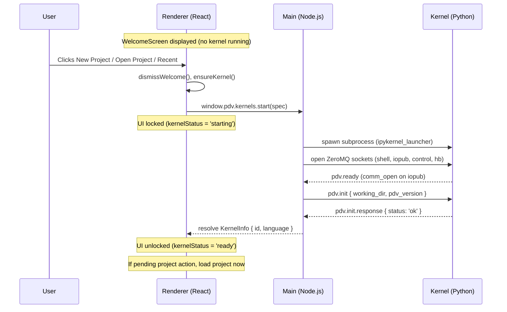
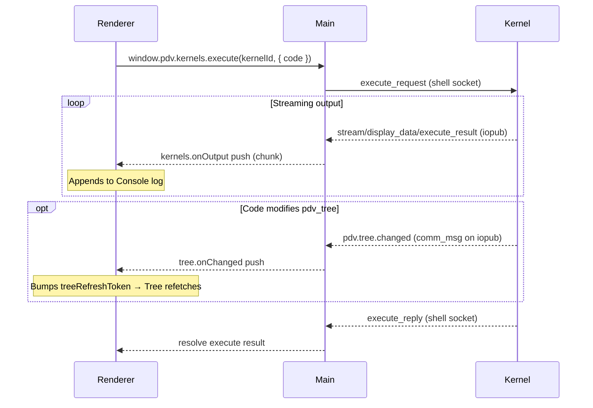
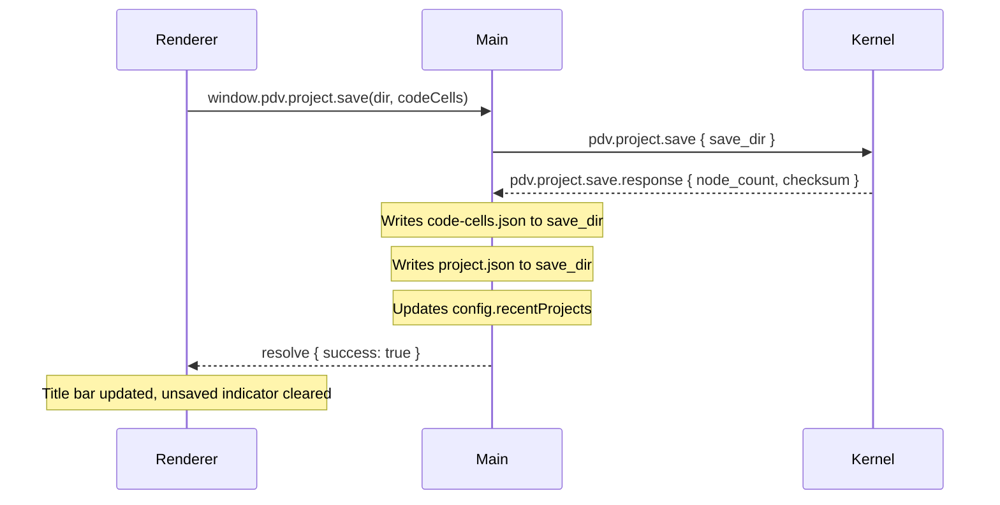
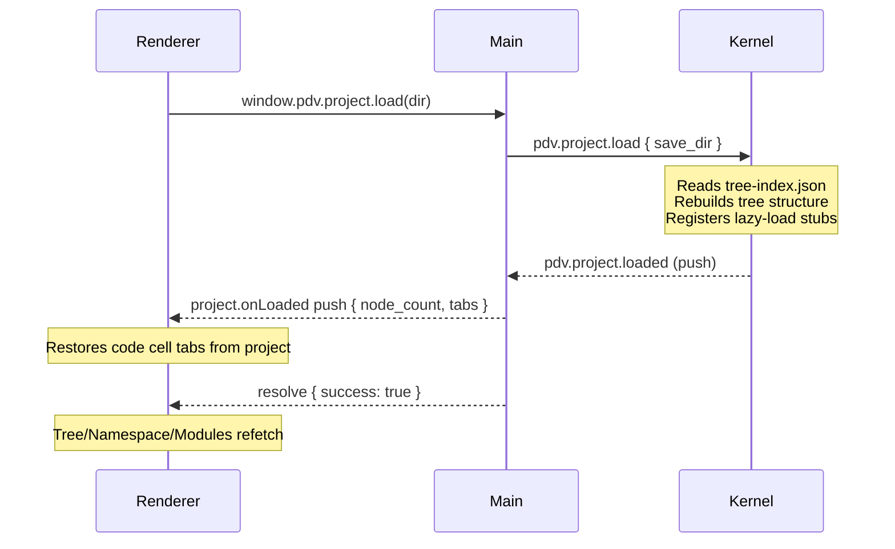

# PDV Architecture Document
**Version**: 0.0.0 (pre-rewrite)  
**Date**: 2026-02-24  
**Status**: Authoritative design specification. All new code must conform to this document. Deviations require updating this document first.

> **New to PDV?** Start with [QUICK_START.md](QUICK_START.md) for setup instructions and a guided tour. This document is the comprehensive reference.

---

## Table of Contents

1. [Project Overview](#1-project-overview)
2. [Process Model](#2-process-model)
3. [The PDV Communication Protocol](#3-the-pdv-communication-protocol)
4. [Kernel Startup and Lifecycle](#4-kernel-startup-and-lifecycle)
5. [The pdv-python Package](#5-the-pdv-python-package)
6. [The Working Directory and Project Save Directory](#6-the-working-directory-and-project-save-directory)
7. [The Tree: Data Model and Authority](#7-the-tree-data-model-and-authority)
8. [Project Save and Load](#8-project-save-and-load)
9. [User Code Execution and the Console](#9-user-code-execution-and-the-console)
10. [Environment Detection and Package Installation](#10-environment-detection-and-package-installation)
11. [Electron Architecture: Main, Preload, Renderer](#11-electron-architecture-main-preload-renderer)
12. [File and Module Structure](#12-file-and-module-structure)
13. [TypeScript Documentation Standard](#13-typescript-documentation-standard)
14. [Testing Strategy](#14-testing-strategy)
15. [What is Explicitly Out of Scope (Alpha)](#15-what-is-explicitly-out-of-scope-alpha)

---

## 1. Project Overview

PDV is an Electron desktop application for computational and experimental physics analysis. It combines:

- A **command workflow** (tabbed code editor + execution console)
- A **persistent project data model** (the Tree — a live, hierarchical data object in a language kernel)
- **Scripted, reusable analysis workflows** (scripts stored as tree nodes)
- **Multi-language backend support** (Python first; Julia deferred to beta)

The defining characteristic that separates PDV from a Jupyter notebook is the **Tree**: a persistent, navigable, typed data hierarchy that lives in the kernel namespace and is the single authority on all project data. Users explore it via a graphical tree panel, store analysis results in it, attach scripts to it, and save/load it as part of a project.

---

## 2. Process Model

PDV uses the standard Electron three-process architecture:

```
┌─────────────────────────────────────────────────────┐
│                   Electron App                      │
│                                                     │
│  ┌──────────────┐        ┌────────────────────────┐ │
│  │ Main Process │◄──IPC─►│ Renderer Process       │ │
│  │ (Node.js)    │        │ (React / TypeScript)   │ │
│  │              │        │                        │ │
│  │ - Kernel mgmt│        │ - Tree panel           │ │
│  │ - IPC handlers        │ - Code Cell            │ │
│  │ - Filesystem │        │ - Console              │ │
│  │ - Config     │        │ - Namespace panel      │ │
│  │ - Comm router│        │ - Settings / dialogs   │ │
│  └──────┬───────┘        └────────────────────────┘ │
│         │ ZeroMQ                                    │
│         ▼                                           │
│  ┌──────────────┐                                   │
│  │ Kernel       │                                   │
│  │ (subprocess) │                                   │
│  │              │                                   │
│  │ ipykernel +  │                                   │
│  │ pdv-python   │                                   │
│  └──────────────┘                                   │
└─────────────────────────────────────────────────────┘
```

### 2.1 Main Process Responsibilities
- Spawn and manage kernel subprocess(es) via ZeroMQ (Jupyter Messaging Protocol)
- Route PDV comm messages between kernel and renderer
- Create and manage the working directory
- Coordinate project save and load
- Own app configuration and theme persistence
- Enforce all filesystem security (path traversal checks, sandboxing)

### 2.2 Renderer Process Responsibilities
- Display and interact with the Tree panel
- Display and interact with the Code Cell (Monaco editor tabs)
- Display the Console (chronological execution output log)
- Display the Namespace panel
- All UI state (expansion, selection, scroll position) lives here and is ephemeral unless saved as part of a project

### 2.3 Kernel Process Responsibilities
- Maintain the `pdv_tree` object as the sole authority on all project data
- Handle PDV comm messages and emit push notifications
- Execute user code
- Manage lazy loading of tree node data from the save directory

### 2.4 What the Main Process Does NOT Do
- The main process does not construct Python or Julia source code strings and send them via `execute_request`. This was the pattern in the old architecture and is explicitly forbidden. All structured data exchange between the main process and the kernel happens via the PDV comm protocol (see Section 3).
- The main process does not scan the filesystem to build the tree. The kernel is the sole tree authority.

---

## 3. The PDV Communication Protocol

### 3.1 Transport

PDV uses the **Jupyter comm mechanism** over the existing ZeroMQ `iopub` and `shell` sockets. This requires no additional sockets or processes. Comms are part of the standard Jupyter Messaging Protocol and are supported by all ipykernel-based kernels.

A **comm** is opened by the kernel at startup (when `pdv-python` initializes). The Electron main process listens for `comm_open`, `comm_msg`, and `comm_close` messages on the `iopub` socket. The main process sends requests to the kernel as `comm_info_request` / `comm_msg` messages on the `shell` socket.

The comm target name is `pdv.kernel`. This is the single comm channel for all PDV protocol traffic.

### 3.2 Message Envelope

Every PDV message — whether sent by the app or by the kernel — has the following JSON structure:

```json
{
  "pdv_version": "0.0.4",
  "msg_id": "<uuid-v4>",
  "in_reply_to": "<uuid-v4-or-null>",
  "type": "<message-type-string>",
  "status": "ok | error",
  "payload": { }
}
```

| Field | Type | Description |
|---|---|---|
| `pdv_version` | string | Protocol version. Currently `"0.0.4"` (alpha). The app rejects messages with an incompatible major version. |
| `msg_id` | string | UUID v4. Unique identifier for this message. |
| `in_reply_to` | string \| null | The `msg_id` of the request this is responding to. `null` for unsolicited push messages. |
| `type` | string | Dot-namespaced message type (see Section 3.4). |
| `status` | string | `"ok"` or `"error"`. Always present on responses; omitted on requests. |
| `payload` | object | Message-specific data. On error responses, always contains `{ "code": string, "message": string }`. |

### 3.3 Request/Response Correlation

The app maintains an internal registry of pending requests, keyed by `msg_id`. When a response arrives with a matching `in_reply_to`, the pending promise is resolved or rejected. Requests that receive no response within a configurable timeout (default: 30 seconds) are rejected with a timeout error and the pending entry is removed.

Multiple requests may be in-flight simultaneously. The protocol does not guarantee response ordering.

### 3.4 Message Type Catalogue

All type strings are namespaced with `pdv.`. The convention is `pdv.<domain>.<action>` for requests and `pdv.<domain>.<action>.response` for responses. Push notifications (kernel → app, no prior request) use `pdv.<domain>.<event>`.

#### Lifecycle Messages

| Type | Direction | Description |
|---|---|---|
| `pdv.ready` | kernel → app | Sent once when the `pdv-python` package has fully initialized and the comm channel is open. No `in_reply_to`. |
| `pdv.init` | app → kernel | Sent by the app immediately after receiving `pdv.ready`. Contains the working directory path and initial configuration. |
| `pdv.init.response` | kernel → app | Confirms working directory was accepted and the kernel is fully operational. |

#### Project Messages

| Type | Direction | Description |
|---|---|---|
| `pdv.project.load` | app → kernel | Instructs the kernel to load a project from a save directory. |
| `pdv.project.loaded` | kernel → app | Sent after the tree is fully populated from a project load. No `in_reply_to` (push notification). |
| `pdv.project.save` | app → kernel | Instructs the kernel to serialize the tree to the save directory. |
| `pdv.project.save.response` | kernel → app | Confirms save completed, includes node count and checksum. |

#### Tree Messages

| Type | Direction | Description |
|---|---|---|
| `pdv.tree.list` | app → kernel | Request tree nodes at a given path. |
| `pdv.tree.list.response` | kernel → app | Returns array of node metadata objects. |
| `pdv.tree.get` | app → kernel | Request data value for a specific node. |
| `pdv.tree.get.response` | kernel → app | Returns node value (may be lazy-loaded from save directory). |
| `pdv.tree.changed` | kernel → app | Push notification. Sent whenever the tree structure changes (node added, removed, or modified). No `in_reply_to`. |

#### Namespace Messages

| Type | Direction | Description |
|---|---|---|
| `pdv.namespace.query` | app → kernel | Request a snapshot of the kernel namespace (excluding internal PDV names). |
| `pdv.namespace.query.response` | kernel → app | Returns array of variable descriptors. |

#### Script Messages

| Type | Direction | Description |
|---|---|---|
| `pdv.script.register` | app → kernel | Register a newly created script file as a node in the tree. |
| `pdv.script.register.response` | kernel → app | Confirms registration. |

### 3.5 Error Payload

When `status` is `"error"`, the payload always has this shape:

```json
{
  "code": "tree.path_not_found",
  "message": "No node exists at path: data.waveforms.xyz"
}
```

`code` is a machine-readable dot-namespaced string. `message` is a human-readable string suitable for display in the UI. The app must never display raw `code` to the user.

### 3.6 Version Compatibility

When the app receives a `pdv.ready` message with a `pdv_version` that differs in major version from the app's expected version, the app must:
1. Display a clear error dialog: "The PDV kernel package installed in your environment is incompatible with this version of PDV. Please update `pdv-python`."
2. Not unlock the UI.
3. Not send `pdv.init`.

Minor version differences are tolerated with a logged warning.

---

## 4. Kernel Startup and Lifecycle

### 4.1 Startup Sequence

The kernel is **not** started when the app launches. On startup, the renderer loads configuration and displays the WelcomeScreen. The kernel is started only when the user picks an action (New Project, Open Project, or a recent project).

```
User selects action on WelcomeScreen
    │
    ├─► Environment detection (see Section 10)
    │       Is pdv-python installed in the selected environment?
    │       No → prompt user (EnvironmentSelector) → install → retry
    │
    ├─► App creates working directory (see Section 6.1)
    │
    ├─► App spawns kernel subprocess
    │       argv: [python, -m, ipykernel_launcher, -f, <connection-file>]
    │       env:  standard env (no PDV env vars — config comes via pdv.init)
    │
    ├─► App opens ZeroMQ sockets (shell, iopub, control, hb)
    │
    ├─► App waits for pdv.ready comm (timeout: 15 seconds)
    │       Timeout → display error: "Kernel did not start. Is pdv-python installed?"
    │
    ├─► App sends pdv.init comm:
    │       payload: { working_dir: "/tmp/pdv-<uuid>", pdv_version: "1.0" }
    │
    ├─► App waits for pdv.init.response (timeout: 10 seconds)
    │       status: error → display error with message
    │
    └─► Kernel is ready. UI unlocks.
            If a project was selected, it is loaded now.
            Code Cell: active
            Tree panel: empty (or populated from loaded project)
            Namespace panel: active
```

### 4.2 Project Load Sequence (separate from startup)

Triggered when the user opens a saved project (File → Open Project, or recent projects list).

```
User selects a save directory
    │
    ├─► App sends pdv.project.load comm:
    │       payload: { save_dir: "/path/to/project" }
    │
    ├─► Kernel:
    │       1. Reads project.json manifest
    │       2. Reads tree-index.json, rebuilds full tree structure in memory
    │          (node metadata only — data files are NOT loaded yet)
    │       3. Registers lazy-load stubs for all file-backed nodes
    │       4. Sends pdv.project.loaded push notification
    │
    ├─► App receives pdv.project.loaded:
    │       payload: { node_count: N, project_name: "...", saved_at: "..." }
    │
    └─► App loads code-cells.json from save directory
            Populates Code Cell tabs with saved code
            Console: empty (output history is ephemeral)
            Tree panel: refreshes via pdv.tree.list
```

### 4.3 Kernel Shutdown

On app quit (`before-quit` event):
1. App sends interrupt signal to kernel (control socket)
2. App sends `kernel_shutdown_request` on control socket
3. App waits up to 3 seconds for clean exit
4. App force-kills the subprocess if it has not exited
5. App deletes working directory

On kernel crash (process exits unexpectedly):
1. App detects subprocess exit
2. App displays error: "The kernel has crashed. Your work in the tree has been lost."
3. Working directory is deleted
4. App offers to restart the kernel (new session, empty tree)

### 4.4 Renderer Startup Behavior

On launch, the renderer loads configuration and displays the WelcomeScreen overlay. No kernel is started at this point — the WelcomeScreen buttons are immediately interactive.

When the user picks an action (New Project, Open Project, or a recent project), the renderer dismisses the WelcomeScreen and starts the kernel. If the user chose to open a project, the project path is stored in a pending-action ref and executed automatically once the kernel becomes ready.

The renderer is never aware of the low-level `pdv.ready → pdv.init → pdv.init.response` handshake. That exchange is entirely encapsulated inside the main process's `kernels.start()` IPC handler: the handler spawns the subprocess, runs the full handshake sequence, and only resolves its promise once `pdv.init.response` has been received with `status: 'ok'`.

From the renderer's perspective, kernel startup is simply:

```tsx
// Renderer (app/index.tsx) — triggered by WelcomeScreen action, not on mount
setKernelStatus('starting'); // locks UI — code cell, tree, namespace all disabled
const info = await window.pdv.kernels.start(spec);
setCurrentKernelId(info.id);
setKernelStatus('ready');   // unlocks UI
// If a pending project action exists, it executes now
```

The renderer shows a loading / disabled state for all panels while `start()` is pending. On rejection (timeout or init error), the renderer displays the error string from the rejected promise.

There is no separate push notification for "kernel ready" that the renderer must subscribe to. The resolved `KernelInfo` value IS the ready signal.

### 4.5 Sequence Diagrams

#### Kernel Startup



#### Code Execution



#### Project Save



#### Project Load



---

## 5. The pdv-python Package

### 5.1 Purpose

`pdv-python` is a Python package (installable via `pip install pdv-python`) that implements the kernel side of the PDV comm protocol, the `PDVTree` and `PDVScript` data structures, the protected kernel namespace, and lazy data loading. It replaces the monolithic `python-init.py` file.

### 5.2 Package Structure

```
pdv_kernel/
    __init__.py          # Public API: bootstrap(), PDVTree, PDVScript
    comms.py             # Comm channel: register target, send/receive, dispatch
    tree.py              # PDVTree class, PDVScript class, lazy-load registry
    namespace.py         # pdv_namespace() — variable inspection
    serialization.py     # Type detection, format writers (npy, parquet, json, etc.)
    environment.py       # Path utilities, working dir management, project root logic
    handlers/
        __init__.py
        lifecycle.py     # pdv.init, pdv.ready handlers
        project.py       # pdv.project.load, pdv.project.save handlers
        tree.py          # pdv.tree.list, pdv.tree.get handlers
        namespace.py     # pdv.namespace.query handler
        script.py        # pdv.script.register handler
```

### 5.3 Bootstrap

`pdv_kernel.bootstrap()` is called by the IPython startup mechanism when the kernel starts. It:
1. Registers the `pdv.kernel` comm target with IPython
2. Injects `pdv_tree` and `pdv` into the IPython user namespace via a custom namespace class that blocks reassignment
3. Sends the `pdv.ready` comm message

`bootstrap()` must be idempotent — calling it twice must not open a second comm or re-inject variables.

### 5.4 Protected Namespace

The IPython user namespace is replaced with a subclass of `dict` that overrides `__setitem__`:

```python
class PDVNamespace(dict):
    _PROTECTED = frozenset({'pdv_tree', 'pdv'})

    def __setitem__(self, key, value):
        if key in self._PROTECTED:
            raise PDVError(
                f"'{key}' is a protected PDV object and cannot be reassigned. "
                f"Use pdv_tree['key'] = value to store data in the tree."
            )
        super().__setitem__(key, value)
```

This is set via `IPython.get_ipython().user_ns = PDVNamespace(...)` during bootstrap.

### 5.5 User-Facing Names in the Kernel Namespace

After bootstrap, exactly two names are injected into the user namespace:

| Name | Type | Description |
|---|---|---|
| `pdv_tree` | `PDVTree` instance | The live project data tree. The sole data authority. |
| `pdv` | `PDVApp` instance | App-control object. Exposes `pdv.save()`, `pdv.help()`, etc. |

All other `pdv_*` names in the namespace are an error. Internal implementation functions must be unreachable from the user namespace.

### 5.6 PDVTree Class

`PDVTree` is a `dict` subclass with the following additions:

- **`__getitem__(key)`**: If key is not in the in-memory dict, consults the lazy-load registry. If the key exists in the registry (i.e., it was populated from a save directory), fetches the data file from the save directory into the working directory and loads it into memory. Then returns the value. If neither in-memory nor in the registry, raises `KeyError`.
- **`__setitem__(key, value)`**: Sets the value in the in-memory dict. Emits `pdv.tree.changed` push notification.
- **`__delitem__(key)`**: Removes from in-memory dict and from the lazy-load registry. Emits `pdv.tree.changed`.
- **Path notation**: Both `pdv_tree['key']` and `pdv_tree['parent.child.grandchild']` are supported as a convenience. Dot-separated paths are resolved recursively.
- **`run_script(path, **kwargs)`**: Loads and executes the script at `path`, passing `pdv_tree` and `**kwargs` to its `run()` function.

`PDVTree` does **not** handle serialization or filesystem layout directly. Those concerns live in `serialization.py` and `environment.py`.

### 5.7 PDVScript Class

A lightweight wrapper stored as a tree node value. Attributes:
- `relative_path`: path of the script file relative to the project root
- `language`: `'python'` (Julia deferred)
- `doc`: first line of the script's module docstring (for preview display)
- `params`: list of `ScriptParameter` descriptors for the user-facing parameters (see below)

`PDVScript.run(tree, **kwargs)` loads the module fresh (no import cache), calls `module.run(tree, **kwargs)`, and returns the result dict.

#### Script File Format

Every PDV script is a plain Python file with a module-level docstring and a single `run()` function:

```python
"""
fit_model.py
created by user on host at 14:32
Description: Fit a Gaussian to the waveform data.
"""
def run(pdv_tree: dict, amplitude: float = 1.0, sigma: float = 0.1) -> dict:
    # pdv_tree is injected by PDVScript.run() — never supplied by the caller
    data = pdv_tree["waveforms.ch1"]
    # ... analysis ...
    return {"fit_amplitude": amplitude}
```

Rules:
- The function **must** be named `run`.
- The **first parameter must be `pdv_tree`** (type hint `dict` is recommended so the language server does not flag tree references as errors). This argument is always injected by `PDVScript.run()` and is never supplied by the user.
- All remaining parameters become the user-facing script parameters surfaced in the `ScriptDialog`. They may have default values and type hints.
- The return value must be a `dict` (or `None`). Non-dict returns are ignored.

#### ScriptParameter Descriptor

When a `PDVScript` is constructed (at registration time), `pdv_kernel` inspects the `run()` function's signature via `inspect.signature` and extracts all parameters except `pdv_tree`. Each becomes a `ScriptParameter` descriptor stored on the `PDVScript` and included in the `NodeDescriptor` returned by `pdv.tree.list.response`:

```json
{
  "name": "amplitude",
  "type": "float",
  "default": 1.0,
  "required": false
}
```

A parameter is `required` if it has no default value. `type` is the string representation of the annotation (e.g. `"float"`, `"int"`, `"str"`), or `"any"` if unannotated. If the script file cannot be parsed (syntax error, `run()` missing), registration still succeeds but `params` is an empty list.

`PDVScript.run(tree, **kwargs)` loads the module fresh (no cache), calls `module.run(tree, **kwargs)`, and returns the result.

### 5.8 The Lazy-Load Registry

An internal dict (not user-accessible) mapping tree paths to save-directory storage references:

```python
# Internal structure, not user-facing
_lazy_registry = {
    "data.waveforms.ch1": {
        "save_dir": "/path/to/project",
        "relative_path": "tree/data/waveforms/ch1.npy",
        "format": "npy"
    }
}
```

Populated during `pdv.project.load`. Entries are removed once the data has been loaded into memory. The registry is never written to disk — it is reconstructed from `tree-index.json` each time a project is loaded.

---

## 6. The Working Directory and Project Save Directory

### 6.1 Working Directory

The working directory is a temporary directory created by the Electron main process at kernel startup. It is the live filesystem backing for the current session.

**Creation**: The main process calls `fs.mkdtemp()` (or equivalent) to create a uniquely named directory in the OS temporary directory. The path is passed to the kernel in the `pdv.init` message.

**Structure**:
```
/tmp/pdv-<uuid>/
    tree/
        data/         ← data files written during the session (npy, parquet, etc.)
        scripts/      ← script .py files for the current session
        results/      ← result files produced by scripts
    .pdv-work/
        autosave/     ← reserved for future autosave feature
```

**Lifecycle**: Created at kernel startup. Deleted on clean shutdown. If the app crashes, the directory is left on disk but is not recovered (crash recovery is out of scope for alpha).

**Ownership**: The main process creates it. The kernel writes to it (data files). The main process deletes it.

### 6.2 Project Save Directory

A persistent, user-chosen directory that stores a complete saved snapshot of a PDV project.

**Created when**: The user explicitly performs File → Save Project (or Save As). Never created automatically.

**Structure** (human-readable, mirrors tree hierarchy):
```
my-project/
    project.json              ← project manifest (owned by Electron main process)
    tree-index.json           ← tree node registry (owned by kernel, written at save time)
    code-cells.json        ← code cell tab state (owned by Electron main process)
    tree/
        data/
            waveforms/
                ch1.npy
                ch2.npy
        scripts/
            analysis/
                fit_model.py
        results/
            fit_output.parquet
```

**`project.json` schema**:
```json
{
  "pdv_version": "1.0",
  "project_id": "<uuid>",
  "project_name": "My Experiment",
  "created_at": "<iso8601>",
  "saved_at": "<iso8601>",
  "language_mode": "python",
  "tree_index_file": "tree-index.json",
  "code_cells_file": "code-cells.json",
  "kernel": {
    "preferred_python": null,
    "preferred_julia": null
  }
}
```

**`tree-index.json` schema**: Written by the kernel during save. Contains an array of node descriptors — one per tree node — with enough information to reconstruct the full tree structure and lazy-load registry without opening any data files. See Section 7.3 for node descriptor fields.

**`code-cells.json` schema**: Written by the Electron main process during save. Contains tab code and active tab ID.

### 6.3 Lazy Loading from Save to Working Directory

When a user accesses a tree node whose data is in the save directory but not yet in the working directory, the kernel:
1. Reads the appropriate file from the save directory
2. Loads it into memory (e.g., `numpy.load`, `pandas.read_parquet`)
3. Stores the result in the in-memory `PDVTree`
4. Removes the entry from the lazy-load registry
5. Does **not** copy the file to the working directory unless the data is subsequently modified

Files are only written to the working directory when data is newly created or modified in the current session.

### 6.4 User Preferences Directory (`~/.PDV`)

Renderer-facing preferences and UI persistence are stored in a dedicated user
directory managed by the main process:

```
~/.PDV/
    preferences.json        ← global app preferences (`config.get/set`)
    themes/
        *.json              ← custom themes (including user-dropped files)
    state/
        code-cells.json     ← renderer code-cell tab persistence
```

Rules:
- `preferences.json` is authoritative for user configuration (`pythonPath`,
  settings, shortcut overrides, appearance choices, etc.).
- Theme files are loaded from `~/.PDV/themes/*.json`; malformed files are
  ignored (non-fatal).
- Code-cell persistence in `~/.PDV/state/code-cells.json` is separate from
  project save snapshots (`<project>/code-cells.json`).

---

## 7. The Tree: Data Model and Authority

### 7.1 Single Authority Rule

**The `PDVTree` object in the kernel is the sole authority on all project data.** No other component — not the Electron main process, not the renderer, not the filesystem — may be treated as a source of truth for what nodes exist or what their values are.

- The renderer always fetches tree state via `pdv.tree.list` / `pdv.tree.get` comms
- The main process never caches tree state
- The filesystem layout is a persistence artifact, not an authority

### 7.2 Node Types

The following node types are supported:

| Type | Description | Backed by |
|---|---|---|
| `folder` | A `PDVTree` sub-dict with no associated file | In-memory only |
| `script` | A `PDVScript` object | `.py` file in working or save directory |
| `ndarray` | NumPy array | `.npy` file |
| `dataframe` | Pandas DataFrame | `.parquet` file |
| `series` | Pandas Series | `.parquet` file |
| `scalar` | Python int, float, bool, None | Inline in tree-index.json |
| `text` | Python string | `.txt` file (if large) or inline |
| `mapping` | Plain Python dict (not PDVTree) | Inline JSON |
| `sequence` | Python list or tuple | Inline JSON |
| `binary` | bytes / bytearray | `.bin` file |
| `unknown` | Unrecognized type | `.pickle` file (only if trusted=True) |

### 7.3 Node Descriptor (tree-index.json entry)

Each node in `tree-index.json` is described by a `NodeDescriptor`. Most fields apply to all node types; a few are type-specific.

**Common fields (all types):**
```json
{
  "id": "data.waveforms.ch1",
  "path": "data.waveforms.ch1",
  "key": "ch1",
  "parent_path": "data.waveforms",
  "type": "ndarray",
  "has_children": false,
  "lazy": true,
  "preview": "float64 array (1024 × 4)"
}
```

**Data node additional fields** (ndarray, dataframe, etc.):
```json
{
  "storage": {
    "backend": "local_file",
    "relative_path": "tree/data/waveforms/ch1.npy",
    "format": "npy"
  },
  "shape": [1024, 4],
  "dtype": "float64",
  "size_bytes": 32768
}
```

Scalar and small inline values use `"backend": "inline"` and store the value directly in `"value"` instead of `"relative_path"`.

**Script node additional fields** (`"type": "script"`):
```json
{
  "language": "python",
  "params": [
    { "name": "amplitude", "type": "float", "default": 1.0, "required": false },
    { "name": "label",     "type": "str",   "default": null, "required": true }
  ]
}
```

`params` lists every parameter of the script's `run()` function except `pdv_tree` (which is always injected). The renderer uses this to build the `ScriptDialog` form. See §5.7 for the `ScriptParameter` descriptor shape and extraction rules.

### 7.4 Tree-Changed Push Notifications

Whenever the tree structure changes — a node is added, deleted, or its value updated — the kernel emits a `pdv.tree.changed` push notification:

```json
{
  "type": "pdv.tree.changed",
  "status": "ok",
  "payload": {
    "changed_paths": ["data.waveforms.ch1"],
    "change_type": "added | removed | updated"
  }
}
```

The renderer subscribes to these notifications and refreshes the relevant subtree of the tree panel. The renderer does **not** poll for tree changes.

---

## 8. Project Save and Load

### 8.1 Save Sequence

Triggered by user action (File → Save / Cmd+S). The app coordinates.

```
User triggers save
    │
    ├─► App prompts for save directory if not previously set (File → Save As flow)
    │
    ├─► App sends pdv.project.save comm:
    │       payload: { save_dir: "/path/to/project" }
    │
    ├─► Kernel:
    │       1. Serializes all tree nodes to the save directory
    │          (data files + scripts, mirroring tree hierarchy)
    │       2. Writes tree-index.json
    │       3. Responds with pdv.project.save.response:
    │              payload: { node_count: N, checksum: "<sha256 of tree-index.json>" }
    │
    ├─► App writes code-cells.json to save directory
    │
    ├─► App writes project.json to save directory
    │       (only after both kernel and app state are flushed)
    │
    └─► App updates title bar: "My Experiment"
```

If the kernel responds with `status: "error"`, the app aborts the save, does not write `project.json`, and displays the error message to the user.

### 8.2 Load Sequence

See Section 4.2. Note that the console output history is **not** saved or restored — the console is always empty after a project load.

### 8.3 Save Directory Layout Invariant

Every file in `tree/` must have a corresponding entry in `tree-index.json`. Files in `tree/` without an index entry are ignored (treated as orphans). The kernel must not rely on filesystem traversal during load — it reads `tree-index.json` only and uses it to reconstruct the tree.

---

## 9. User Code Execution and the Console

### 9.1 Execution Channel

All user-initiated code execution goes through the standard Jupyter `execute_request` message on the shell socket. This includes:
- Code typed in the Code Cell and run via the execute button or Cmd+Enter
- Script `run()` calls triggered by context menu actions in the tree panel

This is the only code that the main process sends via `execute_request`. The main process never uses `execute_request` to call PDV internal functions.

### 9.2 Output Routing

The kernel streams output back on the `iopub` socket as standard Jupyter messages:
- `stream` (stdout / stderr) → displayed in Console
- `execute_result` (return value of last expression) → displayed in Console
- `error` (exception traceback) → displayed in Console
- `display_data` (images, HTML, LaTeX) → displayed in Console

The Console displays all output in chronological order, associated with the cell/command that produced it.

### 9.3 Tree Changes During Execution

When user code modifies `pdv_tree` (e.g., `pdv_tree['results.fit'] = fit_output`), `PDVTree.__setitem__` fires and the kernel emits a `pdv.tree.changed` push notification on the `iopub` socket. This arrives at the main process interleaved with the execution output stream. The main process forwards it to the renderer, which refreshes the tree panel. No polling is needed.

### 9.4 Console History

Console output is **ephemeral**. It is not saved to disk, not persisted across sessions, and not included in the project save. When a project is loaded, the console is empty. This is by design.

---

## 10. Environment Detection and Package Installation

### 10.1 Goal

Users (including students unfamiliar with Python environments) must be able to open PDV, select their Python environment, and have PDV install `pdv-python` automatically with a single confirmation prompt.

### 10.2 Detection

At startup, the app attempts to detect available Python environments in this order:
1. **Previously configured** (`pythonPath` in app config) — validate that `pdv-python` is still installed
2. **conda environments** — read `conda env list` output
3. **uv-managed environments** — check for `.venv` in the workspace
4. **System Python / venv** — fallback

Detected environments are presented in the Environment Selector UI. The user selects one.

### 10.3 Package Check and Installation

After an environment is selected:
1. App runs `<python> -c "import pdv_kernel; print(pdv_kernel.__version__)"` (non-interactive, timeout 5s)
2. If this fails (import error or timeout): app shows a dialog:
   > "PDV kernel support is not installed in this environment. Install it now?"
   > [Install] [Not now]
3. On [Install]: app runs `<python> -m pip install pdv-python` in a subprocess with visible progress output
4. On success: proceed to startup sequence (Section 4.1)
5. On failure: display pip output as a diagnostic and offer to select a different environment

### 10.4 Version Mismatch

If `pdv_kernel.__version__` is installed but incompatible with the app's expected protocol version (major version mismatch), the app shows:
> "Your pdv-python package is outdated. Please update it: `pip install --upgrade pdv-python`"

---

## 11. Electron Architecture: Main, Preload, Renderer

### 11.1 IPC Boundary

The renderer cannot access Node.js APIs directly. Communication between renderer and main process happens exclusively via Electron's `ipcRenderer.invoke` (renderer → main) and `ipcMain.handle` (main handles). The preload script exposes a typed `window.pdv` API to the renderer.

All IPC channel names are defined as constants in `electron/main/ipc.ts`. This file is the single source of truth for all IPC channel names and TypeScript types.

### 11.2 Preload API (`window.pdv`)

The preload bridge exposes exactly the operations the renderer needs. It never exposes raw Node.js or Electron APIs. The API is fully typed (see `ipc.ts`).

The API surface:
- `window.pdv.kernels.*` — kernel lifecycle/execution: `list`, `start`, `stop`, `execute`, `interrupt`, `restart`, `complete`, `inspect`, `validate`; push subscription: `onOutput(cb) → unsub` for streamed execute chunks (`stdout`, `stderr`, images, execute-result fragments)
- `window.pdv.tree.*` — tree operations: `list`, `get`, `createScript`; push: `onChanged(cb) → unsub`
- `window.pdv.namespace.*` — namespace query: `query`
- `window.pdv.script.*` — script tooling: `edit`, `reload` (open in external editor; re-register with kernel)
- `window.pdv.project.*` — project lifecycle: `save`, `load`, `new`; push: `onLoaded(cb) → unsub`
- `window.pdv.config.*` — app config: `get`, `set`
- `window.pdv.about.*` — app metadata: `getVersion`
- `window.pdv.themes.*` — theme persistence: `get`, `save` (stored under `~/.PDV/themes/`)
- `window.pdv.codeCells.*` — tab persistence: `load`, `save` (stored under `~/.PDV/state/code-cells.json`)
- `window.pdv.files.*` — native OS dialogs: `pickExecutable() → string | null` (wraps Electron `dialog.showOpenDialog` for executables); `pickDirectory() → string | null` (wraps `dialog.showOpenDialog` with `properties: ['openDirectory', 'createDirectory']`, used for Save/Open project)
- `window.pdv.menu.*` — menu bridge: `updateRecentProjects(paths)`, `onAction(cb) → unsub` (for File menu actions routed to renderer state)

**Design decision — running scripts via `kernels.execute`**: There is no `window.pdv.script.run()`. Running a `PDVScript` node from the renderer is always done by calling `window.pdv.kernels.execute()` with the appropriate Python code string (e.g. `pdv_tree["path.to.script"].run(a=1)`). This keeps the IPC surface minimal and the comm substrate readable — a script run looks identical to any other user execution in the console and in the kernel logs. The `ScriptDialog` component builds the execute call; it does not call a separate IPC channel.

**Design decision — `settings.onOpen`**: There is no `window.pdv.settings.onOpen()`. The Settings dialog is opened by renderer-internal state only (e.g. clicking a toolbar button). Main-menu integration (File → Preferences triggering the dialog) is deferred to a future release and will be implemented as a `window.pdv.settings.*` push subscription at that time.

### 11.3 Comm Routing in the Main Process

The main process's kernel manager listens on the `iopub` socket for all incoming messages. When a message is a `comm_msg` of type `pdv.kernel`, the kernel manager routes it:

- If `in_reply_to` matches a pending request: resolve that request's promise
- If `in_reply_to` is null (push notification): forward to the renderer via `BrowserWindow.webContents.send()`

This routing logic lives in a dedicated `CommRouter` class in `electron/main/comm-router.ts`.

### 11.4 Renderer Push Subscription Lifecycle

The renderer owns push subscriptions in the root `App` component via dedicated hooks (see `app/HOOKS.md`), split by lifecycle scope:
- **Kernel-scoped** (`currentKernelId` keyed): `tree.onChanged`, `project.onLoaded` — managed by `useKernelSubscriptions`
- **App-scoped** (always-on while renderer mounted): `kernels.onOutput` — managed by `useKernelSubscriptions`; `menu.onAction` — managed by `useProjectWorkflow`

```tsx
// useKernelSubscriptions.ts — kernel-scoped subscriptions
useEffect(() => {
  if (!currentKernelId) return;

  const unsubTree = window.pdv.tree.onChanged(_payload => {
    setTreeRefreshToken(t => t + 1);
  });

  const unsubProject = window.pdv.project.onLoaded(payload => {
    // repopulate code cell tabs from project
  });

  return () => {
    unsubTree();
    unsubProject();
  };
}, [currentKernelId]);

// useKernelSubscriptions.ts — app-scoped subscription
useEffect(() => {
  const unsubOutput = window.pdv.kernels.onOutput(chunk => {
    // append streamed execute output to the matching log entry
  });
  return () => unsubOutput();
}, []);

// useProjectWorkflow.ts — app-scoped menu subscription
useEffect(() => {
  const unsubMenu = window.pdv.menu.onAction(payload => {
    // open/save project actions routed from main menu
  });
  return () => unsubMenu();
}, []);
```

Rules:
- **One owner**: Only `App` (via its hooks) directly registers push subscriptions. Child components receive state/refresh tokens as props.
- **Kernel-scoped cleanup**: `tree.onChanged` and `project.onLoaded` are torn down/re-registered whenever kernel identity changes.
- **App-scoped cleanup**: `kernels.onOutput` and `menu.onAction` are registered once and cleaned up on unmount.
- **No polling**: Tree/project updates are push-driven; renderer does not poll these domains.
- **Hook composition**: See `electron/renderer/src/app/HOOKS.md` for the full hook dependency graph and data flow documentation.

---

## 12. File and Module Structure

### 12.1 Electron (TypeScript)

```
electron/
    package.json
    tsconfig.json
    preload.ts                  ← window.pdv API bridge
    main/
        bootstrap.ts            ← Electron app entry point and singleton guard
        index.ts                ← IPC handler registration hub, push forwarding
        ipc.ts                  ← ALL IPC channel names and TypeScript types
        kernel-manager.ts       ← Kernel process lifecycle, ZeroMQ socket management
        kernel-error-parser.ts  ← Traceback/error parsing for execution errors
        comm-router.ts          ← PDV comm message routing
        config.ts               ← App config persistence (~/.PDV/preferences.json)
        app.ts                  ← Electron app lifecycle (BrowserWindow, menus)
        environment-detector.ts ← Python/Julia environment detection
        project-manager.ts      ← Project manifest read/write, save coordination
        project-file-sync.ts    ← Tree file synchronization between working/save dirs
        module-manager.ts       ← Module import/installation pipeline
        ipc-register-kernels.ts           ← IPC handlers: kernel lifecycle + execution
        ipc-register-project.ts           ← IPC handlers: project save/load/new
        ipc-register-modules.ts           ← IPC handlers: module import/install
        ipc-register-tree-namespace-script.ts ← IPC handlers: tree, namespace, script
        ipc-register-app-state.ts         ← IPC handlers: config, themes, code cells, files, about
    renderer/
        src/
            app/
                index.tsx               ← Root App component (state orchestration, 7 hooks)
                HOOKS.md                ← Hook composition documentation
                useLayoutState.ts       ← Sidebar/pane geometry (localStorage)
                useThemeManager.ts      ← Theme colors, Monaco theme, font settings
                useCodeCellsPersistence.ts ← Load/save code tabs to ~/.PDV/state/
                useKernelSubscriptions.ts  ← Push subscription lifecycle
                useKernelLifecycle.ts    ← Kernel start/restart/env-save callbacks
                useKeyboardShortcuts.ts ← Global keyboard shortcut listener
                useProjectWorkflow.ts   ← Project save/load/new + unsaved dialog
            components/
                CodeCell/
                    index.tsx           ← Tabbed Monaco editor surface
                    monaco-providers.ts ← Completion + hover provider logic
                Console/                ← Streamed output and result rendering
                Tree/                   ← Tree browser + context menu actions
                NamespaceView/          ← Namespace table and filtering
                SettingsDialog/
                    index.tsx           ← Settings modal shell + General/Shortcuts/Runtime/About tabs
                    AppearanceTab.tsx   ← Appearance tab (themes, fonts, colors)
                    ShortcutCapture.tsx ← Reusable shortcut key-capture widget
                ModulesPanel/           ← Module import/install UI
            themes.ts                   ← Builtin themes, Monaco theme definitions, font helpers
            shortcuts.ts                ← Canonical shortcut registry and matcher
            services/tree.ts            ← Renderer tree fetch/cache adapter
            types/                      ← Renderer view-model + preload API types
```

### 12.2 Python Package (separate repository or subdirectory)

```
pdv-python/
    pyproject.toml
    pdv_kernel/
        __init__.py
        comms.py
        tree.py
        namespace.py
        serialization.py
        environment.py
        handlers/
            __init__.py
            lifecycle.py
            project.py
            tree.py
            namespace.py
            script.py
    tests/
        test_tree.py
        test_serialization.py
        test_comms.py
        test_namespace.py
        conftest.py
```

### 12.3 Tests

```
tests/
    python/               ← pytest tests for pdv-python (no kernel required)
    typescript/           ← vitest tests for Electron main process modules
    README.md
```

---

## 13. TypeScript Documentation Standard

All TypeScript files in `electron/` must follow this documentation standard. This is mandatory for maintainability, particularly for contributors unfamiliar with TypeScript or Electron.

### 13.1 File Header

Every `.ts` file begins with a JSDoc block describing the file's purpose, its place in the architecture, and what it does NOT do (to prevent scope creep).

```typescript
/**
 * @file comm-router.ts
 * @description
 * Routes incoming PDV comm messages from the kernel to their appropriate handlers.
 *
 * This module is responsible for:
 * - Parsing comm_msg frames arriving on the iopub ZeroMQ socket
 * - Matching responses to pending requests by msg_id (in_reply_to)
 * - Forwarding push notifications (in_reply_to === null) to the renderer
 *
 * This module is NOT responsible for:
 * - Opening or managing ZeroMQ sockets (see kernel-manager.ts)
 * - Serializing or deserializing tree data (handled by the kernel)
 * - Any IPC communication with the renderer (see index.ts)
 *
 * @see kernel-manager.ts for socket lifecycle
 * @see ipc.ts for all IPC channel names and TypeScript types
 */
```

### 13.2 Exported Functions and Classes

Every exported function, class, and type must have a JSDoc comment with:
- A one-sentence summary
- `@param` tags for every parameter (with type and description)
- `@returns` tag describing the return value
- `@throws` tag if the function can throw
- An example if the usage is non-obvious

```typescript
/**
 * Sends a PDV comm request to the kernel and waits for a correlated response.
 *
 * Registers a pending request keyed by a generated msg_id, sends the message
 * on the shell socket, and returns a promise that resolves when the kernel
 * replies with a matching in_reply_to value. Rejects after `timeoutMs`.
 *
 * @param kernelId - The ID of the target kernel (from KernelManager)
 * @param type - The PDV message type string (e.g., 'pdv.tree.list')
 * @param payload - The message payload object. Must be JSON-serializable.
 * @param timeoutMs - Maximum wait time in milliseconds. Default: 30000.
 * @returns The response payload if status is 'ok'.
 * @throws {PDVCommError} If the kernel responds with status 'error'.
 * @throws {PDVCommTimeoutError} If no response is received within timeoutMs.
 *
 * @example
 * const nodes = await commRouter.request(kernelId, 'pdv.tree.list', { path: 'data' });
 */
export async function request(
  kernelId: string,
  type: string,
  payload: Record<string, unknown>,
  timeoutMs = 30_000,
): Promise<Record<string, unknown>> { ... }
```

### 13.3 Interfaces and Types

All interfaces must have a JSDoc comment and inline comments on every field.

```typescript
/**
 * Envelope for all PDV comm messages, both requests and responses.
 * Every message sent over the pdv.kernel comm channel must conform to this shape.
 */
export interface PDVMessage {
  /** Protocol version. Must be '1.0' for this release. */
  pdv_version: string;
  /** UUID v4 uniquely identifying this message. */
  msg_id: string;
  /** msg_id of the request this is responding to. Null for push notifications. */
  in_reply_to: string | null;
  /** Dot-namespaced message type string. See ARCHITECTURE.md Section 3.4. */
  type: string;
  /** Present on responses only. 'ok' or 'error'. */
  status?: 'ok' | 'error';
  /** Message-specific data. Shape depends on type. */
  payload: Record<string, unknown>;
}
```

### 13.4 Internal Functions

Private/internal functions (not exported) require at minimum a one-line comment explaining their purpose and any non-obvious behavior. They do not require full JSDoc.

```typescript
// Generates a monotonically increasing ISO 8601 timestamp with millisecond precision.
function nowIso(): string {
  return new Date().toISOString();
}
```

### 13.5 IPC Handlers

Every `ipcMain.handle` registration must have an inline comment above it stating:
- What the handler does
- What input it expects
- What it returns on success
- What it returns on failure (error shape)

```typescript
// Handles tree:list requests from the renderer.
// Input: kernelId (string), path (string, dot-separated tree path, may be empty for root)
// Returns: TreeNode[] on success
// On error: returns [] and logs the error (does not throw to renderer)
ipcMain.handle(IPC.tree.list, async (_event, kernelId: string, path: string) => {
  ...
});
```

### 13.6 No Implicit `any`

TypeScript `strict` mode is enabled. `any` is forbidden without an explicit `// eslint-disable-next-line` comment explaining why it is necessary. `unknown` is used instead wherever the type is genuinely unknown.

### 13.7 Architecture Cross-References

Comments may reference this document by section number when the reason for a design decision is not locally obvious:

```typescript
// Per ARCHITECTURE.md §3.6: reject incompatible major protocol versions immediately.
if (majorVersion(msg.pdv_version) !== EXPECTED_MAJOR) {
  throw new PDVVersionError(msg.pdv_version);
}
```

---

## 14. Testing Strategy

### 14.1 Python Tests (pytest, no kernel required)

All `pdv-python` modules must be importable and testable without a running Jupyter kernel. Comm sending is mocked. Tests cover:

- `PDVTree` get/set/delete, dot-path access, protected-name rejection
- `PDVScript` run, docstring extraction
- Lazy-load registry: population from tree-index, fetch-on-access, registry cleanup
- Serialization: round-trip for each supported format (npy, parquet, json, txt)
- `PDVNamespace`: reassignment of protected names raises `PDVError`
- Message envelope validation: malformed messages raise appropriate errors

### 14.2 TypeScript Tests (vitest)

Main process modules tested in isolation with mocked ZeroMQ sockets:
- `CommRouter`: request correlation, timeout, push notification forwarding
- `KernelManager`: startup sequence, shutdown sequence, crash detection
- `ProjectManager`: save sequence (kernel response → app state → `project.json`), manifest read/write, schema coercion
- `EnvironmentDetector`: conda/uv/system Python discovery
- IPC handlers: each `ipcMain.handle` has at least a happy-path and error-path test

### 14.3 What Is Not Unit Tested
- The renderer (React components) — covered by manual QA in alpha
- End-to-end kernel ↔ app comm flow — covered by integration tests once the protocol is stable

---

## 15. What is Explicitly Out of Scope (Alpha)

The following features are acknowledged as future work and must not influence the current architecture in ways that complicate the above design:

- **Julia kernel support** — protocol is designed to be language-agnostic; implementation is deferred
- **Crash recovery** — working directory is deleted on close; future discussion required
- **Remote execution** (SSH, HPC clusters) — no remote connector architecture in this version
- **Autosave** — `.pdv-work/autosave/` directory is created but not used
- **Modules ecosystem hardening** — foundational Modules UI/IPC is implemented; deeper registry/trust/dependency features are deferred
- **Multiple simultaneous kernels** — architecture supports it (kernels have IDs) but UI exposes only one at a time
- **R kernel support** — same deferral as Julia

---

---

*This document is the authoritative design specification for PDV. All implementation decisions made during the rewrite should be traceable to a section of this document. If an implementation decision cannot be so traced, this document should be updated first.*
