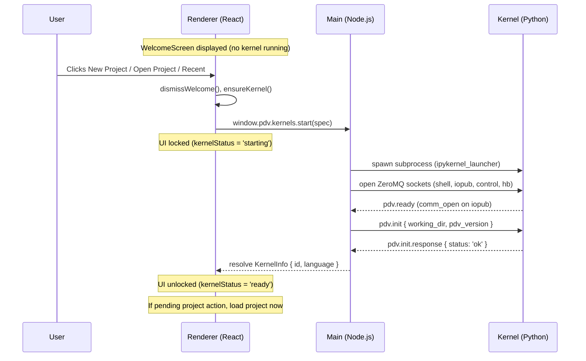
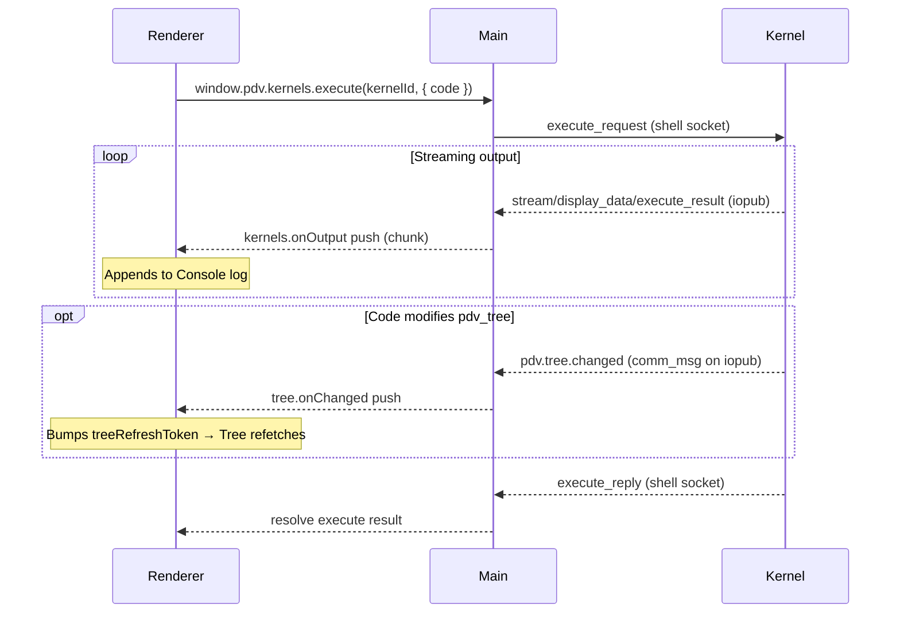
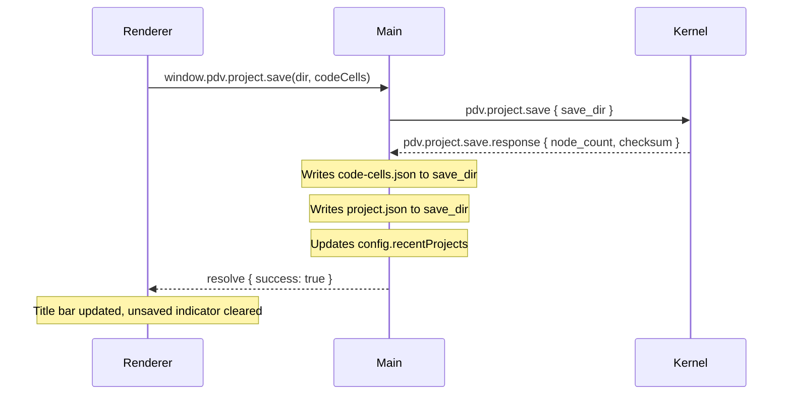
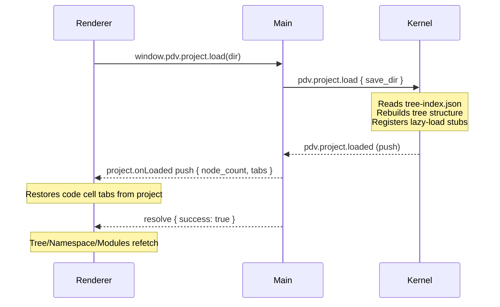

# PDV Architecture Document
**Version**: 0.2.0
**Date**: 2026-04-07
**Status**: Authoritative design specification. All new code must conform to this document. Deviations require updating this document first.

> **New to PDV?** Start with `DEV_QUICKSTART.md` for setup instructions and a guided tour. This document is the comprehensive reference.

---

## Table of Contents

1. [Project Overview](#1-project-overview)
2. [Process Model](#2-process-model)
3. [The PDV Communication Protocol](#3-the-pdv-communication-protocol)
4. [Kernel Startup and Lifecycle](#4-kernel-startup-and-lifecycle)
5. [The pdv-python Package](#5-the-pdv-python-package)
6. [The Working Directory and Project Save Directory](#6-the-working-directory-and-project-save-directory)
7. [The Tree: Data Model and Authority](#7-the-tree-data-model-and-authority)
8. [Project Save and Load](#8-project-save-and-load)
9. [User Code Execution and the Console](#9-user-code-execution-and-the-console)
10. [Environment Detection and Package Installation](#10-environment-detection-and-package-installation)
11. [Electron Architecture: Main, Preload, Renderer](#11-electron-architecture-main-preload-renderer)
12. [File and Module Structure](#12-file-and-module-structure)
13. [TypeScript Documentation Standard](#13-typescript-documentation-standard)
14. [Testing Strategy](#14-testing-strategy)
15. [AI Agent Integration (MCP Server)](#15-ai-agent-integration-mcp-server)
16. [What is Explicitly Out of Scope (Beta)](#16-what-is-explicitly-out-of-scope-beta)

---

## 1. Project Overview

PDV is an Electron desktop application for computational and experimental physics analysis. It combines:

- A **command workflow** (tabbed code editor + execution console)
- A **persistent project data model** (the Tree — a live, hierarchical data object in a language kernel)
- **Scripted, reusable analysis workflows** (scripts stored as tree nodes)
- **Markdown notes** (first-class tree nodes with KaTeX math preview, edited in a dedicated Write tab)
- **Multi-language backend support** (Python via `pdv-python` + ipykernel; Julia via `pdv-julia` (the `PDVKernel.jl` package) + IJulia — see §5.14)

The defining characteristic that separates PDV from a Jupyter notebook is the **Tree**: a persistent, navigable, typed data hierarchy that lives in the kernel namespace and is the single authority on all project data. Users explore it via a graphical tree panel, store analysis results in it, attach scripts to it, and save/load it as part of a project.

---

## 2. Process Model

PDV runs four processes: the Electron shell (main process), the renderer,
the **pdv-server**, and the kernel. The pdv-server is a plain Node child
process (the Electron binary re-executed with `ELECTRON_RUN_AS_NODE=1`)
that owns every session concern — kernels, the comm router, project
save/load, configuration, and the MCP server. The shell owns only
window/OS concerns and forwards session traffic over a newline-delimited
JSON stdio RPC transport. There is one code path: local mode already runs
through the extracted server, so a future remote session only swaps the
transport (SSH instead of a local child), not the logic.

```
┌───────────────────────────────────────────────────────────────┐
│                        Electron App                           │
│                                                               │
│  ┌────────────────┐          ┌────────────────────────┐       │
│  │ Shell (Main)   │◄──IPC───►│ Renderer Process       │       │
│  │                │          │ (React / TypeScript)   │       │
│  │ - Windows/menu │          │                        │       │
│  │ - Native dialogs          │ - Tree panel           │       │
│  │ - Updater      │          │ - Code Cell            │       │
│  │ - Launchers    │          │ - Console              │       │
│  │ - Server bridge│          │ - Namespace panel      │       │
│  └──────┬─────────┘          └────────────────────────┘       │
│         │ stdio RPC (JSON lines: invoke / response / push)    │
│         ▼                                                     │
│  ┌────────────────┐                                           │
│  │ pdv-server     │  plain Node (ELECTRON_RUN_AS_NODE=1)      │
│  │                │                                           │
│  │ - Kernel mgmt  │                                           │
│  │ - Comm router  │                                           │
│  │ - Project/save │                                           │
│  │ - Config       │                                           │
│  │ - MCP server   │                                           │
│  └──────┬─────────┘                                           │
│         │ ZeroMQ (loopback)                                   │
│         ▼                                                     │
│  ┌────────────────┐                                           │
│  │ Kernel         │                                           │
│  │ (subprocess)   │                                           │
│  │ ipykernel +    │                                           │
│  │ pdv-python     │                                           │
│  └────────────────┘                                           │
└───────────────────────────────────────────────────────────────┘
```

### 2.1 Shell (Main Process) Responsibilities
- Create and manage BrowserWindows, menus, native dialogs, and the updater
- Spawn and supervise the pdv-server child (`main/shell/server-supervisor.ts`):
  hello handshake with exact version check, ping liveness, crash
  restart offer, graceful shutdown chain (`pdv.rpc.shutdown` → SIGTERM →
  SIGKILL)
- Bridge every `SERVER_CHANNELS` invoke from the renderer to the server
  and fan server pushes out to windows (`main/shell/server-bridge.ts`)
- Show native confirmation dialogs on the server's behalf (reverse RPC:
  `pdv.rpc.confirmRequest` push → dialog → `pdv.rpc.confirmResponse`)
- Launch local external programs (editor, terminal, AI agent)
- Own custom-theme storage (`~/.PDV/themes`, the `themes.*` channels) — the
  window's background color is applied before the renderer loads, and
  themes stay local even when a future session runs on a remote host

### 2.1.1 pdv-server Responsibilities
- Spawn and manage kernel subprocess(es) via ZeroMQ (Jupyter Messaging Protocol)
- Route PDV comm messages between kernel and renderer
- Create and manage the working directory
- Coordinate project save and load
- Own app configuration (the single `ConfigStore`; the shell reads config
  asynchronously over the transport)
- Run the MCP server for AI agent integration (§15)
- Enforce all filesystem security (path traversal checks, sandboxing)

**Packaged layout.** In development the supervisor runs the tsc output
directly (`dist/main/server/server-main.js`). Packaged builds instead ship a
single esbuild bundle, produced by `npm run build:server` into
`dist/server-bundle/pdv-server.cjs` and placed at
`<Resources>/pdv-server/pdv-server.cjs` via electron-builder's
`extraResources` — it must be a real file on disk because the child runs
under plain Node (`ELECTRON_RUN_AS_NODE=1`), which cannot `require()` from
inside the asar archive. The bundle externalizes `zeromq`; the supervisor
points the server at the asar-unpacked copy through the `PDV_ZEROMQ_PATH`
environment variable (resolved with `createRequire` in `kernel-manager.ts`).
Everything on zeromq's runtime require path (`zeromq`, `cmake-ts`,
`node-addon-api`) must therefore stay in `asarUnpack`;
`main/electron-builder-config.test.ts` guards this layout against drift.

### 2.2 Renderer Process Responsibilities
- Display and interact with the Tree panel
- Display and interact with the Code Cell (Monaco editor tabs)
- Display and interact with the Write tab (markdown note editor with KaTeX math preview)
- Display the Console (chronological execution output log)
- Display the Namespace panel
- All UI state (expansion, selection, scroll position) lives here and is ephemeral unless saved as part of a project

### 2.3 Kernel Process Responsibilities
- Maintain the `pdv_tree` object as the sole authority on all project data
- Handle PDV comm messages and emit push notifications
- Execute user code
- Manage lazy loading of tree node data from the save directory

### 2.4 What the Main Process Does NOT Do
- The main process does not construct arbitrary Python or Julia business logic and send it via `execute_request`. All structured data exchange between the main process and the kernel happens via the PDV comm protocol (see Section 3). The well-defined exceptions are minimal invocation strings whose output must flow through the standard Jupyter iopub stream so it appears in the console: (1) the **bootstrap snippet** in `kernel-session.ts` that initializes `pdv_tree` at startup (a one-time init, not business logic); (2) the **script invocation string** built by the `script:run` IPC handler (`pdv_tree["path"].run(kwargs)`); (3) the **print invocation** built by the `tree:print` IPC handler (`print(pdv_tree[...])` / Julia's size-limited `show(IOContext(stdout, :limit => true), MIME("text/plain"), ...)`); and (4) the **install invocation** built by the `environment:installModule` IPC handler (`pdv.install("<module>")`, §10.5.12). These strings are always built in the main process — the renderer sends only structured requests and never contains Python or Julia code.
- The main process does not scan the filesystem to build the tree. The kernel is the sole tree authority.

---

## 3. The PDV Communication Protocol

### 3.1 Transport

PDV uses two complementary ZeroMQ channels:

1. **Jupyter comm channel** — The standard Jupyter comm mechanism over the existing `iopub` and `shell` sockets. A comm with target name `pdv.kernel` is opened by the kernel at startup. The main process listens for `comm_open`, `comm_msg`, and `comm_close` messages on `iopub`, and sends requests on `shell`. All write operations (script execution, project save/load, tree mutations) go through this channel.

2. **Query channel** — A dedicated ZeroMQ REQ/REP socket for read-only tree and namespace queries. The main process allocates a `query_port` alongside the standard Jupyter ports and passes it to the kernel in the `pdv.init` payload. The kernel starts a daemon thread (`QueryServer`) that serves requests on this port. Because the query thread runs independently of the main execution thread, tree browsing and namespace inspection work even while user code is executing. The query channel uses raw JSON (not the Jupyter wire protocol) and does not require HMAC signing. Only these message types are accepted on the query channel: `pdv.tree.list`, `pdv.tree.get`, `pdv.tree.resolve_file`, `pdv.namespace.query`, `pdv.namespace.inspect`.

The main process's `QueryRouter` tries the query channel first; if it fails (e.g. during startup before the query server is ready), it falls back to the comm channel transparently.

### 3.2 Message Envelope

Every PDV message — whether sent by the app or by the kernel — has the following JSON structure:

```json
{
  "pdv_version": "0.2.0",
  "msg_id": "<uuid-v4>",
  "in_reply_to": "<uuid-v4-or-null>",
  "type": "<message-type-string>",
  "status": "ok | error",
  "payload": { }
}
```

| Field | Type | Description |
|---|---|---|
| `pdv_version` | string | App/package version (e.g. `"0.2.0"`). Both the Electron app and `pdv-python` use their installed version as this value. The app rejects messages with an incompatible major version. |
| `msg_id` | string | UUID v4. Unique identifier for this message. |
| `in_reply_to` | string \| null | The `msg_id` of the request this is responding to. `null` for unsolicited push messages. |
| `type` | string | Dot-namespaced message type (see Section 3.4). |
| `status` | string | `"ok"` or `"error"`. Always present on responses; omitted on requests. |
| `payload` | object | Message-specific data. On error responses, always contains `{ "code": string, "message": string }`. |

### 3.3 Request/Response Correlation

The app maintains an internal registry of pending requests, keyed by `msg_id`. When a response arrives with a matching `in_reply_to`, the pending promise is resolved or rejected. Requests that receive no response within a configurable timeout (default: 30 seconds) are rejected with a timeout error and the pending entry is removed.

Multiple requests may be in-flight simultaneously. The protocol does not guarantee response ordering.

### 3.4 Message Type Catalogue

All type strings are namespaced with `pdv.`. The convention is `pdv.<domain>.<action>` for requests and `pdv.<domain>.<action>.response` for responses. Push notifications (kernel → app, no prior request) use `pdv.<domain>.<event>`.

#### Lifecycle Messages

| Type | Direction | Description |
|---|---|---|
| `pdv.ready` | kernel → app | Sent once when the `pdv-python` package has fully initialized and the comm channel is open. No `in_reply_to`. |
| `pdv.init` | app → kernel | Sent by the app immediately after receiving `pdv.ready`. Contains the working directory path, protocol version, and `query_port` (TCP port for the read-only query socket). The kernel starts the QueryServer daemon thread on this port. |
| `pdv.init.response` | kernel → app | Confirms working directory was accepted and the kernel is fully operational. |

#### Project Messages

| Type | Direction | Description |
|---|---|---|
| `pdv.project.load` | app → kernel | Instructs the kernel to load a project from a save directory. Payload: `{ save_dir, tree_index_dir? }`. When `tree_index_dir` is present and exists, the kernel reads `tree-index.json` from there instead of `save_dir`; used by autosave recovery to overlay an autosaved tree (see §8.4). |
| `pdv.project.loaded` | kernel → app | Sent after the tree is fully populated from a project load. No `in_reply_to` (push notification). |
| `pdv.project.save` | app → kernel | Instructs the kernel to serialize the tree to the save directory. Payload: `{ save_dir, is_autosave?, clear_cache? }`. When `is_autosave: true` the kernel consults its per-node checksum cache and reuses unchanged-data descriptors (see §8.4). `clear_cache: true` wipes the cache before saving (used after the user discards a stale `.autosave/`). |
| `pdv.project.save.response` | kernel → app | Confirms save completed. Payload: `{ node_count, checksum, aborted, module_owned_files, module_manifests, missing_files, failed_nodes, autosave_cache_hits }`. `failed_nodes` lists `{ path, type, error }` entries for values that even the pickle/`Serialization` fallback could not write (running tasks, open handles, lambdas); such nodes are skipped — the save still succeeds without them and the main process logs a warning. `module_owned_files` lists every file-backed node that belongs to a `PDVModule` (see §5.9) so the main process can mirror working-dir edits into `<saveDir>/modules/<id>/<source_rel_path>`. `module_manifests` carries per-module metadata + module-root-relative node descriptors for writing `pdv-module.json` and `module-index.json` under each module dir. Both fields are empty arrays when the tree contains no `PDVModule` nodes. `missing_files` lists tree paths of file-backed nodes whose backing files were missing during serialization; these nodes are skipped rather than pickled. A non-empty `missing_files` (equivalently `aborted: true`) means the save was **aborted before `tree-index.json` was written** — the previous index stays in place, `checksum` is empty, and the main process responds by skipping its own `code-cells.json`/`project.json` writes while the renderer surfaces a "Save blocked" error. `autosave_cache_hits` reports how many nodes were reused from the cache (only meaningful when the request set `is_autosave: true`). |
| `pdv.project.clear_autosave_cache` | app → kernel | Instructs the kernel to drop its in-memory `_autosave_cache`. Empty payload. Sent eagerly when the user clicks *Clear autosave data* so the kernel can't reuse descriptors whose backing files were just deleted from `<saveDir>/.autosave/tree/`. The `clear_cache: true` flag on `pdv.project.save` is the in-band fallback if this comm fails (kernel disconnected/busy); see §8.4. |
| `pdv.project.clear_autosave_cache.response` | kernel → app | Confirms cache reset. Empty payload. |

#### Tree Messages

| Type | Direction | Description |
|---|---|---|
| `pdv.tree.list` | app → kernel | Request tree nodes at a given path. |
| `pdv.tree.list.response` | kernel → app | Returns array of node metadata objects. |
| `pdv.tree.get` | app → kernel | Request descriptive info (and optionally a repr) for a specific node. Payload: `{ path, mode? }` where `mode` is `"value"` (default) or `"metadata"`/`"preview"`. |
| `pdv.tree.get.response` | kernel → app | Returns `{ path, type, preview, python_type, has_handler }` for every mode; `mode: "value"` adds `value` — the node's `repr`, truncated to 10 000 characters with `value_truncated: true` when the cap bites (so a giant builtin can't produce a multi-MB comm message). |
| `pdv.tree.resolve_file` | app → kernel | Resolve a file-backed tree node (PDVFile subclass) to its absolute filesystem path. Payload: `{ path }`. |
| `pdv.tree.resolve_file.response` | kernel → app | Returns `{ path, file_path }` where `file_path` is the absolute path on disk. |
| `pdv.tree.create_node` | app → kernel | Create an empty container node. Payload: `{ parent_path, name }`. A dotted `name` is rejected with `tree.invalid_name` (keys are dot-path segments). |
| `pdv.tree.create_node.response` | kernel → app | Returns `{ path, created }`. |
| `pdv.tree.delete` | app → kernel | Remove a node by path. Payload: `{ path }`. |
| `pdv.tree.delete.response` | kernel → app | Returns `{ path, deleted }`. |
| `pdv.tree.rename` | app → kernel | Re-key a node under the same parent. Payload: `{ path, new_name }`. Emits a removed-at-old + added-at-new pair (batched into one `pdv.tree.changed`). |
| `pdv.tree.rename.response` | kernel → app | Returns `{ old_path, new_path, renamed }`. |
| `pdv.tree.move` | app → kernel | Re-parent a node. Payload: `{ path, new_path }`. Rejects moving a node into its own subtree (`tree.circular_move`). |
| `pdv.tree.move.response` | kernel → app | Returns `{ old_path, new_path, moved }`. |
| `pdv.tree.duplicate` | app → kernel | Deep-copy a node to a new path. Payload: `{ path, new_path }`. File-backed descendants are copied with fresh UUIDs. |
| `pdv.tree.duplicate.response` | kernel → app | Returns `{ new_path, duplicated }`. |
| `pdv.tree.changed` | kernel → app | Push notification. Sent when tree structure changes. Payload: `{ changed_paths: string[], change_type: "added" \| "removed" \| "updated" \| "batch" \| "unknown" }`. Notifications are **debounced** (100ms): rapid mutations are batched into a single notification with `change_type: "batch"` and all affected paths. Mutations on a **non-root `PDVTree`** (intermediate sub-tree, or a scratch instance the user constructed and is mutating before assigning into the root) emit `change_type: "unknown"` with empty `changed_paths`, signalling that the renderer should do a full refresh. No `in_reply_to`. See §7.4 for the full propagation contract. |

#### Namespace Messages

| Type | Direction | Description |
|---|---|---|
| `pdv.namespace.query` | app → kernel | Request a snapshot of the kernel namespace (excluding internal PDV names). |
| `pdv.namespace.query.response` | kernel → app | Returns array of variable descriptors. |
| `pdv.namespace.inspect` | app → kernel | Lazily inspect one namespace value. Payload: `{ root_name, path }` where `path` is an array of selector segments. |
| `pdv.namespace.inspect.response` | kernel → app | Returns one level of child descriptors for the requested namespace value, plus truncation metadata. |

#### Introspection Messages

These are read-only and served both on the main comm channel and the QueryServer socket (see §5.10).

| Message Type | Direction | Description |
|---|---|---|
| `pdv.help` | app → kernel | Introspect a `pdv` symbol. Payload: `{ symbol, include_source? }`. |
| `pdv.help.response` | kernel → app | Returns `{ symbol, kind, signature, doc, source }` (`signature`/`doc`/`source` are `null` when not introspectable). |
| `pdv.tree.resolve_path` | app → kernel | Resolve a tree path to a namespace-style expression for the namespace inspector. Payload: `{ path }`. |
| `pdv.tree.resolve_path.response` | kernel → app | Returns the resolved path metadata. |

#### Script Messages

| Type | Direction | Description |
|---|---|---|
| `pdv.script.register` | app → kernel | Register a newly created script file as a node in the tree. Payload: `{ parent_path, name, relative_path, language?, module_id?, source_rel_path? }`. `source_rel_path` is set when the script lives inside a known module alias (workflow A/B, §5.13). |
| `pdv.script.register.response` | kernel → app | Confirms registration. |
| `pdv.script.params` | app → kernel | Extract `run()` function parameters from a script file. Payload: `{ tree_path }`. |
| `pdv.script.params.response` | kernel → app | Returns `ScriptParameter[]` array built from the script's `run()` signature. |

#### Note Messages

| Type | Direction | Description |
|---|---|---|
| `pdv.note.register` | app → kernel | Register a newly created markdown note file as a node in the tree. Payload: `{ parent_path, name, relative_path }`. |
| `pdv.note.register.response` | kernel → app | Confirms registration. |

#### Module Registration Messages

| Type | Direction | Description |
|---|---|---|
| `pdv.module.register` | app → kernel | Register a `PDVModule` node at a tree path. Payload: `{ path, module_id, name, version, dependencies?, module_index? }`. v4-only: if `module_index` is absent the kernel rejects the request. Child nodes (scripts, GUIs, namelists, libs) are mounted from the index using the same two-pass logic as project load, with each file-backed entry carrying its module-root-relative `source_rel_path` (see §5.13). |
| `pdv.module.register.response` | kernel → app | Confirms module registration. |
| `pdv.module.create_empty` | app → kernel | Create a brand-new empty `PDVModule` with seeded `scripts` / `lib` / `plots` subtrees. Payload: `{ id, name, version, description?, language? }`. Used by workflow B (authoring a new module from scratch inside the app) — see the §5.9 and #140 workflow plan. |
| `pdv.module.create_empty.response` | kernel → app | Confirms creation. Payload: `{ path }`. |
| `pdv.module.update` | app → kernel | Patch mutable metadata on an existing `PDVModule`. Payload: `{ alias, name?, version?, description? }`. Omitted fields are left unchanged. `module_id` and `language` are immutable. |
| `pdv.module.update.response` | kernel → app | Echoes the post-update metadata. |
| `pdv.module.reload_libs` | app → kernel | Fired as a preflight before `script:run` on a module-owned script. Payload: `{ alias }`. Walks `sys.modules` and `importlib.reload()`s every module whose `__file__` sits under `<workdir>/<alias>/lib/` so edits to module libs take effect on the next run without restarting the kernel. Short-circuits when `alias` is not a `PDVModule`. |
| `pdv.module.reload_libs.response` | kernel → app | Returns `{ reloaded: string[], errors: { [name]: string } }`. Per-module reload failures are captured rather than thrown so a broken lib surfaces at script-run time with a proper traceback. |
| `pdv.gui.register` | app → kernel | Register a `PDVGui` node at a tree path. Payload: `{ parent_path, name, relative_path, module_id?, source_rel_path? }`. |
| `pdv.gui.register.response` | kernel → app | Confirms GUI registration. |
| `pdv.modules.setup` | app → kernel | Add lib file parent directories to `sys.path` and import entry points. Payload: `{ modules: [{ lib_paths: string[], lib_dir?: string, entry_point?: string }] }`. Sent after module import and on kernel start/restart. |
| `pdv.modules.setup.response` | kernel → app | Confirms module setup with handler registry. |
| `pdv.handler.invoke` | app → kernel | Dispatch a registered handler for a tree node. Payload: `{ path }`. |
| `pdv.handler.invoke.response` | kernel → app | Returns handler dispatch result. The main process wraps each invoke in a Console entry (`handler-invoke-tracker.ts`): the comm round-trip is the handler's measured wall-clock duration, and the handler's comm-parented iopub output (inline figures, `[PDV]` notices) is routed into the entry while the invoke is in flight. Figures with no invoke in flight still surface as synthetic "Plot" entries. |

#### Namelist Messages

| Type | Direction | Description |
|---|---|---|
| `pdv.namelist.read` | app → kernel | Parse a `PDVNamelist` backing file. Payload: `{ tree_path }`. Returns groups, hints, types, format. |
| `pdv.namelist.read.response` | kernel → app | Parsed namelist data. |
| `pdv.namelist.write` | app → kernel | Write structured data back to a `PDVNamelist` backing file. Payload: `{ tree_path, data }`. |
| `pdv.namelist.write.response` | kernel → app | Confirms write success. |
| `pdv.file.register` | app → kernel | Register a file-backed tree node (`PDVNamelist`, `PDVLib`, `PDVDataset`, `PDVHdf5`, or `PDVFile`). Payload: `{ tree_path, filename, node_type, name?, module_id?, source_rel_path? }`. `node_type` is one of `"namelist"`, `"lib"`, `"dataset_file"`, `"hdf5_file"`, or `"file"` (default); with `"file"`, NetCDF/HDF5 extensions auto-detect to the typed data nodes (§5.8.1). Julia kernels support the HDF5 half only — `"hdf5_file"` and `.h5`/`.hdf5` autodetect map to Julia's `PDVHdf5`; `.nc` stays a plain `PDVFile` (no Julia `PDVDataset` yet). `source_rel_path` is set by the module bind path and by `tree:createLib` / `tree:createScript` / `tree:createGui` when the target lives inside a known module alias; see §5.13. |
| `pdv.file.register.response` | kernel → app | Confirms file registration with resulting path. |

#### Progress Messages

| Type | Direction | Description |
|---|---|---|
| `pdv.progress` | kernel → app | Push notification sent during long-running save/load operations. Payload: `{ operation, phase, current, total }`. Also resets the comm-router timeout clock to prevent timeout during lengthy operations. |

### 3.5 Error Payload

When `status` is `"error"`, the payload always has this shape:

```json
{
  "code": "tree.path_not_found",
  "message": "No node exists at path: data.waveforms.xyz"
}
```

`code` is a machine-readable dot-namespaced string. `message` is a human-readable string suitable for display in the UI. The app must never display raw `code` to the user.

### 3.6 Version Compatibility

When the app receives a `pdv.ready` message with a `pdv_version` that differs in major version from the app's own version, the app must:
1. Display a clear error dialog: "The PDV kernel package installed in your environment is incompatible with this version of PDV. Please update `pdv-python`."
2. Not unlock the UI.
3. Not send `pdv.init`.

Minor version differences are tolerated with a logged warning.

---

## 4. Kernel Startup and Lifecycle

### 4.1 Startup Sequence

The kernel is **not** started when the app launches. On startup, the renderer loads configuration and displays the WelcomeScreen. The kernel is started only when the user picks an action (New Project, Open Project, or a recent project).

```
User selects action on WelcomeScreen
    │
    ├─► Environment detection (see Section 10)
    │       Is pdv-python installed in the selected environment?
    │       No → prompt user (EnvironmentSelector) → install → retry
    │
    ├─► App creates working directory (see Section 6.1)
    │
    ├─► App spawns kernel subprocess
    │       argv: [python, -m, ipykernel_launcher, -f, <connection-file>]
    │       env:  standard env (no PDV env vars — config comes via pdv.init)
    │
    ├─► App opens ZeroMQ sockets (shell, iopub, control, hb, query)
    │
    ├─► App waits for pdv.ready comm (timeout: 15 seconds)
    │       Timeout → display error: "Kernel did not start. Is pdv-python installed?"
    │
    ├─► App sends pdv.init comm:
    │       payload: { working_dir: "/tmp/pdv-<uuid>", pdv_version: "<app-version>",
    │                  query_port: <allocated-port> }
    │       The kernel starts the QueryServer daemon thread on the given port.
    │
    ├─► App waits for pdv.init.response (timeout: 30 seconds, the comm default)
    │       status: error → display error with message
    │
    ├─► App attaches QueryRouter to kernel's query socket
    │
    └─► Kernel is ready. UI unlocks.
            If a project was selected, it is loaded now.
            Code Cell: active
            Tree panel: empty (or populated from loaded project)
            Namespace panel: active
```

### 4.2 Project Load Sequence (separate from startup)

Triggered when the user opens a saved project (File → Open Project, or recent projects list).

```
User selects a save directory
    │
    ├─► App sends pdv.project.load comm:
    │       payload: { save_dir: "/path/to/project" }
    │
    ├─► Kernel:
    │       1. Reads project.json manifest
    │       2. Reads tree-index.json, rebuilds full tree structure in memory
    │          (node metadata only — data files are NOT loaded yet)
    │       3. Registers lazy-load stubs for all file-backed nodes
    │       4. Sends pdv.project.loaded push notification
    │
    ├─► App receives pdv.project.loaded:
    │       payload: { node_count: N }
    │
    └─► App loads code-cells.json from save directory
            Populates Code Cell tabs with saved code
            Console: empty (output history is ephemeral)
            Tree panel: refreshes via pdv.tree.list
```

### 4.3 Kernel Shutdown

On app quit (`before-quit` event):
1. App sends interrupt signal to kernel (control socket)
2. App sends `kernel_shutdown_request` on control socket
3. App waits up to 3 seconds for clean exit
4. App force-kills the subprocess if it has not exited
5. App deletes working directory

On kernel crash (process exits unexpectedly):
1. App detects subprocess exit
2. App displays error: "The kernel has crashed. Your work in the tree has been lost."
3. Working directory is deleted
4. App offers to restart the kernel (new session, empty tree)

### 4.4 Renderer Startup Behavior

On launch, the renderer loads configuration and displays the WelcomeScreen overlay. No kernel is started at this point — the WelcomeScreen buttons are immediately interactive.

When the user picks an action (New Project, Open Project, or a recent project), the renderer dismisses the WelcomeScreen and starts the kernel. If the user chose to open a project, the project path is stored in a pending-action ref and executed automatically once the kernel becomes ready.

The renderer is never aware of the low-level `pdv.ready → pdv.init → pdv.init.response` handshake. That exchange is entirely encapsulated inside the main process's `kernels.start()` IPC handler: the handler spawns the subprocess, runs the full handshake sequence, and only resolves its promise once `pdv.init.response` has been received with `status: 'ok'`.

From the renderer's perspective, kernel startup is simply:

```tsx
// Renderer (app/index.tsx) — triggered by WelcomeScreen action, not on mount
setKernelStatus('starting'); // locks UI — code cell, tree, namespace all disabled
const info = await window.pdv.kernels.start(spec);
setCurrentKernelId(info.id);
setKernelStatus('ready');   // unlocks UI
// If a pending project action exists, it executes now
```

The renderer shows a loading / disabled state for all panels while `start()` is pending. On rejection (timeout or init error), the renderer displays the error string from the rejected promise.

There is no separate push notification for "kernel ready" that the renderer must subscribe to. The resolved `KernelInfo` value IS the ready signal.

### 4.5 Sequence Diagrams

#### Kernel Startup


```mermaid
sequenceDiagram
    participant U as User
    participant R as Renderer (React)
    participant M as Main (Node.js)
    participant K as Kernel (Python)

    Note over R: WelcomeScreen displayed (no kernel running)
    U->>R: Clicks New Project / Open Project / Recent
    R->>R: dismissWelcome(), ensureKernel()

    R->>M: window.pdv.kernels.start(spec)
    Note over R: UI locked (kernelStatus = 'starting')

    M->>K: spawn subprocess (ipykernel_launcher)
    M->>K: open ZeroMQ sockets (shell, iopub, control, hb)

    K-->>M: pdv.ready (comm_open on iopub)
    M->>K: pdv.init { working_dir, pdv_version }
    K-->>M: pdv.init.response { status: 'ok' }

    M-->>R: resolve KernelInfo { id, language }
    Note over R: UI unlocked (kernelStatus = 'ready')
    Note over R: If pending project action, load project now
```

#### Code Execution


```mermaid
sequenceDiagram
    participant R as Renderer
    participant M as Main
    participant K as Kernel

    R->>M: window.pdv.kernels.execute(kernelId, { code })
    M->>K: execute_request (shell socket)

    loop Streaming output
        K-->>M: stream/display_data/execute_result (iopub)
        M-->>R: kernels.onOutput push (chunk)
        Note over R: Appends to Console log
    end

    opt Code modifies pdv_tree
        K-->>M: pdv.tree.changed (comm_msg on iopub)
        M-->>R: tree.onChanged push
        Note over R: Bumps treeRefreshToken → Tree refetches
    end

    K-->>M: execute_reply (shell socket)
    M-->>R: resolve execute result
```

#### Project Save


```mermaid
sequenceDiagram
    participant R as Renderer
    participant M as Main
    participant K as Kernel

    R->>M: window.pdv.project.save(dir, codeCells)

    M->>K: pdv.project.save { save_dir }
    K-->>M: pdv.project.save.response { node_count, checksum }

    Note over M: Writes code-cells.json to save_dir
    Note over M: Writes project.json to save_dir
    Note over M: Updates config.recentProjects

    M-->>R: resolve { success: true }
    Note over R: Title bar updated, unsaved indicator cleared
```

#### Project Load


```mermaid
sequenceDiagram
    participant R as Renderer
    participant M as Main
    participant K as Kernel

    R->>M: window.pdv.project.load(dir)

    M->>K: pdv.project.load { save_dir }
    Note over K: Reads tree-index.json<br/>Rebuilds tree structure<br/>Registers lazy-load stubs

    K-->>M: pdv.project.loaded (push)
    M-->>R: project.onLoaded push { node_count, tabs }
    Note over R: Restores code cell tabs from project

    M-->>R: resolve { success: true }
    Note over R: Tree/Namespace/Modules refetch
```

---

## 5. The pdv-python Package

### 5.1 Purpose

`pdv-python` is a Python package (installable via `pip install pdv-python`) that implements the kernel side of the PDV comm protocol, the `PDVTree`, `PDVScript`, `PDVModule`, `PDVGui`, and `PDVNamelist` data structures, the protected kernel namespace, and lazy data loading. It replaces the monolithic `python-init.py` file.

### 5.2 Package Structure

```
pdv/
    __init__.py          # Public API: bootstrap(), PDVTree, PDVScript, PDVFile, PDVNote, PDVGui, PDVNamelist, PDVModule, PDVLib, PDVError, handle(), log, __version__
    comms.py             # Comm channel: register target, send/receive, dispatch, thread-local response sink
    tree.py              # PDVTree (debounced _emit_changed), PDVScript, PDVFile, PDVNote, PDVModule, PDVGui, PDVNamelist, PDVLib
    query_server.py      # QueryServer: ZMQ REP daemon thread for read-only queries during execution
    namespace.py         # PDVNamespace (protected dict), pdv_namespace(), inspect_namespace()
    serialization.py     # Type detection, format writers (npy, pickle, json, module, gui, namelist, lib)
    environment.py       # Path utilities, working dir management, project root logic
    errors.py            # PDVError, PDVPathError, PDVKeyError, PDVProtectedNameError, PDVSerializationError, PDVScriptError, PDVVersionError
    modules.py           # Custom type handler registry and dispatch (@pdv.handle() decorator)
    default_handlers.py  # Built-in double-click plot handlers for np.ndarray, pd.Series/DataFrame, xr.DataArray, h5py.Dataset
    namelist_utils.py    # Fortran namelist and TOML parsing utilities
    checksum.py          # Content-based XXH3-128 Merkle-tree checksum for PDVTree (tree_checksum())
    tree_loader.py       # Shared two-pass tree-index loader used by project.load and module.register handlers
    handlers/
        __init__.py
        _helpers.py      # Shared register-validation, namelist resolution, and gui-attach helpers
        lifecycle.py     # pdv.init handler (pdv.ready is emitted, not handled)
        project.py       # pdv.project.load, pdv.project.save, pdv.project.clear_autosave_cache handlers
        tree.py          # pdv.tree.list/get/resolve_file/delete/create_node/rename/move/duplicate handlers
        introspection.py # pdv.help, pdv.tree.resolve_path handlers
        namespace.py     # pdv.namespace.query, pdv.namespace.inspect handlers
        script.py        # pdv.script.register, pdv.script.params handlers
        note.py          # pdv.note.register handler
        modules.py       # pdv.module.register/create_empty/update/reload_libs, pdv.modules.setup, pdv.handler.invoke handlers
        gui.py           # pdv.gui.register handler
        namelist.py      # pdv.namelist.read, pdv.namelist.write, pdv.file.register handlers
```

### 5.3 Bootstrap

`pdv.bootstrap()` is called by a bootstrap snippet that the main process sends via `execute_request` (silent mode) from `kernel-session.ts` immediately after the kernel subprocess starts. It:
1. Registers the `pdv.kernel` comm target with IPython
2. Injects `pdv_tree` into the IPython user namespace via a custom namespace class that blocks reassignment
3. Configures an interactive matplotlib backend (or patches `plt.show()` for inline emission when none is available)
4. Arranges the built-in double-click plot handlers to register **lazily**: the handler-registry lookups in `pdv.modules` (`has_handler_for`, `dispatch_handler`) call `pdv.default_handlers.register_defaults()`, which registers per-library defaults once numpy / pandas / xarray actually appear in `sys.modules`. Bootstrap itself imports none of them — eager imports cost real startup latency and undercut the never-import-xarray design in `serialization.py`, and a tree value can only *be* one of these types if its library is already imported. Per-type behavior: `np.ndarray` 1D → `ax.plot`, 2D → `ax.imshow` + colorbar, 0D/>2D → printed notice; complex arrays (any source) split into parts — 1D plots labeled `Re`/`Im` lines on one axes, 2D shows side-by-side `Re`/`Im` `imshow` panels each with its own colorbar (the parts routinely span different ranges); `h5py.Dataset` → materialized (under a 100 MB cap with a slice-it-in-code notice) and drawn with the same array logic; `pd.Series` and `pd.DataFrame` → their built-in `.plot()`; `xr.DataArray` → its built-in `.plot()` (which dispatches 1D → line, 2D → pcolormesh, >2D → histogram by ndim). A value that cannot actually be plotted (e.g. a non-numeric `pd.Series` or an object-dtype array) closes its half-built figure and prints a `[PDV]` notice rather than raising — a raised exception would reach the renderer as an opaque `internal.error`. `xr.Dataset` is intentionally not registered — users drill into a specific `data_var`
5. Sends the `pdv.ready` comm message

`bootstrap()` must be idempotent — calling it twice must not open a second comm or re-inject variables. `register_defaults()` is likewise safe to call any number of times: each library's defaults register once, and a default never overwrites an existing registration, so a user handler for the same type wins regardless of registration order.

### 5.4 Protected Namespace

The IPython user namespace is replaced with a subclass of `dict` that overrides `__setitem__`:

```python
class PDVNamespace(dict):
    _PROTECTED = frozenset({'pdv_tree'})

    def __setitem__(self, key, value):
        if key in self._PROTECTED:
            raise PDVProtectedNameError(
                f"'{key}' is a protected PDV object and cannot be reassigned. "
                f"Use pdv_tree['key'] = value to store data in the tree."
            )
        super().__setitem__(key, value)
```

This is set via `IPython.get_ipython().user_ns = PDVNamespace(...)` during bootstrap.

### 5.5 User-Facing Names in the Kernel Namespace

After bootstrap, exactly one name is injected into the user namespace:

| Name | Type | Description |
|---|---|---|
| `pdv_tree` | `PDVTree` instance | The live project data tree. The sole data authority. |

App-level operations (`pdv.save()`, `pdv.help()`, `pdv.add_file()`, etc.) are module-level functions on the `pdv` package itself. Users access them via `import pdv` (or the package is already importable since `pdv-python` is installed). There is no injected `pdv` object — the `pdv` name in the namespace is simply the Python package.

All other `pdv_*` names in the namespace are an error. Internal implementation functions must be unreachable from the user namespace.

### 5.6 PDVTree Class

`PDVTree` is a `dict` subclass with the following additions:

- **`__getitem__(key)`**: If key is not in the in-memory dict, consults the lazy-load registry. If the key exists in the registry (i.e., it was populated from a save directory), fetches the data file from the save directory into the working directory and loads it into memory. Then returns the value. If neither in-memory nor in the registry, raises `KeyError`.
- **`__setitem__(key, value)`**: Sets the value in the in-memory dict. Emits `pdv.tree.changed` push notification.
- **`__delitem__(key)`**: Removes from in-memory dict and from the lazy-load registry. Emits `pdv.tree.changed`.
- **`set_quiet(key, value)`**: Same dot-path traversal as `__setitem__` (creating intermediate `PDVTree` containers as needed) but bypasses the change notification. Used by bulk loaders (`pdv.project.load`, `pdv.module.register`) to populate the tree without flooding the comm channel — callers typically emit a single `pdv.project.loaded` push when bulk load completes.
- **Path notation**: Both `pdv_tree['key']` and `pdv_tree['parent.child.grandchild']` are supported as a convenience. Dot-separated paths are resolved recursively.
- **Key naming**: Because `.` is the path separator, a single key must never contain a dot. Every UI creation surface enforces this — the shared `CreateTreeItemDialog` sanitizers strip dots (and other unsafe characters) per node kind, the main process's `sanitizeScriptName`/note/gui/lib sanitizers mirror them, and the kernel's `pdv.tree.create_node` handler rejects dotted names outright (`tree.invalid_name`) so programmatic callers (MCP tools, user scripts driving comms) can't corrupt path addressing either.
- **`run_script(path, **kwargs)`**: Loads and executes the script at `path`, passing `pdv_tree` and `**kwargs` to its `run()` function.

`PDVTree` does **not** handle serialization or filesystem layout directly. Those concerns live in `serialization.py` and `environment.py`.

### 5.7 PDVScript Class

A lightweight wrapper stored as a tree node value. Attributes:
- `relative_path`: path of the script file relative to the project root
- `language`: `'python'` or `'julia'`
- `doc`: first line of the script's module docstring (for preview display)

Note: `params` (the `ScriptParameter` array) is **not** stored as a class attribute. It is computed on-demand by `_extract_script_params()` at registration time and via the `pdv.script.params` comm handler, and included in `pdv.tree.list` responses. Extraction parses the script with `ast` — it never imports or executes the module, so a UI param fetch cannot trigger the script's top-level side effects. Literal defaults come back as real values; non-literal defaults (e.g. `np.pi`) fall back to their source text. See below for the descriptor shape.

`PDVScript.run(tree, **kwargs)` loads the module fresh (no import cache), calls `module.run(tree, **kwargs)`, and returns the result dict.

#### Script File Format

Every PDV script is a plain Python file with a module-level docstring and a single `run()` function:

```python
"""
fit_model.py
created by user on host at 14:32
Description: Fit a Gaussian to the waveform data.
"""
def run(pdv_tree: dict, amplitude: float = 1.0, sigma: float = 0.1) -> dict:
    # pdv_tree is injected by PDVScript.run() — never supplied by the caller
    data = pdv_tree["waveforms.ch1"]
    # ... analysis ...
    return {"fit_amplitude": amplitude}
```

Rules:
- The function **must** be named `run`.
- The **first parameter must be `pdv_tree`** (type hint `dict` is recommended so the language server does not flag tree references as errors). This argument is always injected by `PDVScript.run()` and is never supplied by the user.
- All remaining parameters become the user-facing script parameters surfaced in the `ScriptDialog`. They may have default values and type hints.
- The return value must be a `dict` (or `None`). Non-dict returns are ignored.

Julia scripts follow the same contract with keyword parameters (`pdv_tree` is a
`PDVTree`, an `AbstractDict` subtype — annotate `::AbstractDict`, not `::Dict`):

```julia
function run(pdv_tree::AbstractDict; amplitude::Float64 = 1.0, sigma::Float64 = 0.1)
    data = pdv_tree["waveforms.ch1"]
    # ... analysis ...
    return Dict("fit_amplitude" => amplitude)
end
```

Only keyword parameters are user-facing on Julia (positional parameters cannot be
supplied by name at invocation); `pdv.script.params` extracts them by parsing the
source with `Meta.parseall`, never executing it — same rule as the Python `ast` path.

#### ScriptParameter Descriptor

When a `PDVScript` is constructed (at registration time), `pdv` inspects the `run()` function's signature via `inspect.signature` and extracts all parameters except `pdv_tree`. Each becomes a `ScriptParameter` descriptor stored on the `PDVScript` and included in the `NodeDescriptor` returned by `pdv.tree.list.response`:

```json
{
  "name": "amplitude",
  "type": "float",
  "default": 1.0,
  "required": false
}
```

A parameter is `required` if it has no default value. `type` is the string representation of the annotation (e.g. `"float"`, `"int"`, `"str"`), or `"any"` if unannotated. If the script file cannot be parsed (syntax error, `run()` missing), registration still succeeds but `params` is an empty list.

`PDVScript.run(tree, **kwargs)` loads the module fresh (no cache), calls `module.run(tree, **kwargs)`, and returns the result.

### 5.8 PDVFile and PDVNote Classes

`PDVFile` is a base class for tree nodes backed by on-disk files that are not data or scripts. Subclasses include `PDVNote`, `PDVGui`, `PDVNamelist`, `PDVLib`, `PDVDataset`, and `PDVHdf5`.

**PDVFile** attributes (inherited by all subclasses):
- `uuid`: 12-hex-character UUID identifying this node's storage directory (see §6.3)
- `filename`: original filename including extension (e.g. `"fit.py"`, `"mesh.h5"`)
- `source_rel_path`: optional path relative to the owning module's root (see §5.13); `None` for non-module files
- `resolve_path(working_dir?)`: returns the absolute file path `<working_dir>/tree/<uuid>/<filename>`

**PDVNote** attributes:
- `uuid`, `filename` (inherited from `PDVFile`)
- `title`: optional display title
- `preview()`: returns the title, or the first non-empty line of the file, or `"Markdown note"` as fallback

Notes are created via `pdv.note.register` (app → kernel) which creates a `PDVNote` instance and attaches it to the tree. The `.md` file itself lives in `<workingDir>/tree/<uuid>/<filename>` and is read/written directly by the main process via `note:read` / `note:save` IPC channels — no kernel round-trip is needed for content editing. On project save, the kernel serializes the note entry to `tree-index.json` and the main process copies the `.md` file into the save directory. On project load, the `.md` file is copied back from the save directory to the working directory and re-registered as a `PDVNote` in the tree.

#### 5.8.1 PDVDataset and PDVHdf5 (lazy scientific data files)

`PDVDataset` (NetCDF via xarray; kind `dataset_file`) and `PDVHdf5` (general HDF5 via h5py; kind `hdf5_file`) wrap large scientific data files that must never be fully loaded. Both are `PDVFile` subclasses — UUID storage, `smart_copy` import, save-as-copy — with three additional behaviors:

- **Lazy, read-only open.** Construction does no I/O. The backing file opens on first access (`xr.open_dataset(...)` / `h5py.File(path, "r", locking=False)`) and the handle is cached on the node for the session. Both libraries page variable data from disk on demand, so multi-GB files on small machines are fine. Files are strictly read-only through these nodes: to modify data, read a variable into memory and store the result at a normal tree path. `close()` drops the handle (also the retry path after a failed open); `__getstate__` drops it for pickling, so the nodes stay save/deepcopy-safe.
- **Virtual children.** Expanding the node in the tree panel reads the file header on demand through the virtual-children protocol (§7.2) — variables/coords for `PDVDataset`, the group hierarchy at arbitrary depth for `PDVHdf5`. No header metadata is cached in `tree-index.json`; every listing re-reads from the (cached, open) handle. Dot-paths descend into the file: `tree["efit.data.profiles.pressure"]` and `tree["efit.data"]["profiles/pressure"]` agree.
- **Deferred dependency checks.** The optional deps (`pdv-python[netcdf]` = xarray + netcdf4; `pdv-python[hdf5]` = h5py) are checked at *open* time, not construction — a project containing these nodes always loads, and expansion without the deps degrades to a `tree.load_error` with a `pdv.install(...)`/pip hint. The explicit import APIs `pdv.add_dataset()` / `pdv.add_hdf5()` check deps *before* the file copy so a missing library fails fast. `pdv.add_file()` and the GUI Add File flow (`pdv.file.register`) auto-detect `.nc`/`.cdf` → `PDVDataset` and `.h5`/`.hdf5` → `PDVHdf5`.

Known limitation: HDF5 object names containing `.` list in the tree but cannot be addressed by dot-path (dots are PDV path separators); use slash-path access from Python (`node["a.b/c"]`). Zarr directory stores are not supported (single-file storage only); tracked as a follow-up.

**Julia kernels ship the HDF5 half.** PDVKernel.jl has its own `PDVHdf5` (`PDVHdf5 <: AbstractPDVFile`, opened via HDF5.jl) with the same kind strings, storage format, wire behavior, and lazy/read-only/deferred-dep contract — `HDF5.jl` is an optional package resolved from the active environment (`PDVKernel.install("HDF5")`), never a PDVKernel dependency. Import via `PDVKernel.add_hdf5(path)` or extension autodetect in `PDVKernel.add_file` / the GUI Add File flow. The virtual-children protocol lives in `pdv-julia/src/virtual.jl` (multiple dispatch on `virtual_adapter` replaces Python's dunder protocol; a predicate registry covers foreign `HDF5.Group` values). Two Julia-specific constraints: all HDF5 I/O happens on the main task only (libhdf5 is not thread-safe; the busy-time query server serves listings from the main-thread snapshot, which memoizes a node's listings per open handle since the backing file is immutable), and there is no Julia `PDVDataset` yet — a Python-authored `dataset_file` node is skipped at load with an "open with a Python session" pointer (JULIA_KNOWN_ISSUES #9 tracks the NCDatasets.jl/DimensionalData.jl question).

### 5.9 PDVModule Class

`PDVModule` is a subclass of `PDVTree` (i.e. a dict subclass). It represents a module in the tree — either imported from the global store or authored in-session via workflow B (#140). Because it inherits from `PDVTree`, it holds children naturally — a module's sub-nodes (GUI, scripts, libs, namelists, plots) are direct dict entries.

Attributes:
- `module_id` (read-only): unique identifier string (e.g. `"n_pendulum"`). Immutable identity — changing it would require rebinding the subtree.
- `name` (read-write): human-readable display name (e.g. `"N-Pendulum"`). Mutable via `pdv.module.update`.
- `version` (read-write): semantic version string (e.g. `"2.0.0"`). Mutable via `pdv.module.update`.
- `description` (read-write): longer human-readable description, or empty string. Persisted into `pdv-module.json` at save time.
- `language` (read-only): kernel language (`"python"` or `"julia"`). Also persisted into `pdv-module.json`.
- `gui` (read-write): optional reference to the child `PDVGui` node, or `None`.
- `dependencies` (read-only): list of dependency dicts (e.g. `[{"name": "numpy"}]`), or empty list.

`preview()` returns `"{name} v{version}"`.

Two creation paths:

- `pdv.module.register` — used by the module bind path after the main process copies an imported module's v4 `module-index.json` entries into the working directory. Receives `path`, `module_id`, `name`, `version`, optional `dependencies`, and optional `module_index` and inserts the `PDVModule` into the tree at the given path. If a `PDVModule` already exists at that path (e.g. from project load), the handler updates it in place to preserve existing children.
- `pdv.module.create_empty` — used by **workflow B** (authoring a new module from scratch inside the app). Takes `{ id, name, version, description?, language? }`, constructs a `PDVModule` at the top of the tree, and seeds it with three empty `PDVTree` children (`scripts`, `lib`, `plots`). Consumers then populate content via the existing `tree:createScript` / `tree:createLib` / `tree:createGui` handlers. The project-local module directory (`<saveDir>/modules/<id>/`) doesn't exist yet for in-session modules — it is created on first `project:save` via §5.13's save-time sync.

Projects track in-session modules via an `origin: "in_session"` field on the `ProjectModuleImport` manifest entry, distinct from the default `"imported"` origin. On project load, in-session modules are rebound via the same v4 bind path used for imported modules — the `<saveDir>/modules/<id>/` directory functions as the authoritative source.

### 5.10 PDVGui Class

`PDVGui` is a subclass of `PDVFile`. It represents a GUI definition file (`.gui.json`) that describes a module's user interface — inputs, actions, and layout.

Attributes:
- `uuid`, `filename` (inherited from `PDVFile`): UUID-based storage identity (§6.3)
- `module_id` (read-only): the owning module's ID, or `None` for standalone project GUIs

`preview()` returns `"GUI"`.

Created by the `pdv.gui.register` handler. For module GUIs, the `.gui.json` file is copied from the installed module directory into the working directory at import time. If the parent node is a `PDVModule`, the handler also sets the module's `.gui` attribute to point to this node.

### 5.11 PDVNamelist Class

`PDVNamelist` is a subclass of `PDVFile`. It represents a simulation namelist file that can be parsed and edited through the namelist editor widget.

Attributes:
- `uuid`, `filename` (inherited from `PDVFile`): UUID-based storage identity (§6.3)
- `format` (read-only): one of `"fortran"`, `"toml"`, or `"auto"` (auto-detected from file content)
- `module_id` (read-only): the owning module's ID, or `None` for standalone namelists

`preview()` returns `"Namelist ({format})"`.

The namelist file is parsed and written by dedicated comm handlers (`pdv.namelist.read`, `pdv.namelist.write`) that run in the kernel, keeping all format-specific logic in Python. The renderer requests parsed data and sends structured edits back; it never reads or writes the raw namelist file directly.

### 5.12 PDVLib Class

`PDVLib` is a subclass of `PDVFile`. It represents a Python library file provided by a module's `lib/` directory that is importable by scripts and entry points.

Attributes:
- `uuid`, `filename` (inherited from `PDVFile`): UUID-based storage identity (§6.3)
- `source_rel_path` (inherited from `PDVFile`): path relative to the owning module's root, e.g. `"lib/helpers.py"`. Set for module-owned libs; `None` for project-level libs. Used by §5.13's save-time sync.
- `module_id` (read-only): the owning module's ID, or `None`

`preview()` returns `"Library (<filename>)"`.

**Module lib/ convention**: Module developers place importable `.py` files in `<module-root>/lib/`. When a v4 module is imported into a project, the main process:
1. Reads `module-index.json`, assigns each file-backed entry a fresh UUID, and copies each file into the working directory under `tree/<uuid>/<filename>`.
2. Sends `pdv.module.register` with the remapped `module_index` (carrying UUIDs) so the kernel reconstructs the subtree and creates `PDVLib` nodes via `load_tree_index`.
3. Sends `pdv.modules.setup`. The kernel walks each `PDVModule` subtree, collects the parent directory of every `PDVLib` descendant (`<workdir>/tree/<uuid>/`), and adds each to `sys.path` so scripts can `import helpers` etc.

In-session modules (workflow B) follow the same convention: `tree:createLib` writes new `.py` files under `<workdir>/tree/<uuid>/<filename>`, sets `source_rel_path = "lib/<filename>"`, and §7's `pdv-module.json` writer stamps `lib_dir: "lib"` so the next project load's `setupModuleNamespaces` injects the path automatically.

**Live lib reload**: Before every `script:run` on a module-owned script, the main process fires a `pdv.module.reload_libs` preflight (§3.4). The kernel walks `sys.modules`, finds modules whose `__file__` sits under `<workdir>/<alias>/lib/`, and `importlib.reload()`s them so edits take effect without restarting the kernel. Reload failures are captured per-module and never block the script run itself — broken libs surface at import time inside the user's own traceback. The handler uses `os.path.realpath` on both sides of the prefix comparison so macOS's `/var` → `/private/var` symlink doesn't defeat the path match.

On project load (deserialization), the `lib` node type is restored as a `PDVLib` and its `source_rel_path` is re-injected from the stored descriptor.

### 5.13 Module Storage and Resolution

PDV has three tiers of module storage:

1. **Project-local** (`<saveDir>/modules/<module-id>/`): Every module — imported or in-session — has an authoritative copy here. On import, the main process copies the installed module's content into this directory. For in-session modules (workflow B) the directory is created on first `project:save` by §7's manifest writer. This makes projects fully portable — zip a project folder and send it to someone who has never seen the module.
2. **Global store** (`~/.PDV/modules/packages/`): A catalog of installed modules. Modules can be installed from local directories, GitHub URLs, or **exported back from an active project** via `modules:exportFromProject` (workflow A/B §9). The global store determines what is available to import, but projects never read from it at runtime.
3. **Bundled examples** (`examples/modules/` in the app resources): Read-only example modules shipped with the application (e.g. N-Pendulum for Python and Julia). Surfaced in the module library with a "Bundled" badge, filtered by active kernel language. Cannot be uninstalled.

**v4-only**: As of the #140 module editing workflow pass, the legacy (v1/v2/v3) module bind paths are gone. Every module must ship a `module-index.json`; attempts to import non-v4 modules fail with a clear error and a prompt to reinstall from an updated source. Bundled example modules were updated to v4 before the legacy removal.

**Resolution order**: When the main process needs to resolve a module's on-disk directory, it checks project-local `modules/` first, then the global store, then bundled examples. The first match wins.

**`source_rel_path`**: Every module-owned `PDVFile` node (script, lib, gui, namelist) carries a `source_rel_path` attribute recording its location relative to the module root (e.g. `"scripts/run.py"`, `"lib/helpers.py"`). The field is:
- Set at bind time by the v4 `bindImportedModule` remap loop for imported modules.
- Set by `tree:createScript` / `tree:createLib` / `tree:createGui` when the target is inside a known module alias.
- Round-tripped through `tree-index.json` (for project-level save/load) and `module-index.json` (for module-level save/load and export).
- Consumed by §7's save-time sync (below) to know where each file belongs inside `<saveDir>/modules/<id>/`.

**Save-time sync** (ARCHITECTURE §8.1 step 4): After `_collect_nodes` writes each node's data files into `<saveDir>/tree/`, the kernel's `project:save` handler also emits a `module_owned_files` list. The main process iterates this list and `fs.copyFile`s each entry from the working-dir location to `<saveDir>/modules/<module_id>/<source_rel_path>`, overwriting whatever was there. This is how edits (whether made via the external editor on an imported module's scripts, or via `tree:create*` for authored content on an in-session module) end up mirrored into the project-local copy so they survive a save → reopen cycle. Deletion propagation is tracked under #182.

**Per-module manifest writer**: At the tail of `project:save`, the main process also writes `pdv-module.json` (v4 schema) and `module-index.json` into each `<saveDir>/modules/<id>/` directory, built from the `module_manifests` payload the kernel emits. The manifest carries `id`, `name`, `version`, `description`, `language`, and `lib_dir: "lib"`; the index carries module-root-relative node descriptors so a fresh `bindImportedModule` at project-load time can re-prefix them with the chosen alias. This is what makes in-session modules (workflow B) reloadable at all.

**Installation sources**: Modules can be installed from:
- **Local directory**: User selects a directory containing a `pdv-module.json` manifest.
- **GitHub URL**: User pastes a git-cloneable URL. The module is shallow-cloned (`git clone --depth 1`) into the global store.
- **Export from active project**: `modules:exportFromProject` copies `<activeProjectDir>/modules/<id>/` to `~/.PDV/modules/packages/<id>/`, prompting to overwrite when a global-store entry already exists. Used by workflow A (publish edits to an imported module) and workflow B (publish a newly-authored module). A TODO(#182) in the handler tracks the follow-up "commit and push to upstream GitHub" flow for modules with an `upstream` URL.

**`upstream` field**: An optional git-cloneable URL in `pdv-module.json`. Automatically set when installing from GitHub, or declared manually. Enables update checks via `git ls-remote --tags` (no clone needed) and one-click re-install from upstream.

**Uninstall**: Removes a module from the global store. Bundled modules cannot be uninstalled. Existing projects are unaffected since they carry their own local copies.

**Update**: Modules with an `upstream` URL can check for newer tags and re-install from upstream. Users must re-import into a project to pick up changes.

**Dependency pre-flight**: Before executing a module action, the main process reads the module's `dependencies` list from `pdv-module.json` and sends them to the kernel for validation. Missing dependencies are reported to the user before execution proceeds.

### 5.14 The pdv-julia Package (PDVKernel.jl)

`pdv-julia/` contains **PDVKernel.jl**, the Julia counterpart of `pdv-python`. It implements the same comm protocol (§3), the same message-type catalogue (§3.4), and the same on-disk project format (§6–§8) on top of IJulia, so the Electron side is language-agnostic: the same `CommRouter`/`QueryRouter`, the same `tree-index.json` loader flows, and the same renderer. A Julia session is started by spawning `julia -e "import IJulia; IJulia.run_kernel()" <connection-file>` and executing the `JULIA_BOOTSTRAP` snippet in `kernel-session.ts` (which opens the `pdv.kernel` comm and sends `pdv.ready`, mirroring the Python snippet).

The file layout mirrors `pdv-python` one-to-one (`tree.jl`, `serialization.jl`, `comms.jl`, `query_server.jl`, `checksum.jl`, `tree_loader.jl`, `namespace.jl`, `namelist_utils.jl`, `handlers/…`). Behavioral parity is exact at the wire level; the language-level differences are deliberate translations:

| Concern | pdv-python | pdv-julia |
|---|---|---|
| Kernel host | ipykernel | IJulia |
| Tree type | `PDVTree(dict)` subclass | `PDVTree <: AbstractDict{String,Any}` |
| Protected `pdv_tree` | `PDVNamespace` blocks reassignment | `const pdv_tree` in `Main` (Julia rejects rebinding a const) |
| Script contract | `run(pdv_tree, **params) -> dict` | `run(pdv_tree; params...) -> Dict` (keyword-only user params) |
| Script loading | fresh `importlib` module per run | fresh anonymous `Module` + `Base.include` per run, lib-module exports brought into scope with `using` |
| Module libs | lib dirs inserted into `sys.path`; entry point imported | lib files `include`d into `Main`; `reload_libs` re-includes (the `importlib.reload` analog) |
| Double-click handlers | `@pdv.handle(Class)` registry + `__pdv_handle__` dunder | methods on the `pdv_handle(obj, path, tree)` generic function (multiple dispatch) + `register_handler` for foreign types |
| Default double-click handlers | `default_handlers.py`, lazily gated on `sys.modules` (ndarray → plot, complex arrays → Re/Im split, Series/DataFrame → `.plot()`, DataArray → `.plot()`, `h5py.Dataset` → materialize under a 100 MB cap + array logic) | `default_handlers.jl`, lazily gated on `Base.loaded_modules` (numeric Vector → `lines`, Matrix → `heatmap` via the loaded Makie backend — an installed-but-unloaded CairoMakie is auto-`require`d on first plot, so the §10.5.14 prefill makes fresh-project double-clicks plot without a manual `using`; complex Vector → labeled Re/Im `lines` + `axislegend`, complex Matrix → side-by-side Re/Im `heatmap` panels each with its own `Colorbar`; `HDF5.Dataset` → materialize under the same 100 MB cap + array logic; Makie `Figure`/`FigureAxisPlot` → `display`, `DataFrame` → `display`); Makie figures also gain a lazy `pdv_digest` hashing the rendered pixels so figure digests survive save/load |
| Custom serializers | `pdv.register_serializer` + `__pdv_format__`/`__pdv_serialize__`/`__pdv_deserialize__` dunders | `register_serializer` + `pdv_format`/`pdv_serialize`/`pdv_deserialize` method protocol |
| Data formats | ndarray → `.npy`, other data → pickle (`format: "pickle"`) | numeric `Array` → `.npy` (numpy-compatible via NPZ), other data → `Serialization` (`format: "jls"`); scripts/libs are `jl_script`/`jl_lib` |
| Inline-JSON admission | JSON round-trips Python's str/int/float/bool/None/list/dict faithfully, so anything JSON-encodable inlines | only the JSON-native **fixed point** inlines — `nothing`, `Bool`, `Int64`, finite `Float64`, strings, `Vector{Any}`, `Dict{String,Any}` of the same. Anything narrower or typed (`Int32`, `Float32`, `BitVector`, `Vector{String}`, `Dict{String,Int}`) persists as `.jls`: a JSON reload would widen/retype it silently with an unchanged digest (the checksum feeds numbers width-insensitively), invisible until a strict type annotation MethodErrors (PR #347 review) |
| Checksum | XXH3-128; unknown values digest via pickled bytes (pickle's memo table handles cyclic objects) | SHA-256 truncated to 128 bits (opaque to the app; same Merkle feeding scheme); unknown structs digest via a cycle-guarded structural field walk (name-based type tags, name-only functions, `Ptr` by type) with a feed budget — exhaustion or a walk error falls back to `Serialization` bytes. Keeps digests round-trip stable for Dict-bearing structs (Julia Dicts rehash on deserialize) and terminates on cyclic GUI objects like Makie figures |
| Sequence keys in dot-paths | 0-based (`tree["xs.0"]`), negative from end | 1-based (`tree["xs.1"]`), negative from end |
| Results-bundle display | plain dicts expand as `mapping` nodes | plain Dicts *and* NamedTuples expand as `mapping` nodes (field-name keys, read-only children, dot-path navigable); NamedTuples persist as one `.jls` leaf for type fidelity (§7.2) |
| Lazy data-file nodes (§5.8.1) | `PDVDataset` (xarray/NetCDF, kind `dataset_file`) + `PDVHdf5` (h5py, kind `hdf5_file`); virtual children via `pdv/virtual.py` dunders + predicate registry | `PDVHdf5` via HDF5.jl (optional package, never a PDVKernel dep; kind/format strings identical); virtual children via `virtual.jl` (`virtual_adapter` multiple dispatch + predicate registry); all HDF5 I/O main-task only, busy-time listings served from the query-cache snapshot with per-open-handle memoization; no `PDVDataset` yet — Python `dataset_file` nodes are skipped at load with an "open with a Python session" pointer (JULIA_KNOWN_ISSUES #9) |
| Interrupt-safety heal | n/a (no threaded-region counter) | an IJulia **posterror** hook releases leaked `jl_in_threaded_region` increments (Base's `threading_run` lacks try/finally, so interrupting an `@threads` loop otherwise poisons every later `@threads :static` in the session). The heal counts `threading_run` frames in the cell's `InterruptException` backtrace and releases exactly that many — the value is a counter, and a blind clear would underflow it while a background task's live `@threads` legitimately holds an increment |
| Package installs | `pdv.install()` → `uv add` (uv-mode only) | `PDVKernel.install()` → `Pkg.add` into the active environment — the per-project environment in pkg mode (§10.6), the user's default environment in shared mode |
| Per-project environments | uv-managed venv from `pyproject.toml` + `uv.lock` (§10.5) | Pkg-managed project from `Project.toml` + `Manifest.toml` (§10.6); activation via `JULIA_PROJECT`, no venv analog — packages live in the shared depot |
| Runtime discovery + kernel-package install | conda/venv/pyenv/system scan (§10.2); one-click `pip install` of bundled pdv-python (§10.3) | juliaup-channel scan from `juliaup.json`, shim bypass to the real versioned binary (§10.7); one-click `Pkg.develop` of staged pdv-julia + `Pkg.add("IJulia")` into the default environment (§10.7.4) |
| Runtime version acquisition | bundled uv downloads interpreters on demand (`uv python install`, §10.5.7) | the *user's* juliaup, never bundled (§10.7.5): selector-driven `juliaup add`, one-click juliaup bootstrap via the official script, and a load-time `Manifest.toml` version check with a `juliaup add` offer |
| Query server | ZMQ REP on a daemon thread (GIL makes concurrent dict reads safe) | ZMQ REP on a **spare interactive-pool** OS thread when one exists (the app spawns Julia with `--threads=auto,2`: the main task holds one interactive thread, the query loop the other). The pool choice is load-bearing — `@threads :static` pins one task per *default*-pool thread, so a resident loop on a default thread would deadlock every `:static` loop in the session; interactive tids are never pinned. The loop never touches libuv (a blocked `ZMQ.recv` starves while the main thread computes) — it polls `sock.events` + `Libc.systemsleep` with a `yield()` per tick (so it can never starve the sticky root task if scheduled onto tid 1), and answers `pdv.tree.list` from a lock-guarded listings snapshot rebuilt on the main thread (debounce flush, postexecute hook, project load) so it never reads live tree values cross-thread. Other query types reply `query.kernel_busy`, which the app converts into a comm-channel fallback. Without a spare interactive thread it degrades to the original cooperative async-task loop |
| Save-walker rescue | any error → pickle fallback; a value even pickle refuses (lambda, open handle) is skipped and reported in `failed_nodes` | same contract: any error → jls fallback; a value even jls refuses (running `Task`, ...) is skipped and reported in `failed_nodes`. `Serialization` refuses more values than pickle, so this path is far more reachable on Julia |
| Change debounce | `threading.Timer` (fires mid-execution) | libuv `Timer` (fires at yield points; the renderer's version-check poll (§7.4.3) is the safety net during tight loops) |

Because saved data formats differ (`pickle` vs `jls`), projects are per-language: `project.json`'s `language` field selects the kernel at open time, and the Julia loader rejects `pickle`-format nodes with a clear "open with a Python session" error (and vice-versa — the Python loader does not know `jls`).

The unified version rule (§ key design rules) extends to Julia: `pdv-julia/Project.toml`'s `version` (and `PDVKernel.VERSION`) must match `electron/package.json` and `pdv-python/pyproject.toml`. The environment detector reads PDVKernel's version via `Base.locate_package` + its `Project.toml` — never `using PDVKernel`, which recompiles when caches are stale (§10.7.3) — and applies the same core-version compatibility rule as for pdv-python.

Testing: `julia --project=pdv-julia -e 'using Pkg; Pkg.test()'` runs the kernel-free unit suite (comm transport stubbed); `JULIA_PATH=<julia> npm test -- main/integration-julia.test.ts` drives a real IJulia kernel through the production bootstrap; `e2e/julia-smoke.spec.ts` (gated on `JULIA_PATH`) drives the full app GUI.

---

## 6. The Working Directory and Project Save Directory

### 6.1 Working Directory

The working directory is created by the Electron main process at kernel startup under `~/.PDV/working/`. It is the live filesystem backing for the current session. Using a persistent, app-managed directory instead of OS temp space prevents silent purging during long-running sessions.

**Creation**: The main process calls `fs.mkdtemp()` to create a uniquely named directory under `~/.PDV/working/`. A `session.lock` file containing `{ pid, createdAt }` is written so that orphan cleanup on next startup can distinguish active sessions from crashed ones. The working directory path is passed to the kernel in the `pdv.init` message.

**Kernel CWD policy**: the kernel process's *current working directory* is deliberately **not** the working directory. `pdv.environment.reset_cwd_to_home()` points the CWD at the user's home directory after `pdv.init` and again after every project load, so relative paths in user code resolve somewhere durable and predictable rather than into a session temp dir that is deleted on stop.

**Structure** (UUID-based — see §6.3):
```
~/.PDV/working/pdv-<random>/
    session.lock              ← { pid, createdAt } for orphan detection
    code-cells.json           ← per-session autosave of the renderer's cell tabs
    pyproject.toml            ← (uv-mode only) materialized from the save dir — see §10.5.3
    uv.lock                   ← (uv-mode only) materialized from the save dir — see §10.5.3
    .venv/                    ← (uv-mode only) project venv built by uv sync; never persisted
    tree/
        a1b2c3d4e5f6/         ← each file-backed node gets its own UUID directory
            fit_model.py
        f7e8d9c0b1a2/
            ch1.npy
        ...
    .autosave/                ← present once the autosave timer has fired at least once
        tree-index.json
        code-cells.json
        tree/...
```

File-backed tree nodes (scripts, notes, GUIs, namelists, libs, data files) each get a unique 12-hex-character UUID directory under `tree/`. The tree path is decoupled from the filesystem path — renaming or moving a tree node does not require renaming or copying files on disk. See §6.3 for the full UUID storage design.

**Lifecycle**: Created at kernel startup. Deleted on clean shutdown. On next launch, the app scans `~/.PDV/working/` for `pdv-*` directories whose `session.lock` PID is no longer running (or whose lockfile is missing) and removes them as orphans — **except** when the directory contains `.autosave/tree-index.json`. Such orphans are preserved so the welcome screen can offer recovery (see §8.4); Recover or Discard removes the directory afterwards.

**Ownership**: The main process creates it. The kernel writes to it (data files). The main process deletes it.

### 6.2 Project Save Directory

A persistent, user-chosen directory that stores a complete saved snapshot of a PDV project.

**Created when**: The user explicitly performs File → Save Project (or Save As). Never created automatically.

**Structure** (UUID-based — see §6.3):
```
my-project/
    project.json              ← project manifest (owned by Electron main process)
    tree-index.json           ← tree node registry (owned by kernel, written at save time)
    code-cells.json           ← code cell tab state (owned by Electron main process)
    pyproject.toml            ← (optional) per-project deps, only when environment.mode == "uv" (§10.5)
    uv.lock                   ← (optional) uv lock file, only when environment.mode == "uv" (§10.5)
    modules/                  ← project-local module copies (one subdir per module_id)
        n_pendulum/
            pdv-module.json       ← v4 manifest (written by main process, §5.13)
            module-index.json     ← module-root-relative node descriptors
            scripts/
                solve.py
                animate.py
            lib/
                n_pendulum.py
            gui.json
    tree/                     ← UUID-indexed file storage (§6.3)
        a1b2c3d4e5f6/
            ch1.npy
        b2c3d4e5f6a7/
            ch2.npy
        c3d4e5f6a7b8/
            fit_model.py
        d4e5f6a7b8c9/
            fit_output.pickle
```

Each `modules/<id>/` subdirectory is maintained authoritatively by `project:save`: §5.13's save-time sync copies edited files from the working directory into it, then the manifest writer stamps `pdv-module.json` and `module-index.json` from the current in-memory `PDVModule` state. In-session modules (workflow B, origin `"in_session"` in the manifest) get their directory created on first save; imported modules get it at import time and updated on every subsequent save.

**`project.json` schema** (current version `"1.2"`; `"1.1"` manifests remain readable and are upgraded in place on next save — see §10.5.5):
```json
{
  "schema_version": "1.2",
  "saved_at": "<iso8601>",
  "pdv_version": "<app-version>",
  "project_name": "My Project",
  "language": "python",
  "interpreter_path": "/path/to/python3",
  "environment": {
    "mode": "shared"
  },
  "tree_checksum": "<sha256 of tree-index.json>",
  "modules": [
    {
      "module_id": "n_pendulum",
      "alias": "n_pendulum",
      "version": "2.0.0",
      "revision": "<optional hash>"
    }
  ],
  "module_settings": {
    "n_pendulum": { "key": "value" }
  }
}
```

| Field | Type | Description |
|---|---|---|
| `schema_version` | string | Semantic version of the project.json format. The app rejects manifests with an incompatible major version. Currently `"1.2"`. |
| `saved_at` | string | ISO 8601 timestamp of last save. |
| `pdv_version` | string | PDV app version used when saving (e.g. `"0.2.0"`). |
| `project_name` | string? | Optional human-readable project name chosen by the user. Displayed in the title bar and recent projects list. Falls back to the directory name when absent (backward compat). |
| `language` | string | Kernel language: `"python"` or `"julia"`. |
| `interpreter_path` | string? | Optional path to the interpreter used at save time. Used for pre-selection when `environment.mode == "shared"`; ignored when `environment.mode == "uv"`. |
| `environment` | object? | Environment configuration; see §10.5.5. Absent or `{"mode": "shared"}` means use the app-wide selected environment (§10.2). |
| `tree_checksum` | string | SHA-256 checksum of `tree-index.json` for integrity verification. |
| `modules` | array | Modules active in this project. Each entry has `module_id`, `alias`, `version`, optional `revision`, and optional `origin` (`"imported"` default, or `"in_session"` for modules authored via workflow B — see §5.9). |
| `module_settings` | object | Persisted per-module user settings keyed by module alias. |

`tree-index.json` and `code-cells.json` are always stored alongside `project.json` with those exact filenames (not configurable).
```

**`tree-index.json` schema**: Written by the kernel during save. Contains an array of node descriptors — one per tree node — with enough information to reconstruct the full tree structure and lazy-load registry without opening any data files. See Section 7.3 for node descriptor fields.

**`code-cells.json` schema**: Written by the Electron main process during save. Contains tab code and active tab ID.

### 6.3 UUID-Based File Storage

All file-backed tree nodes use UUID-based paths, decoupling the tree hierarchy from the filesystem layout. This is the single most important storage invariant in the codebase.

**Design**: Each file-backed node (scripts, notes, GUIs, namelists, libs, data files) receives a 12-hex-character UUID at creation time. The backing file lives at `<dir>/tree/<uuid>/<filename>`, where `<dir>` is the working directory during a session or the save directory on disk.

**Why UUIDs**: Tree operations (rename, move) become O(1) metadata updates — no file copies or renames on disk. Duplicate is the only tree mutation that creates a new file (with a fresh UUID). This eliminates a class of bugs around path escaping, collision, and stale references that plagued the earlier path-mirroring design.

**UUID generation**: `generate_node_uuid()` in `environment.py` produces a 12-character hex string from UUID4. Short enough to be human-glanceable in logs and directory listings.

**Path resolution**: `PDVFile.resolve_path(working_dir)` computes `<working_dir>/tree/<uuid>/<filename>`. The `uuid_tree_path()` helper in `environment.py` does the same for non-PDVFile data nodes during serialization.

**File copying**: All file copy operations in the Python kernel use `smart_copy()` (in `environment.py`), which attempts copy-on-write cloning before falling back to a regular copy:
1. Python 3.14+ `pathlib.Path.copy()` — OS-level CoW on APFS, btrfs, XFS, ZFS
2. `reflink_copy.reflink_or_copy()` — optional dependency (`pip install pdv-python[copy]`), Rust-backed
3. `shutil.copy2()` — universal fallback

**Orphan cleanup**: Data nodes (ndarray, DataFrame, custom-serialized objects, pickle) receive a fresh UUID on every save because the in-memory value has no stable identity. After writing `tree-index.json`, the save handler purges any `tree/<uuid>/` directories not referenced in the new index. File-backed PDV nodes (scripts, notes, libs, etc.) reuse their UUID across saves and are never purged.

**Invariant**: Every file under `tree/` must have a corresponding entry in `tree-index.json`. Files without an index entry are orphans and may be deleted. The kernel never traverses the `tree/` directory at load time — it reads `tree-index.json` and uses UUIDs to locate files.

### 6.4 Lazy Loading from Save to Working Directory

When a user accesses a tree node whose data is in the save directory but not yet in the working directory, the kernel:
1. Reads the appropriate file from the save directory
2. Loads it into memory (e.g., `numpy.load`, `pickle.load`)
3. Stores the result in the in-memory `PDVTree`
4. Removes the entry from the lazy-load registry
5. Does **not** copy the file to the working directory unless the data is subsequently modified

Files are only written to the working directory when data is newly created or modified in the current session.

### 6.5 User Preferences Directory (`~/.PDV`)

Renderer-facing preferences and UI persistence are stored in a dedicated user
directory managed by the main process:

```
~/.PDV/
    preferences.json        ← global app preferences (`config.get/set`)
    themes/
        *.json              ← custom themes (including user-dropped files)
    state/
        code-cells.json     ← renderer code-cell tab persistence (between sessions)
```

Both `themes/` and `state/` directories are created by the main process on startup if they do not exist.

Rules:
- `preferences.json` is authoritative for user configuration (`pythonPath`,
  settings, shortcut overrides, appearance choices, etc.).
- Theme files are loaded from `~/.PDV/themes/*.json`; malformed files are
  ignored (non-fatal).
- Code-cell persistence in `~/.PDV/state/code-cells.json` is separate from
  project save snapshots (`<project>/code-cells.json`). The `state/` directory stores session-level renderer state that is not tied to any project.

#### External-app launchers (`launchers`)

`preferences.json` carries a `launchers` block for configuring how PDV
invokes external applications:

- `launchers.terminal` — `{ preset, customTemplate? }`. The `preset` selects
  a terminal emulator (`terminal-app`, `iterm2`, `alacritty`, `kitty`,
  `ghostty`, `wezterm`, `gnome-terminal`, `konsole`, `xterm`,
  `x-terminal-emulator`, `windows-terminal`) or one of two meta-presets:
  `custom` (use `customTemplate`) and `none` (no terminal wrapper).

  TUI editors (`vim`, `nvim`, …) opened via `script.edit` are wrapped in the
  selected terminal so they get a real window. `editor-spawn.ts` owns the
  per-platform preset templates and the `{cmd}` / `{cmdstr}` placeholder
  expansion. When `launchers.terminal` is unset, a platform default is used
  (`terminal-app` on macOS, `x-terminal-emulator` on Linux, `wt.exe` on
  Windows).

- `launchers.editor` — `{ fileCommand?, dirCommand?, isTuiEditor? }`. The
  command PDV uses to open a script (`fileCommand`) or a directory
  (`dirCommand`); `{}` is the path placeholder. `isTuiEditor` forces terminal
  wrapping on/off; when unset PDV auto-detects from the command basename.
  This slot supersedes the legacy `pythonEditorCmd` / `juliaEditorCmd` keys —
  `ConfigStore` migrates a pre-existing `pythonEditorCmd` into
  `launchers.editor.fileCommand` once, at load, and drops the legacy keys.

- `launchers.agent` — `{ command?, cwd? }`. The AI-agent CLI launched by the
  activity-bar agent button. The command runs inside the configured terminal
  preset, in a login shell that has `cd`-ed into the project (`cwd: 'project'`)
  or session working directory (`cwd: 'working'`). Three placeholders are
  substituted with quoted absolute paths: `{mcpConfig}`, `{projectRoot}`,
  `{workingDir}`. Before launch, `mcp/mcp-config-writer.ts` materializes a
  `.pdv-mcp.json` (mode `0600`) into the kernel working directory so the agent
  — Claude Code by default — connects back to PDV's MCP server. The working
  directory is ephemeral, so the embedded bearer token never lands in a
  user-visible or version-controlled location.

The renderer reads the host platform synchronously via the preload value
`window.pdv.system.platform` — exposed as a constant rather than an IPC
channel because `process.platform` never changes during a session.

---

## 7. The Tree: Data Model and Authority

### 7.1 Single Authority Rule

**The `PDVTree` object in the kernel is the sole authority on all project data.** No other component — not the Electron main process, not the renderer, not the filesystem — may be treated as a source of truth for what nodes exist or what their values are.

- The renderer always fetches tree state via `pdv.tree.list` / `pdv.tree.get` (routed through the query channel when available)
- The main process never caches tree state
- The filesystem layout is a persistence artifact, not an authority

### 7.1.1 Tree Panel Rendering

The tree panel uses **virtualized rendering** (`react-window` `List` component) to efficiently handle trees with thousands of nodes. Only the visible rows (~30-40) are rendered as DOM elements regardless of total tree size. Key design decisions:

- `TreeNodeRow` is wrapped in `React.memo` with stable props to prevent unnecessary re-renders
- Expand/collapse discards children (no expansion state persistence across sessions). Re-expanding a node always fetches fresh children from the kernel.
- After code cell or script execution completes, the renderer bumps `treeRefreshToken` (in `executeImmediate`'s `finally` block) so the tree does a full refetch. This runs **in addition to** push-driven updates and serves as defense in depth for the nested-dict limitation in §7.1.2 — silent sub-tree mutations during a run are caught when the cell finishes.
- Incremental updates from `pdv.tree.changed` push notifications update only affected subtrees (selective parent re-fetch)

### 7.1.2 Change Notification Debouncing

`PDVTree._emit_changed()` uses a **100ms debounce timer**. Rapid mutations (e.g. a script adding 1000 nodes in a loop) are batched into a single `pdv.tree.changed` notification with `change_type: "batch"` and all affected paths. This prevents flooding the ZeroMQ comm channel with thousands of individual notifications.

All mutating `dict` methods are overridden to emit notifications: `__setitem__`, `__delitem__`, `pop`, `update`, `clear`, `setdefault`, `popitem`, `__ior__` (the `|=` operator). The standard `dict.fromkeys()` classmethod is not overridden because new instances have no comm attached.

**Non-root PDVTree mutations**: Only the root `PDVTree` (which has `_send_fn` attached) can emit precise-path notifications, because absolute paths are only known relative to the root. Sub-trees accessed via `pdv_tree['path']` and scratch `PDVTree` instances the user constructs locally have no awareness of their parent. To keep the renderer in sync without parent pointers or aliasing bookkeeping, every `PDVTree` instance — root or not — falls back on a class-level "global ping" channel. Mutations on a non-root `PDVTree` fire a single coarse `change_type: "unknown"` notification (with empty `changed_paths`) that signals the renderer to do a full refresh-with-expansion. The class-level send_fn is registered alongside the root's `_send_fn` in `_attach_comm` and torn down in `_detach_comm`. Plain `dict` values stored in the tree (`pdv_tree['data'] = {'x': 1}`) bypass this entirely — they have no emission machinery — and are caught by the 1 Hz safety-net poll instead (see §7.4).

### 7.2 Node Types

The following node types are supported:

| Type | Description | Backed by |
|---|---|---|
| `folder` | A `PDVTree` sub-dict with no associated file | In-memory only |
| `module` | A `PDVModule` dict subclass carrying module metadata | Inline metadata in tree-index.json |
| `gui` | A `PDVGui` file-backed GUI definition node | `.gui.json` file in working or save directory |
| `namelist` | A `PDVNamelist` file-backed namelist definition | Namelist file in working or save directory |
| `lib` | A `PDVLib` file-backed Python library provided by a module | `.py` file in working or save directory |
| `file` | A generic `PDVFile` subclass (fallback for file-backed nodes that don't match a more specific type) | File in working or save directory |
| `script` | A `PDVScript` object | `.py` file in working or save directory |
| `markdown` | A `PDVNote` object | `.md` file in working or save directory |
| `ndarray` | NumPy array | `.npy` file |
| `dataframe` | Pandas DataFrame | `.pickle` file |
| `series` | Pandas Series | `.pickle` file |
| `scalar` | Python int, float, bool, None | Inline in tree-index.json |
| `text` | Python string | `.txt` file (if large) or inline |
| `mapping` | Plain Python dict (not PDVTree) | Inline JSON |
| `sequence` | Python list or tuple | Inline JSON |
| `dataset` | xarray.Dataset (in-memory) | Pickle |
| `dataarray` | xarray.DataArray (in-memory) | Pickle |
| `dataset_file` | `PDVDataset` — lazy file-backed NetCDF dataset (§5.8.1) | `.nc`/`.cdf` file, copied as-is (`storage.format: "netcdf"`) |
| `hdf5_file` | `PDVHdf5` — lazy file-backed HDF5 file (§5.8.1) | `.h5`/`.hdf5` file, copied as-is (`storage.format: "hdf5"`) |
| `hdf5_group` | Virtual child: group inside an open HDF5 file | Runtime-only — never written to tree-index.json |
| `hdf5_dataset` | Virtual child: dataset inside an open HDF5 file | Runtime-only — never written to tree-index.json |

`mapping` and `sequence` containers are expandable in the tree panel. The `pdv.tree.list` handler descends into either kind, returning one descriptor per child. Sequence children carry stringified-int keys (`"0"`, `"1"`, …) and a `parent_is_opaque: true` flag; the renderer suppresses rename / move / duplicate / delete on those rows since the tree-mutation handlers can't address a child by key inside a non-dict parent. Sequence children remain navigable from Python: a numeric segment in a dot-path indexes into a list or tuple value (e.g. `tree["records.0.name"]` resolves through a list of dicts). Negative indices are supported (`tree["xs.-1"]` returns the last element).

On Julia sessions, **NamedTuples ride the `mapping` kind** — they are the idiomatic "results bundle" (a nested dictionary in spirit), so they expand in the tree with field-name keys, dot-paths resolve through them (`tree["run.fields.b"]`), and the chip reads `NamedTuple`. Their children carry `parent_is_opaque` (NamedTuples are immutable — no structural mutations), and they persist as a single `.jls` leaf rather than the composite mapping split so the concrete NamedTuple type survives save/load (§10.6-era fidelity rule: a per-child split would reload as a Dict).

**Virtual-children protocol.** Beyond dicts and sequences, some values expose children that are *not* real tree entries — a live `xarray.Dataset`'s variables, or the contents of a `PDVDataset`/`PDVHdf5` file read from its header on demand. These all flow through one dispatch point, `pdv/virtual.py`: PDV-owned classes implement `__pdv_children__()` / `__pdv_child__(key)` / `__pdv_has_children__()` directly, while foreign types (live `xr.Dataset`, `h5py.Group`) are matched by predicate in a registry of `VirtualAdapter`s (guarded via `sys.modules`, never triggering an import). `handle_tree_list`, per-child `has_children` computation, and dot-path resolution (`PDVTree._resolve_nested`) all dispatch through `get_virtual_adapter()`, so a new expandable type needs only an adapter (or the dunders) — no handler changes. Adapter enumeration failures (missing optional dependency, corrupt/missing file) surface as a `tree.load_error` response with an actionable message; they never crash the listing.

Every adapter-served child is tagged `parent_is_opaque: true` (same suppression semantics as sequence children — the tree-mutation handlers can't address a child by key inside a non-dict parent). `dataset` and `dataset_file` rows enumerate data variables in insertion order **followed by coordinates**; coordinate rows additionally carry `is_coord: true`, which the renderer shows as a `coord` chip with muted styling so grids read as supporting context under the variables. (Through v0.2.x coords were omitted from live-Dataset listings; the file-backed dataset feature unified both on vars + coords.) `hdf5_group` children expand recursively to arbitrary depth; `dataarray` and `hdf5_dataset` are leaves — dot-paths cannot descend past one (`tree["ds.var.0"]` raises `PDVKeyError`). xarray and h5py are optional dependencies; PDV runs unchanged when they aren't installed.
| `binary` | bytes / bytearray | `.bin` file |
| `unknown` | Unrecognized type | Custom serializer file (if a module registered one for the type), otherwise `.pickle` (only if `trusted=True`) |

**Custom serializer hook.** Module developers can register save/load
callbacks for a class via `pdv.register_serializer(MyClass, format="my_fmt",
extension=".h5", save=..., load=...)`. PDV chooses the on-disk filename and
passes the absolute path to the callbacks; the module just reads or writes
that file. Lookup walks `type(value).__mro__` so subclasses inherit. The
node's `type` field stays `"unknown"`, but `storage.format` carries the
registered name and `metadata` records `python_type` and `serializer`. Format
names must be unique and must not collide with builtin formats. The module
that registered the serializer must be imported before a project that
contains nodes of that format is loaded; otherwise load fails with a clear
error. Implementation lives in `pdv/serializers.py`.

**Dunder-protocol hook.** Classes the package author defines can opt into PDV
compatibility without calling `register_serializer` by implementing
`__pdv_format__`, `__pdv_serialize__`, and `__pdv_deserialize__` (required as
a set; partial trios are silently treated as "no protocol" so the same dunder
names may be used for unrelated purposes). Optional companion methods:
`__pdv_preview__`, `__pdv_handle__`, `__pdv_digest__`. Lookup walks
`type(value).__mro__` via standard attribute access. `register_serializer` and
`@pdv.handle` win over the corresponding dunder when both are present —
explicit registration is for wrapping types you don't own; the dunder protocol
is for types you do. Load-time class recovery uses the descriptor's
`metadata.python_type` field with `importlib.import_module`; the defining
package must be installed (no need to be imported beforehand). Reserved and
registered-serializer format names are rejected at save time. Dunder-served
nodes carry `metadata.serializer = "dunder:<class_name>"` in `tree-index.json`
to distinguish them from `register_serializer`-served nodes. Implementation
lives in `pdv/serializers.py` (`find_for_value_dunder`,
`find_for_format_dunder`) with integration points in `pdv/serialization.py`,
`pdv/modules.py`, and `pdv/checksum.py`.

### 7.3 Node Descriptors

There are two related but distinct descriptor formats: one for **`tree-index.json`** (written by `serialize_node` during project save) and one for **`pdv.tree.list` responses** (constructed at runtime by the tree list handler). Both share the same base fields but diverge on type-specific data.

#### 7.3.1 `tree-index.json` Entry (Serialized Descriptor)

Each node in `tree-index.json` is produced by `serialization.serialize_node()`. Type-specific data lives in a nested `metadata` dict, and a `storage` dict describes where the data lives on disk.

**Common fields (all types):**
```json
{
  "id": "data.waveforms.ch1",
  "path": "data.waveforms.ch1",
  "key": "ch1",
  "parent_path": "data.waveforms",
  "type": "ndarray",
  "has_children": false,
  "lazy": false,
  "updated_at": "<iso8601>",
  "storage": { },
  "metadata": { "preview": "..." }
}
```

| Field | Type | Description |
|---|---|---|
| `id` / `path` | string | Dot-separated tree path (identical values). |
| `key` | string | The node's own key (last segment of the path). |
| `parent_path` | string | Dot-separated parent path. Empty string `""` for top-level nodes. |
| `type` | string | One of the kind strings from §7.2 (e.g. `"ndarray"`, `"script"`, `"module"`). |
| `has_children` | boolean | `true` for folder and module nodes that contain children. |
| `lazy` | boolean | Reserved for the planned lazy-loading design (see PLANNED_FEATURES); both kernels currently write `false` on every node — project load materializes all values eagerly. |
| `updated_at` | string | ISO 8601 timestamp of when this descriptor was serialized. (A `created_at` field existed through v0.2.x but was regenerated on every save — always equal to `updated_at` — so it recorded nothing and was dropped.) |
| `storage` | object | Describes where the data lives. See below. |
| `metadata` | object | Type-specific metadata. Always contains at least `"preview"`. |

**Storage object** — one of three backends:
- File-backed: `{ "backend": "local_file", "uuid": "<12-hex-uuid>", "filename": "<name.ext>", "format": "<format>" }` — file lives at `tree/<uuid>/<filename>` (§6.3)
- Inline: `{ "backend": "inline", "format": "<format>", "value": <json-value> }`
- Folder: `{ "backend": "none", "format": "none" }`

Scalar and small inline values use `"backend": "inline"` and store the value directly in `"value"`.

**ndarray metadata:**
```json
{
  "metadata": {
    "shape": [1024, 4],
    "dtype": "float64",
    "size_bytes": 32768,
    "preview": "float64 array (1024 × 4)"
  }
}
```

**dataframe / series metadata:**
```json
{
  "metadata": {
    "shape": [100, 5],
    "preview": "DataFrame (100 × 5)"
  }
}
```

**Script metadata:**
```json
{
  "metadata": {
    "language": "python",
    "doc": "Fit a Gaussian to the waveform data.",
    "preview": "Fit a Gaussian to the waveform data."
  }
}
```

Note: `params` (the `ScriptParameter` array) is NOT stored in `tree-index.json` metadata. It is re-extracted from the script's `run()` signature at registration time and included only in `pdv.tree.list` responses. See §5.7 for the `ScriptParameter` descriptor shape.

**Markdown metadata:**
```json
{
  "metadata": {
    "language": "markdown",
    "title": "My Note Title",
    "preview": "My Note Title"
  }
}
```

**Module metadata:**
```json
{
  "metadata": {
    "module_id": "n_pendulum",
    "name": "N-Pendulum",
    "version": "2.0.0",
    "preview": "N-Pendulum v2.0.0"
  }
}
```

Module `storage` uses inline backend with `format: "module_meta"` and `value: { module_id, name, version }`.

**GUI metadata:**
```json
{
  "metadata": {
    "language": "json",
    "module_id": "n_pendulum",
    "preview": "GUI"
  }
}
```

**Namelist metadata:**
```json
{
  "metadata": {
    "module_id": "n_pendulum",
    "namelist_format": "fortran",
    "language": "namelist",
    "preview": "Namelist (fortran)"
  }
}
```

**Lib metadata:**
```json
{
  "metadata": {
    "language": "python",
    "module_id": "n_pendulum",
    "preview": "Library (n_pendulum.py)"
  }
}
```

**Data file metadata** (`dataset_file` / `hdf5_file`):
```json
{
  "metadata": {
    "preview": "gpec_output.nc — 12 vars, 4 coords"
  }
}
```

Deliberately preview-only: variable names, shapes, and dtypes are *not* cached in `tree-index.json` — the tree panel re-reads them from the file header on every expansion (§5.8.1), so the index can never go stale against the file. `storage.format` is `"netcdf"` or `"hdf5"` and the file is copied as-is on save.

**Unknown-kind metadata** (registered serializer or dunder protocol):
```json
{
  "metadata": {
    "preview": "GEqdsk(R0=1.8, B0=2.1)",
    "python_type": "mypkg.geqdsk.GEqdskData",
    "serializer": "dunder:mypkg.geqdsk.GEqdskData"
  }
}
```

`metadata.serializer` records which custom hook wrote the file. Values written by `pdv.register_serializer` use the bare fully qualified class name (e.g. `"scipy.sparse.csr_matrix"`); values written via the dunder protocol carry a `"dunder:"` prefix so loaders can tell the two paths apart without a new descriptor field. `metadata.python_type` is the dotted module path that the load-time fallback feeds to `importlib.import_module` when no registered serializer matches the format.

#### 7.3.2 `pdv.tree.list` Response Descriptor (Runtime)

The `pdv.tree.list` handler builds descriptors on-the-fly from live tree state. These are simpler — no `storage`, `metadata`, or `updated_at`. Type-specific fields are at top level alongside common fields.

```json
{
  "id": "data.waveforms.ch1",
  "path": "data.waveforms.ch1",
  "key": "ch1",
  "parent_path": "data.waveforms",
  "type": "ndarray",
  "has_children": false,
  "lazy": false,
  "preview": "float64 array (1024 × 4)",
  "python_type": "numpy.ndarray",
  "has_handler": false
}
```

Additional fields present at top level for specific types:
- **Scripts**: `"params": [{ name, type, default, required }, ...]` — the `ScriptParameter` array built from `run()` signature inspection.
- **Modules**: `"module_id"`, `"module_name"`, `"module_version"` — module identity fields.
- **GUIs**: `"module_id"` — owning module identifier.
- **Children of opaque containers** (sequences and all virtual-adapter parents, §7.2): `"parent_is_opaque": true` — the renderer suppresses rename/move/duplicate/delete on these rows.
- **Dataset coordinates** (children of `dataset` / `dataset_file` rows): `"is_coord": true` — rendered with a `coord` chip and muted styling.

| Field | Type | Description |
|---|---|---|
| `preview` | string | Human-readable summary of the node value. |
| `python_type` | string | Fully-qualified Python type name (e.g. `"numpy.ndarray"`). |
| `has_handler` | boolean | `true` if a custom `@pdv.handle()` handler is registered for this node's type. |
```

### 7.4 Tree-Update Propagation

Tree changes propagate to the renderer by three complementary mechanisms — push notifications for snappy live updates, a post-execute structural fingerprint that catches silent mutations at the source, and a low-frequency version-check poll as the last-resort safety net.

#### 7.4.1 Push (primary)

Whenever the tree structure changes — a node is added, deleted, or its value updated — the kernel emits a `pdv.tree.changed` push notification:

```json
{
  "type": "pdv.tree.changed",
  "status": "ok",
  "payload": {
    "changed_paths": ["data.waveforms.ch1"],
    "change_type": "added" | "removed" | "updated" | "batch" | "unknown"
  }
}
```

Mutations on the **root** `PDVTree` emit precise paths via the per-instance debounced queue (§7.1.2). Mutations on **any other** `PDVTree` (intermediate sub-trees, scratch instances) emit `change_type: "unknown"` with empty `changed_paths` via a class-level global channel — local paths can't be reconciled with the renderer's absolute view, so the renderer responds with a full refresh-with-expansion. Both channels share the 100 ms debounce.

#### 7.4.2 Post-execute fingerprint (silent-mutation detection)

Push cannot see mutations of plain-`dict` values stored in the tree (`pdv_tree['data']['x'] = 1` where `data` is a plain dict) — they have no emission machinery. Both kernels therefore compare a cheap structural fingerprint of the root tree after every execution (IPython `post_execute` event / IJulia postexecute hook). The fingerprint covers what listings display — keys, value type names, scalar values (previews show them), and shape/length for sized containers — and never touches array contents, with a node budget and depth cap bounding pathological trees. When the fingerprint drifts and no precise notification already covered the execution, the kernel bumps its **tree version counter** and emits a coarse `change_type: "unknown"` ping so the renderer refreshes immediately.

The version counter (`PDVTree._tree_version` / `PDVKernel._TREE_VERSION`) is a monotonic integer bumped by every mutation notification and by fingerprint drift. It is served by the read-only query server as `pdv.tree.version` → `{ "version": n }`, answerable mid-execution (in Julia's threaded query mode it is answered off-thread directly, since it reads only a lock-guarded counter).

#### 7.4.3 Poll (safety net)

The renderer also polls, as a last resort for mutations neither push nor the fingerprint sees (e.g. a background thread in user code mutating between executions). Every 2 s — and only when no `pdv.tree.changed` push arrived in the last 2 s, since a live push stream proves the pipeline works — the Tree issues **one** `pdv.tree.version` query and compares the counter. On change, it invalidates the React Query tree cache; the root and every expanded listing then refetch **in parallel** (≈1 round trip of wall-clock) and structural sharing keeps unchanged listings identity-stable, so no-op refreshes render nothing. Kernels that predate the version channel are feature-detected once (the query returns null) and polled by listing instead: the same parallel revalidation of root + expanded paths through the query cache.

The user-facing contract:

- Mutations on `PDVTree` values are reflected in the tree panel within ~100 ms (push).
- Mutations on plain `dict` values stored in the tree are reflected at the end of the execution that made them (fingerprint ping), or within ~2–4 s in the worst case (version poll).

This is the trade we accept to avoid silently coercing user-supplied `dict` values into `PDVTree` at assignment time, which would change the type of stored values out from under the user.

---

## 8. Project Save and Load

### 8.1 Save Sequence

Triggered by user action (File → Save / Cmd+S). The app coordinates.

**Save As dialog**: When saving for the first time or via File → Save As (Cmd+Shift+S), a custom Save As dialog is shown. The user enters a project name and chooses a parent directory; the app creates `<parent>/<sanitized-name>/` and saves into it. The project name is stored in `project.json` as `project_name` and displayed in the title bar and recent projects list. Subsequent saves (Cmd+S) go directly to the same directory without a dialog.

**Open dialog**: File → Open (Cmd+O) opens a native directory picker defaulting to the parent of the current project directory.

```
User triggers save
    │
    ├─► App shows Save As dialog if no project directory set
    │       (user enters project name + picks parent location)
    │
    ├─► App sends pdv.project.save comm:
    │       payload: { save_dir: "/path/to/project" }
    │
    ├─► Kernel:
    │       1. Serializes all tree nodes to the save directory
    │          (data files + scripts, mirroring tree hierarchy)
    │       2. Writes tree-index.json (with `source_rel_path` on every
    │          module-owned PDVFile so load can re-inject it)
    │       3. Walks the tree collecting module_owned_files (every
    │          file-backed node under a PDVModule with source_rel_path)
    │          and module_manifests (per-module metadata + module-root-
    │          relative node descriptors for pdv-module.json /
    │          module-index.json writing)
    │       4. Responds with pdv.project.save.response:
    │              payload: {
    │                node_count, checksum,
    │                module_owned_files, module_manifests,
    │              }
    │
    ├─► App writes code-cells.json to save directory (atomic)
    │
    ├─► App syncs module-owned file contents from the working dir
    │       into <saveDir>/modules/<id>/<source_rel_path> (§5.13),
    │       each copy staged at `<dest>.tmp` and renamed (atomic).
    │       Missing source files are swallowed (ENOENT logged, not
    │       thrown) so a mid-save deletion doesn't abort the save.
    │
    ├─► App stamps pdv-module.json + module-index.json into each
    │       <saveDir>/modules/<id>/ from module_manifests (§7), each
    │       staged at `<dest>.tmp` and renamed (atomic). This makes
    │       in-session modules reloadable on the next project load
    │       via the same v4 bind path used for imported modules.
    │
    ├─► App atomically writes project.json to save directory — this
    │       is the **commit gate**. Until the rename onto project.json
    │       completes, the prior project.json is byte-for-byte intact
    │       and the loader sees the prior project state. After the
    │       rename returns, every preceding write is already on disk;
    │       "project.json exists and parses" is therefore sufficient
    │       to know the save is complete.
    │
    └─► App updates title bar: "My Experiment"
```

All on-disk writes in the save pipeline (`tree-index.json`, `code-cells.json`, per-module `pdv-module.json` / `module-index.json`, module-owned file copies, data-node files written by `serialize_node` (`.npy`, pickle, `.txt`, `.bin`, custom-serializer output), and `project.json`) are atomic: each is written to a sibling `.tmp` file and `rename`d onto its final path, so a process crash mid-save leaves the destination either fully-old or fully-new but never torn. `tree-index.json` is the kernel-side commit point for the tree (in `pdv-python/pdv/handlers/project.py`); `project.json`, written last by the app, is the overall commit gate that promises every other artifact is durable. See `docs/developer/save-pipeline.md` for the full atomicity audit.

To prevent a concurrent module-settings IPC handler from silently overwriting the manifest snapshot taken inside `ProjectManager.save`, the entire save body runs inside `runSerializedProjectManifestMutation` (the same lock that `ipc-register-modules.ts` uses around its read-modify-write mutations of `project.json`). Lock order: save-lock (outer) → manifest-write-lock (inner). No deadlock: nothing acquires the save-lock while holding the manifest-write-lock.

If the kernel responds with `status: "error"`, the app aborts the save, does not write `project.json`, and displays the error message to the user.

The module-owned file sync and the per-module manifest writer are both best-effort: errors are logged but never thrown, because by the time they run the kernel-side serialization (the authoritative part) has already succeeded and aborting would leave the save dir in a confusing half-saved state. A follow-up pass (#182) will move deletion propagation and overall robustness into the same lock.

### 8.2 Load Sequence

See Section 4.2. Note that the console output history is **not** saved or restored — the console is always empty after a project load.

### 8.3 Save Directory Layout Invariant

Every file in `tree/` must have a corresponding entry in `tree-index.json`. Files in `tree/` without an index entry are ignored (treated as orphans). The kernel must not rely on filesystem traversal during load — it reads `tree-index.json` only and uses it to reconstruct the tree.

### 8.4 Autosave and Recovery

Autosave protects against losing tree state and code cells when the user forgets to save or PDV crashes. It is a periodic, partial save that writes alongside the canonical save without disturbing it.

**Where autosaves land.** The autosave timer fires from the main process. The renderer responds by handing the current code-cell state back over IPC, then the main process serializes the kernel's tree to a `.autosave/` subdirectory:

- **For an open project** (a save dir is set): writes to `<saveDir>/.autosave/`.
- **For an unsaved project** (no save dir yet): writes to `<workingDir>/.autosave/`. This is the only path that ever produces orphan recovery candidates.

The contents of `.autosave/` mirror the save-dir layout — `tree-index.json`, `code-cells.json`, and a `tree/` directory of file-backed nodes — so that recovery can use the same load primitives as a normal project open.

**Incremental serialization.** The kernel keeps an in-memory `_autosave_cache: dict[tree_path, (digest, descriptor)]` (see `pdv-python/pdv/handlers/project.py`). The cache is consulted *and* updated on every save — autosave and explicit. On an explicit save it ends up populated with `(digest, descriptor)` pairs whose descriptors point at canonical UUIDs in `<saveDir>/tree/`; the next autosave then hits the cache for unchanged data nodes, returns the canonical descriptor (so its `tree-index.json` references the canonical UUID), and skips writing duplicate file contents under `<saveDir>/.autosave/tree/`. Only nodes that genuinely changed since the last save get a fresh UUID and a new file. At the end of every successful save the cache is pruned of tree paths that no longer exist, so it cannot grow without bound over a long session of creating and deleting nodes.

**Cache-hit file reconciliation.** Because the cache survives across saves to *different* directories (`<saveDir>` for explicit saves, `<saveDir>/.autosave/` for autosaves), a cached descriptor's UUID may reference a file that physically lives in the *other* directory. `serialize_node` reconciles this on every cache hit via `_verify_or_relocate_cached_file`:

- If the file is already at `<working_dir>/tree/<uuid>/<filename>`, hit is valid.
- Else, when `working_dir` is the canonical save dir, look under `<working_dir>/.autosave/tree/<uuid>/<filename>` and move the file into the canonical location with `os.replace` (same-volume rename is constant-time; falls back to `shutil.copy2 + os.remove` on EXDEV). This is the common case: an autosave wrote a changed value into `.autosave/tree/`, the user then explicit-saves with no further changes, and the file folds into the canonical tree dir essentially for free.
- Else, when `working_dir` is itself `.autosave/`, accept a file in the parent's `tree/<uuid>/` as a valid home — the autosave's `tree-index.json` will reference that UUID and the recovery overlay (`copyFilesForLoad` + `overlayAutosaveTreeFiles`) brings it into the working dir at load time.
- Otherwise the entry is stale: drop it from the cache and force re-serialization with a fresh UUID. Keeps `tree-index.json` and the on-disk tree consistent even after the cache and the filesystem drift apart.

**Cache invalidation.** When the user clicks *Clear autosave data* the main process sends `pdv.project.clear_autosave_cache` (see §3.4) to reset the kernel cache eagerly. The `clear_cache: true` flag on the next `pdv.project.save` is the in-band fallback if the eager comm fails (kernel disconnected, busy). Kernel shutdown also resets the cache via module reload.

The cache covers in-memory data kinds — ndarray, DataFrame, Series, scalar, text, mapping, sequence, binary. File-backed kinds (PDVScript, PDVLib, PDVNote, PDVGui, PDVNamelist, PDVFile) bypass the cache and `smart_copy` their backing file on every autosave; the per-file copy is cheap because `smart_copy` is reflink/CoW where the filesystem supports it.

**Save / autosave serialization.** Both `IPC.project.save` and `IPC.autosave.run` acquire a single FIFO mutex inside `ProjectManager` (`runWithSaveLock`). When the autosave timer fires while an explicit save is in flight, the autosave queues until the save finishes. When the user clicks Save while an autosave is in flight, Save queues the same way. Combined with the kernel-busy deferral via `consumeAutosavePending`, this means autosave never overlaps an explicit save's main-process post-save side effects (manifest writes, module mirror).

**Three recovery flows.**

1. **Recovery on project open.** When the user opens a project that has a `<saveDir>/.autosave/` younger than (or independent of) the canonical save, the renderer prompts: "Restore autosaved changes?" If yes, the main process copies any file-backed nodes from `.autosave/` into the kernel working dir and calls `projectManager.load(saveDir, { treeIndexDir: <saveDir>/.autosave, codeCellsDir: <saveDir>/.autosave })`. The kernel reads `tree-index.json` from the override directory; everything else (the `save_dir` argument, the kernel's `_set_save_dir`) is unchanged. After a successful load the `.autosave/` directory is cleared.

2. **Recovery on welcome screen (unsaved sessions).** When the welcome screen renders, the renderer calls `IPC.autosave.scanWorkingDirs`, which lists `pdv-*` subdirectories of the working-dir base that contain `.autosave/tree-index.json`. Each entry is shown under "Recoverable Unsaved Sessions" with a Recover and a Discard button.
    - **Recover** starts the kernel (deferring via the welcome-screen pending-action ref if needed), then calls `IPC.autosave.recoverUnsaved(orphanDir)`. Each scanned entry carries an `envMode` (`"uv"` when the orphan root holds `pyproject.toml`, `"pkg"` for `Project.toml`): sessions that ran in a per-project environment boot the recovery kernel through `launchUvKernel`/`launchPkgKernel` with the orphan dir as the env-file source — exactly like opening a uv/pkg project — instead of a shared-mode start. The handler copies file-backed nodes from `<orphan>/.autosave/` into the new kernel's working dir, copies any project-environment files (`Project.toml`/`Manifest.toml`, `pyproject.toml`/`uv.lock`/`.python-version`) from the orphan root, calls `projectManager.load(workingDir, { treeIndexDir: …, codeCellsDir: … })`, mirrors `code-cells.json`, runs module setup, and then deletes the orphan directory — unless an environment-file copy failed, in which case the orphan (the only copy of the env) is kept. The renderer leaves `currentProjectDir = null` so the project remains in the unsaved state — the user is expected to Save As to keep it.
    - **Discard** calls `IPC.autosave.deleteOrphan(orphanDir)`, which removes the directory wholesale.

3. **Restart preservation.** A user-initiated restart (the StatusBar **⟳ Restart** control, driving `IPC.kernels.restart`) must not lose in-memory work. Before the old session is torn down, the restart handler takes a snapshot: if the session is idle it hands the current code-cell tabs back and runs the same `performAutosave` core as the timer, writing a fresh `.autosave/` next to the active project (or in the working dir for an unsaved session). A non-idle session — often *why* the user is restarting — is not snapshotted; the handler falls back to whatever the last timer autosave left. After the new session is ready, restore reuses the two flows above:
    - **Saved project:** the same overlay + `treeIndexDir`/`codeCellsDir` override recipe as flow 1, gated on a snapshot actually existing (`ProjectManager.checkForAutosave`).
    - **Unsaved session:** the old working dir is kept (the restart's `preserveOldDir` path skips its deletion) and handed to the flow-2 `recoverUnsavedAfterRestart` routine. If restore fails for any reason, the old dir is left on disk, so the session reappears under "Recoverable Unsaved Sessions" on the next launch — restart degrades to flow 2 rather than losing data.

**Status bar feedback.** After every successful autosave, the status bar shows "Autosaved at HH:MM:SS" (left of the checksum diamond). The timestamp clears when the user opens a different project; the next autosave repopulates it.

---

## 9. User Code Execution and the Console

### 9.1 Execution Channel

All user-initiated code execution goes through the standard Jupyter `execute_request` message on the shell socket. This includes:
- Code typed in the Code Cell and run via the execute button or Cmd+Enter
- Script `run()` calls triggered by context menu actions in the tree panel

This is the only code that the main process sends via `execute_request`. The main process never uses `execute_request` to call PDV internal functions.

### 9.2 Output Routing

The kernel streams output back on the `iopub` socket as standard Jupyter messages:
- `stream` (stdout / stderr) → displayed in Console
- `execute_result` (return value of last expression) → displayed in Console
- `error` (exception traceback) → displayed in Console
- `display_data` (images, HTML, LaTeX) → displayed in Console

The Console displays all output in chronological order, associated with the cell/command that produced it.

### 9.3 Tree Changes During Execution

When user code modifies `pdv_tree` (e.g., `pdv_tree['results.fit'] = fit_output`), `PDVTree.__setitem__` fires and the kernel emits a `pdv.tree.changed` push notification on the `iopub` socket. This arrives at the main process interleaved with the execution output stream. The main process forwards it to the renderer, which refreshes the tree panel. No polling is needed.

### 9.4 Code Completion and Inspection

PDV exposes Jupyter's code intelligence features to the Monaco editor via two IPC methods:

- `kernels.complete(kernelId, code, cursorPos)` — forwards a Jupyter `complete_request`. Returns matching completions and the cursor replacement span. Used by `monaco-providers.ts` for autocomplete.
- `kernels.inspect(kernelId, code, cursorPos)` — forwards a Jupyter `inspect_request`. Returns MIME-keyed documentation (e.g. `text/plain`). Used for hover documentation in the editor.

Both gracefully return empty/not-found results on error.

### 9.5 Console History

Console output is **ephemeral**. It is not saved to disk, not persisted across sessions, and not included in the project save. When a project is loaded, the console is empty. This is by design. (The MCP agent integration writes execution output to a separate, session-scoped scratch file in the working directory for agent consumption — see §15.7; that file is not the renderer console and is never saved with the project.)

---

## 10. Environment Detection and Package Installation

### 10.1 Goal

Users (including students unfamiliar with Python environments) must be able to open PDV, select their Python environment, and have PDV install `pdv-python` automatically with a single confirmation prompt.

### 10.2 Detection

At startup, the app attempts to detect available Python environments in this order:
1. **Previously configured** (`pythonPath` in app config) — validate that `pdv-python` is still installed
2. **Active conda environment** — check `CONDA_PREFIX` environment variable
3. **Active virtualenv** — check `VIRTUAL_ENV` environment variable (covers venv, virtualenv, uv-managed `.venv`, etc.)
4. **Listed conda environments** — parse `conda env list --json` output (excludes already-added active conda)
5. **pyenv versions** — scan `~/.pyenv/versions/` for installed Python interpreters
6. **System Python fallback** — probe `python3` then `python` on PATH

Detected environments are presented in the Environment Selector UI. The user selects one.

### 10.3 Package Check and Installation

After an environment is selected:
1. App runs `<python> -c "import pdv; print(pdv.__version__)"` (non-interactive, timeout 5s)
2. If this fails (import error or timeout): app shows a dialog:
   > "PDV kernel support is not installed in this environment. Install it now?"
   > `[Install]` `[Not now]`
3. On `[Install]`: app runs `<python> -m pip install pdv-python` in a subprocess with visible progress output
4. On success: proceed to startup sequence (Section 4.1)
5. On failure: display pip output as a diagnostic and offer to select a different environment

### 10.4 Version Mismatch

If `pdv.__version__` is installed but incompatible with the app's expected protocol version (major version mismatch), the app shows:
> "Your pdv-python package is outdated. Please update it: `pip install --upgrade pdv-python`"

### 10.5 Per-Project Environments (uv-managed)

A project can own an isolated Python environment, managed by [`uv`](https://docs.astral.sh/uv/). This is the **default for newly created projects**. It is distinct from the shared-environment flow in §10.2–10.4, which remains available as a parallel mode (§10.5.17).

#### 10.5.1 Goal

Opening a uv-mode project must produce a working kernel with every declared dependency installed, without the user running a single shell command — even on a machine that has never opened the project before, and even for a user who does not know what a virtual environment is.

#### 10.5.2 Modes

`environment.mode` in `project.json` selects the flow:

| Mode | Meaning |
|---|---|
| `"uv"` | Isolated per-project environment, materialized by `uv` from a `pyproject.toml` + `uv.lock` pair. The default for projects created by a uv-capable app. |
| `"shared"` | Use the app-wide environment selected in the Environment Selector (§10.2). The home of conda users and the fallback for environments uv cannot build. |

There is no automatic migration between modes. A pre-existing shared-mode project keeps working as a shared-mode project; PDV does not convert it and ships no conversion tooling. Users who want a shared project to become a uv project recreate it.

#### 10.5.3 The Two Directories

uv-mode hinges on PDV's existing split between the **working directory** (§6.1 — ephemeral, per-session, under `~/.PDV/working/`) and the **project save directory** (§6.2 — persistent, user-chosen). The split maps cleanly onto uv:

| Artifact | Save directory | Working directory |
|---|---|---|
| `project.json` | ✓ | — |
| `pyproject.toml` | ✓ | ✓ (materialized on open, written back on save) |
| `uv.lock` | ✓ | ✓ (materialized on open, written back on save) |
| `.python-version` | ✓ | ✓ (uv's native interpreter pin, written at creation from the New Project dialog's version choice) |
| `.venv/` | — | ✓ (built by `uv sync`; **never** persisted) |

`pyproject.toml`, `uv.lock`, and `.python-version` are three more project files that ride the existing materialize-on-open / write-on-save flow used for the tree (`ENV_FILES` in `project-file-sync.ts`). `.venv/` is the only uv artifact never copied to the save directory.

The consequences are all deliberate:

- **The working directory is a textbook uv project.** It contains `pyproject.toml`, `uv.lock`, and `.venv/` at its root, exactly as `uv init` would produce. `uv` invoked there — by PDV or by the user from a terminal — behaves identically to `uv` in any hand-made project.
- **VS Code / Pylance work with zero configuration.** A user who opens a VS Code window on the working directory gets `.venv/` auto-discovered at the workspace root. PDV writes no `.vscode/` files.
- **The save directory stays small and git-friendly.** It gains two text files — no machine-specific binaries, and no `.gitignore` management by PDV.
- **The venv is rebuilt every open.** Because the working directory is created fresh each session, `uv sync` always runs on open. uv's content-addressed cache makes this cheap (§10.5.9). It also means venvs need no garbage collection: they are removed with the working directory by the orphan-cleanup in §6.1.

#### 10.5.4 Source of Truth

For `mode: "uv"`, the authoritative dependency specification is the `pyproject.toml` / `uv.lock` pair:

- **`pyproject.toml`** is user-owned (PEP 621 `[project]` + optional `[tool.uv]`). PDV writes to it only through explicit actions — package add/remove/upgrade and project creation — and never rewrites fields it did not author. Hand-editing is supported.
- **`uv.lock`** is generated and owned by `uv`. PDV never edits it directly; it only runs uv commands that regenerate it. It travels with the project so the environment reproduces deterministically on any machine.
- **`pdv-python` is never listed in `pyproject.toml`.** It is app-managed (§10.5.7).

#### 10.5.5 Manifest Additions

`project.json` gains an `environment` object; the schema version bumps to `"1.2"`:

```json
{
  "schema_version": "1.2",
  "environment": {
    "mode": "uv",
    "python_version": "3.12"
  }
}
```

| Field | Type | Description |
|---|---|---|
| `environment.mode` | string | `"uv"` or `"shared"`. Absent (legacy `"1.1"` manifests) is treated as `"shared"`. Both modes are recorded explicitly at save time from the active kernel's environment metadata. |
| `environment.python_version` | string? | The `major.minor` Python version the session actually ran on, uv-mode only — resolved by probing the live venv interpreter at kernel start and recorded on every save. The working/save-dir `.python-version` pin (§10.5.3) is what drives `uv sync --python` on reopen; the manifest field is a fallback for pre-pin projects and for display. |

No venv path and no project identifier are stored. The venv always lives at `<working-dir>/.venv/`, derived from the session's working directory, so there is nothing machine-specific to record.

A `"1.1"` manifest opened by a 1.2-capable app is upgraded in place on next save: `schema_version` becomes `"1.2"` and `environment.mode` defaults to `"shared"`. No `pyproject.toml` is created — an existing project is never silently turned into a uv project.

The top-level `interpreter_path` field from §6.2 is **authoritative for `mode: "shared"`**: it records the interpreter the kernel actually spawned on (from the per-kernel environment metadata the main process keeps, `kernelEnvMeta`), not the app-wide config value. On reopen it is probed via `environment.check`; if the environment is gone the user is warned and offered the Default Runtime selector. For `mode: "uv"` no `interpreter_path` is recorded — the venv path is ephemeral, and mode + version pin are the environment's identity.

#### 10.5.6 The `uv` Binary

PDV bundles a per-platform `uv` binary under `resources/uv/<platform>/uv[.exe]` via electron-builder's `extraResources`. The bundled version is pinned in `electron/package.json` so every install is reproducible. The main process prefers the bundled binary; the `uv.binaryPath` config setting lets a developer point at a system `uv`.

Bundling is mandatory, not a convenience: §10.5.1's "a machine that has never opened the project" goal forbids any "install uv first" prerequisite.

**Interoperability with a system `uv`.** PDV never overrides uv's environment defaults — in particular it does not set `UV_CACHE_DIR` or `UV_PYTHON_INSTALL_DIR`. uv therefore uses its standard platform locations for the package cache and for downloaded interpreters. A `uv` the user installed independently shares that cache and interpreter pool with PDV's bundled copy, so the two never duplicate downloads and never disagree about what is installed.

#### 10.5.7 `pdv-python` Handling

`pdv-python` is installed into the project venv by PDV, never through the user's `pyproject.toml`. Coupling the user's dependency graph to PDV's internal version would turn every app update into a merge conflict in every project.

PDV ships the matching `pdv-python` wheel as a bundled resource and, after every `uv sync`, installs it from that local file into the venv:

```
uv pip install --python <venv-python> <bundled-pdv-python-wheel>
```

where `<venv-python>` is `<working-dir>/.venv/bin/python` (`...\.venv\Scripts\python.exe` on Windows). Installing from the bundled wheel means the kernel's own support package needs no network access and can never version-drift from the running app. The operation is idempotent and fast when the matching version is already present. The version-match check from §10.4 remains authoritative. Developer mode (§10.5.16) skips this step.

#### 10.5.8 New Project Flow

Clicking **New Python Project** on the welcome screen opens the **New Project dialog** — the one moment the environment choice is free, so it is made here and recorded, not changed later (§10.5.19). The project itself stays unsaved until the first explicit Save; the dialog configures only the environment:

- **Python version** — a dropdown over `SUPPORTED_PYTHON_VERSIONS` (`electron/main/python-versions.ts`, kept in sync with pdv-python's `requires-python`), defaulting to `DEFAULT_PYTHON_VERSION` (one behind the newest supported, for wheel availability). Missing interpreters are downloaded automatically by uv (§10.5.15).
- **Initial packages** — prefilled from the user-level default-packages list (§10.5.14); comma-separated PEP 508 specs, validated by uv itself.
- **Advanced: use an existing environment** — a mode toggle for the conda/cluster case (§10.5.17). Opening it *replaces* the uv fields with the embedded environment selector (its own confirm and install buttons suppressed via `hideConfirm`/`hideInstallButton`), so the two paths are mutually exclusive and the footer's primary button is the **single always-visible action**: **Create** when the highlighted environment has a compatible pdv-python; **Install pdv-python** when that is the required next step (driving the selector's install flow through its `actionsRef`, then flipping to Create on the post-install re-probe); disabled with the reason in its tooltip otherwise (no selection, no-GIL build). Nothing the user must click is ever below the scroll. Confirming starts a shared-mode session on that interpreter, session-scoped (the global config is untouched); the choice reaches the manifest as `mode: "shared"` + `interpreter_path` on first save.

On Create (uv path):

1. `kernels.start` receives the choices via `KernelUvContext` (`{ newProject, pythonVersion, packages }`); `pythonVersion` is validated against `SUPPORTED_PYTHON_VERSIONS`.
2. PDV writes a `pyproject.toml` seeded from the chosen packages and a `.python-version` pin into the fresh working directory.
3. PDV runs `uv sync --python <version>` there, streaming output to the environment activity panel behind a blocking modal.
4. PDV installs `pdv-python` (§10.5.7).
5. The kernel launches against `<working-dir>/.venv` and §4.1's startup sequence proceeds. The resolved venv version and interpreter are recorded in the per-kernel environment metadata for later manifest writes (§10.5.5).

#### 10.5.9 Project Open Flow

When the main process loads a project whose manifest has `environment.mode: "uv"`:

1. Materialize the working directory, copying `pyproject.toml` and `uv.lock` from the save directory alongside the tree files.
2. Run `uv sync` in the working directory, streaming output to the environment activity panel behind a **blocking modal** — the UI is not interactive until the kernel is ready, because almost nothing in PDV is meaningful without a kernel.
3. Install `pdv-python` (§10.5.7).
4. Launch (or restart) the kernel against `<working-dir>/.venv`; §4.1 proceeds unchanged.

The blocking modal (`EnvSyncModal`) is the **unified session-launch overlay** for both environment modes. For uv launches it shows "Setting up project environment…" with streamed uv output, then flips to "Starting ipykernel…" when the main process pushes a `stage: "kernel-boot"` marker over `envActivity` (sent the moment the environment is materialized and the kernel spawn begins). Shared/conda launches show the same overlay starting directly at the kernel-boot stage, with the interpreter path as the subtitle. On failure the overlay stays up with **Retry / Cancel** — plus **Choose environment…** for shared launches (routes to Settings → Default Runtime with the error as a warning), since picking a different interpreter is the natural recovery there. Pre-flight failures that never reach a kernel start (no interpreter configured, pdv-python missing/incompatible, saved interpreter unavailable) still route directly to the environment selector.

`uv sync` always runs, because the working directory — and therefore `.venv/` — is created fresh each session. There is no lock-hash cache to consult and no venv to detect. The cost profile:

- **Warm cache** (the project was opened before on this machine): `uv sync` resolves against the lock and hard-links/clones packages from uv's cache into a new `.venv/`. Sub-second to a few seconds even for a large scientific stack.
- **Cold cache** (first open on a machine — the handoff case): uv downloads the locked package set once. A one-time cost, surfaced with streaming progress.

Once the locked package set is in uv's cache, every later open works fully offline — `uv sync` rebuilds `.venv/` from the local cache with no network.

On failure the app surfaces uv's output verbatim and offers **Retry** and **Cancel**. uv's output names the failing package, so the user can correct `pyproject.toml` and retry. There is deliberately no silent fallback to a different interpreter: a uv project's identity is its locked environment.

#### 10.5.10 Project Save Flow

On `project.save`, `pyproject.toml`, `uv.lock`, and `.python-version` are written from the working directory back into the save directory alongside the tree (§8.1). The first two can change mid-session — `pdv.install()` and the package UI mutate them — so all are part of every save. `.venv/` is never saved. The manifest additionally records the environment (`mode`, `python_version` / `interpreter_path`) from the active kernel's metadata (§10.5.5).

**Opening a project always starts a fresh session.** Opening while a session is running (e.g. abandoning an unsaved project to open a saved one) does not reuse the live kernel: the previous session's namespace, temp working directory, and venv all belong to the abandoned project, so the renderer stops the kernel and starts a new one built for the opened project's environment — the same path the welcome screen uses. Renderer-side note tabs are cleared with it; cell tabs are replaced by the load.

As a safety net, `project:load` additionally verifies the working dir's env files against the save dir's before the kernel load (`syncUvEnvironmentForLoad`, uv-mode kernels only). In the standard flow the files are byte-identical (the working dir was just materialized from the save dir) and this is a no-op. If they diverge — any future caller loading into a pre-existing session — the project's env files are copied over the working dir's and `uv sync --inexact` runs in place (streamed over `envActivity`; `--inexact` because pdv-python is installed outside the lock, §10.5.7, and an exact sync would strip it from under the running kernel), followed by an import-cache refresh. Without the copy, save's working-dir → save-dir env-file copy would let a stale `pyproject.toml`/`uv.lock` silently clobber the opened project's. Two guarded cases return a warning (surfaced in the "Project loaded" console entry) instead of syncing: a Python-pin mismatch with the running interpreter (an in-place venv rebuild under a live kernel is an ABI hazard), and a failed `uv sync`. A save dir without `pyproject.toml` (legacy/shared-mode save) leaves the environment untouched.

#### 10.5.11 `pdv.install()` — In-Kernel Installs

`pdv.install("pkg", ...)` is callable from any code cell and installs packages into the project venv **without a kernel restart**.

The kernel runs `uv` directly. The main process resolves the bundled `uv` binary (honoring the `uv.binaryPath` override) and passes its path, alongside the working directory, to the kernel in the `pdv.init` payload — for uv-mode kernels only. `pdv.install()` then:

1. Runs `uv add <specs>` as a subprocess with the working directory as its cwd, blocking the cell. Because the kernel's own interpreter *is* `<working-dir>/.venv`, `uv add` installs into the very venv the kernel runs in, and updates `pyproject.toml` + `uv.lock` so the dependency persists into the next save and every future open. uv's output streams straight to the cell.
2. On success runs `importlib.invalidate_caches()`. A subsequent `import` of a newly installed package then succeeds — failed imports are not cached in `sys.modules`, so only the path-finder caches need invalidating.

Running uv on the kernel's own (blocked) cell thread is intentional: blocking until the install finishes is the desired UX, and there is no comm-channel deadlock to avoid because the call never waits on a main-process reply. Concurrent uv invocations — e.g. a cell's `pdv.install()` racing the Packages UI (§10.5.13) — are serialized by uv's own project lock.

In shared mode (no project venv) the kernel is not given a uv binary path, and `pdv.install()` raises a clear error pointing the user at the shared environment's own package manager.

**Upgrades of already-imported packages.** If a requested package is already present in `sys.modules`, `invalidate_caches()` cannot swap the live module object. `pdv.install()` does not attempt to — no `sys.modules` walking, no forced `reload()`. It emits a warning to the cell output stating that a kernel restart is required for the upgrade to take full effect (the restart re-materializes the venv with the new package, §11.6).

#### 10.5.12 Reactive Install from Errors

A `ModuleNotFoundError` raised by a code cell is detected in the kernel's output stream, and the console renders an affordance beneath the traceback: a one-click `Install with pdv.install("<name>")` action that runs the install for the user. Detection is not restricted to a curated package list — any missing module name is offered. A wrong suggestion (a typo, a missing local module) costs only an ignored button; the discoverability win for users who do not know `pdv.install()` exists is worth that.

The click dispatches `environment:installModule` with just the module name; the main process builds the `pdv.install("<name>")` code string (§2.4) and brackets the run with `executeBegin`/`executeFinish` pushes — the same pattern as MCP agent runs (§15.7) — so the console seeds a log entry and streams the install output live.

#### 10.5.13 Project Environment Tab (Package Management UI)

The **Project Environment** settings tab (tab id `packages`) answers "what is this session running on" and is the friendly face over `uv add` / `uv remove` / `uv lock --upgrade-package`. Users never have to read `pyproject.toml`.

The tab:
- Opens with an environment header driven by the `environment:activeInfo` IPC channel (backed by the main process's per-kernel `kernelEnvMeta` map): a mode badge ("uv-managed · shareable" vs "external environment"), the interpreter the kernel actually spawned on, and its Python version.
- For uv mode, lists direct dependencies parsed from `pyproject.toml`'s `[project].dependencies` array, each with its installed version.
- Supports add (PyPI name with optional version spec), remove, and per-package upgrade.
- Runs every operation through `uv` so `uv.lock` stays consistent, and refreshes the kernel's import caches afterward exactly as §10.5.11 does.
- Streams output to the same environment activity panel used by bootstrap.
- For shared mode, shows the environment header plus a note that packages are managed by the external environment's own tooling and that changing an existing project's environment is a planned dedicated action (issue #335), not a settings toggle.

PDV never parses or resolves dependency constraints itself — everything is delegated to `uv`.

#### 10.5.14 Default Packages

A user-level setting (Settings → Python) holds a list of PEP 508 dependency specs. It is consulted **only** at new-project creation (§10.5.8), where it seeds the initial `[project].dependencies` of the generated `pyproject.toml` — via the New Project dialog's Initial-packages field, which prefills from this list so users can drop entries per project. Editing the list later never retroactively changes an existing project — once created, a project owns its own dependency set. The out-of-the-box default is `numpy, matplotlib, xarray, netcdf4, h5py`: the data stack is included so the lazy data-file nodes (§5.8.1) work in fresh projects without a manual install, and users who don't want it delete the entries in the dialog or trim the setting.

The Julia sibling is `defaultJuliaPackages`, consulted only by the New Julia Project dialog (§10.6.5) with the same prefill/removability semantics. Its out-of-the-box default is `CairoMakie, HDF5`: a Makie backend so the default double-click plot handlers render instead of printing a load-a-backend notice (the plot path auto-`require`s an installed CairoMakie on first use — installing alone is enough, no manual `using`), and HDF5.jl so `PDVHdf5` nodes open. (CairoMakie's first-ever install precompiles for a few minutes behind the standard environment overlay; the compiled cache is shared across projects per depot.)

#### 10.5.15 Python Version Acquisition

If the pinned version (`.python-version` / `--python`) names an interpreter uv cannot find, `uv sync` downloads one automatically as part of environment materialization — uv's default behavior, which PDV does not override. The download streams through the same blocking environment-setup modal as the rest of the sync, and the New Project dialog notes next to the version dropdown that missing versions are downloaded automatically. Downloaded interpreters land in uv's standard location (§10.5.6) and are shared with any system `uv`, so the tens-of-megabytes cost is paid once per machine per version.

#### 10.5.16 Developer Mode (editable `pdv-python`)

PDV contributors want their edits to `pdv-python/` to take effect live, not be shadowed by a pinned bundled wheel. The app detects developer mode by a `.pdv-dev` marker file at the repo root (a packaged app has no repo root, so this is never true in distribution). When present, the §10.5.7 wheel install is replaced by an **editable install of the repo checkout** into the project venv:

```
uv pip install --python <venv-python> -e <repo>/pdv-python
```

The editable install is preferred over a `PYTHONPATH` shim because it both keeps the source live *and* resolves `pdv-python`'s own dependencies (`ipykernel`, `numpy`, …) into the venv, so the kernel can launch. This is documented in the contributor guide; end users never see it.

#### 10.5.17 Conda and Shared Mode

`mode: "shared"` (§10.2–10.4) remains a fully supported, parallel environment model — not a deprecated path. It is where conda users live: a hand-curated conda environment with cluster-compiled binaries (MPI, PETSc, and the like) is something `uv` cannot reproduce, and shared mode lets such an environment be selected as-is. The Packages tab (§10.5.13) and `pdv.install()` (§10.5.11) are uv-mode features and are inactive in shared mode. PDV does not build conda environments per project and does not bridge uv and conda within one project.

#### 10.5.18 The `uv-runner` Module

All `uv` invocations in the main process go through one module, `electron/main/uv-runner.ts` — a single spawn helper that locates the bundled binary (or the `uv.binaryPath` override), runs `uv sync` / `add` / `remove` / `lock` / `pip install` / `python install`, and streams stdout/stderr over IPC to the environment activity panel. No other file in the main process spawns `uv` directly.

The one uv invocation *outside* the main process is `pdv.install()` in the kernel (§10.5.11), which spawns `uv add` itself using the binary path the main process resolved with `uv-runner`'s resolver and passed to the kernel at init.

#### 10.5.19 Default Runtime vs Project Environment

The environment is a **property of the project, not of the app** — the settings UI is split along that line:

- **Default Runtime tab** (tab id `runtime`, the environment selector): global scope only. It sets the interpreter used for the first run, shared-mode sessions started outside a project's own choice, and Julia. When a session is `ready`, selecting an environment there writes the global config **for future sessions only**, with an explanatory note — it never stops, restarts, or re-homes the live session. (The pre-rescope behavior — stop the kernel and relaunch shared-mode on the new interpreter — silently demoted uv projects to shared mode.) When no session is ready (first run, start-failure recovery, missing-interpreter fallback on open), the selector keeps its save-and-start behavior, which those flows depend on.
- **Project Environment tab** (§10.5.13): per-project scope — what the active session actually runs on, and uv package management.

There is deliberately **no mid-project environment switching**. The choice is made once in the New Project dialog (§10.5.8) and recorded in the manifest; a guarded, explicit "Change project environment…" action is tracked as issue #335.

### 10.6 Per-Project Julia Environments (Pkg-managed)

Julia projects own an isolated dependency record, managed by Julia's built-in `Pkg`. This is the Julia analog of §10.5 and the **default for all newly created Julia projects**. Wherever this section is silent, §10.5's behavior applies unchanged — the two flows are deliberately symmetric, and the differences below are exactly the places where Julia's environment model genuinely differs from Python's.

#### 10.6.1 What is different from uv mode

Three Julia facts make this flow strictly simpler than §10.5:

1. **There is no venv analog.** Julia packages live in the shared depot (`~/.julia/packages`), content-addressed by version. A "project environment" is just two text files — `Project.toml` (direct dependencies, user-owned) and `Manifest.toml` (the full resolved graph, `Pkg`-owned) — so materializing an environment copies two files, and `Pkg.instantiate` fetches only what the depot is missing, once per machine. Nothing is rebuilt per session and nothing needs garbage collection.
2. **No binary needs bundling.** `Pkg` is a Julia stdlib; the Julia executable that runs the kernel is the environment tooling. There is no §10.5.6 analog.
3. **Environments stack instead of isolating.** Julia's `LOAD_PATH` defaults to `["@", "@v#.#", "@stdlib"]`: with a project active, `using X` still finds an `X` installed in the user's default environment. Two consequences, both deliberate:
   - **PDVKernel handling is free.** IJulia and PDVKernel resolve from the default environment even while the project environment is active — the §10.5.7 goal (the kernel's support package never appears in the user's dependency file) with no install step at all. PDVKernel is never written into a project's `Project.toml`.
   - **Pkg mode is strictly additive, so it needs no mode choice.** Activating a project environment can never hide packages a shared-mode session would have seen; a cluster user's hand-curated default environment keeps working untouched. New Julia projects are therefore always pkg mode — the New Julia Project dialog offers a Julia version and initial packages (§10.6.5) but no uv-style uv/shared fork. `mode: "shared"` survives only as the reading of legacy manifests.

   The trade-off is honesty about what travels: the project reproduces **what was recorded** — packages added via `PDVKernel.install()`, the Packages tab, or any `Pkg.add` run in a cell (all land in the active project). A package that happens to be installed in the machine's default environment but was never added to the project works locally and silently rides the stack, but is not in `Project.toml` and will not be instantiated on another machine. This matches standard Julia practice; PDV does not attempt venv-style hard isolation, because that would force PDVKernel and IJulia into the user's project file — exactly what §10.5.7 forbids.

#### 10.6.2 The Two Directories

| Artifact | Save directory | Working directory |
|---|---|---|
| `Project.toml` | ✓ | ✓ (materialized on open, written back on save) |
| `Manifest.toml` | ✓ | ✓ (materialized on open, written back on save) |

`JULIA_ENV_FILES = ["Project.toml", "Manifest.toml"]` rides the same materialize-on-open / write-on-save flow as Python's `PYTHON_ENV_FILES` (`project-file-sync.ts` selects the set by session language). The working directory is a textbook Julia project — `julia --project=<working-dir>`, VS Code's Julia extension, and `Pkg` from a terminal all behave exactly as in a hand-made project. `Manifest.toml` travels with the project so the environment reproduces deterministically (it records exact versions and the `julia_version` that resolved them). There is no third pin file: Julia version pinning is `Manifest.toml`'s `julia_version` entry. On a mismatch at load, §10.7.5's juliaup flow either points the session at the installed matching channel or offers a streamed `juliaup add` of the missing minor — never a silent auto-install, and the load itself always proceeds (§10.6.6).

#### 10.6.3 Activation

The kernel process itself runs with the project environment active: `kernels.start` sets `JULIA_PROJECT=<working-dir>` in the kernel spec's environment (Julia's native activation variable, honored at process start — no `Pkg.activate` call, no bootstrap change, and `Base.active_project()` reports the project from the first prompt). Restarts reuse the spec, and the crash handler already preserves the working directory, so activation survives kernel restarts for free. A missing `Project.toml` is not an error: Julia treats the path as an empty project and `Pkg.add` creates the file.

#### 10.6.4 Manifest Additions

`environment.mode` gains a third accepted value, `"pkg"`; the schema version stays `"1.2"` (the block's shape is unchanged — an older 1.2 app reading `mode: "pkg"` degrades to a shared-mode open, which still boots thanks to stacking).

```json
{
  "schema_version": "1.2",
  "language": "julia",
  "environment": {
    "mode": "pkg",
    "julia_version": "1.11.6"
  }
}
```

| Field | Type | Description |
|---|---|---|
| `environment.mode` | string | `"uv"`, `"shared"`, or `"pkg"`. `"pkg"` is recorded for every project created by a pkg-capable app with a Julia session. |
| `environment.julia_version` | string? | The Julia version the session actually ran on, pkg-mode only — captured at environment setup and recorded on every save. Display and mismatch-warning only; `Manifest.toml`'s own `julia_version` is what `Pkg` checks. |

As with uv mode, no `interpreter_path` is recorded for `mode: "pkg"`: the Julia executable is the app-level Default Runtime choice (§10.5.19), not part of the project's identity.

#### 10.6.5 New Project Flow

Clicking **New Julia Project** opens the New Julia Project dialog — the Julia sibling of §10.5.8's, with two differences. First, there is no uv/shared mode fork to offer: §10.6.1's additivity means every new Julia project is pkg-mode, so the dialog carries only the two uv-parity fields. Second, the version choice is juliaup-driven (§10.7.5) rather than uv-driven:

- **Julia version** — a dropdown over `SUPPORTED_JULIA_VERSIONS` (`julia-versions.ts`, the sibling of `python-versions.ts`; its floor tracks pdv-julia's `julia` compat bound). Installed juliaup channels are marked with their exact version (the juliaup default channel's minor is preselected); missing minors read "will be downloaded". On Create, `kernels.start` makes the requested minor launchable **before** the kernel spawns via `ensureJuliaVersionReady` (juliaup-runner.ts): `juliaup add <minor>` when no installed channel provides it, then the §10.7.4 PDVKernel/IJulia install into that version's default environment when needed — both streamed into the launch overlay, the uv "downloaded automatically" experience. The ready channel's real binary becomes the session's `JULIA_PATH` (no separate shim pass needed). When juliaup is not installed, the version field collapses to a pointer at the §10.7.5 one-click bootstrap and the launch uses the configured runtime.
- **Initial packages** — package names (with optional REPL-style `Name@version` pins, translated to `Pkg.PackageSpec` exactly like `PDVKernel.install`), prefilled from the user-level `defaultJuliaPackages` list (the §10.5.14 sibling; out-of-the-box `CairoMakie, HDF5` so the default double-click plot handlers and PDVHdf5 nodes work in fresh projects — users delete entries in the dialog or trim the setting). They ride the §10.6.6 environment subprocess: a new project with packages runs `Pkg.add([...])` instead of the bare no-op instantiate, recording them into the fresh `Project.toml` while the kernel boots.

The main process then creates the fresh working directory, writes an empty `Project.toml`, and launches the kernel with `JULIA_PROJECT` set. The environment subprocess's `VERSION` print is what stamps `julia_version` into the manifest on first save. The project reaches the manifest as `mode: "pkg"` on first save.

#### 10.6.6 Project Open Flow

When the main process loads a project whose manifest has `environment.mode: "pkg"`:

1. Materialize the working directory, copying `Project.toml` and `Manifest.toml` from the save directory alongside the tree files.
2. Run `Pkg.instantiate` **in parallel with the kernel boot** (see below), streaming output over `envActivity` into the same `EnvSyncModal` overlay uv launches use.
3. The session is `ready` only when both the kernel handshake and the instantiate have completed; instantiate failure keeps the overlay up with **Retry / Cancel**, uv-style.

The instantiate runs as a separate subprocess — `<julia> --project=<working-dir> --startup-file=no -e 'using Pkg; Pkg.instantiate()'` — via `julia-env.ts`, the Julia sibling of `uv-runner.ts` (§10.5.18's single-spawn-site rule applies: no other main-process file spawns Julia for environment work). Unlike `uv sync`, this is safe to overlap with the kernel boot: the kernel's own boot needs only IJulia and PDVKernel, which resolve from the default environment (§10.6.1), and no user code runs until the overlay drops. The overlap makes the warm-open cost **zero added wall-clock** — a satisfied `Manifest.toml` verifies in well under the kernel's own boot time — while a cold open streams download/precompile progress for as long as it takes. `Pkg.instantiate` also precompiles what it installs, so the first `using` after a cold open is not a multi-minute JIT surprise. The same subprocess prints `VERSION` so the main process can record `julia_version` in the per-kernel environment metadata (§10.6.4) without an extra probe.

The §10.5.10 load-time safety net has a pkg analog (`syncPkgEnvironmentForLoad`): if the working directory's env files diverge from the save directory's, the project's files are copied over and `Pkg.instantiate` re-runs. The Python-pin ABI guard has no analog — Julia recompiles native code per version instead of breaking — so a `julia_version` mismatch is never a block; §10.7.5's load-time check turns it into an actionable message (switch to the installed matching channel, or a `juliaup add` offer) instead of a silent proceed.

#### 10.6.7 Save Flow

On `project.save`, `Project.toml` and `Manifest.toml` are written from the working directory back into the save directory (both change mid-session via `PDVKernel.install()`, the Packages tab, and user `Pkg.add` in cells). The manifest records `mode: "pkg"` and `julia_version` from the active kernel's environment metadata.

#### 10.6.8 `PDVKernel.install()` and the Packages Tab

`PDVKernel.install("Pkg1", ...)` is unchanged in shape — `Pkg.add` into the **active** environment, blocking the cell — and needs no uv-style binary handoff in the init payload: with `JULIA_PROJECT` set, the active environment *is* the project, so installs are recorded in the project's `Project.toml` automatically. `PDVKernel.remove(...)` (→ `Pkg.rm`) and `PDVKernel.update(...)` (→ `Pkg.update`) complete the verb set. No import-cache invalidation step exists because Julia needs none. The reactive-install affordance (§10.5.12) already routes Julia sessions to `PDVKernel.install`.

The Project Environment tab (§10.5.13) activates for pkg-mode Julia sessions: the header shows a "Pkg-managed · shareable" badge with the Julia executable and version (from `environment:activeInfo`); the dependency list is parsed in the main process from the working directory's `Project.toml` (`[deps]`) with installed versions from `Manifest.toml` (both TOML — parsed with the already-bundled `smol-toml`, never hand-parsed); add/remove/upgrade dispatch the corresponding `PDVKernel.install`/`remove`/`update` invocation through the same `executeAndTranscribe` bracket as §10.5.12, so operations stream to the console and are serialized with cell execution by the kernel's own queue (Julia has no uv-subprocess path — running Pkg inside the kernel is what keeps the live session and the files consistent); the stream output is additionally mirrored over `envActivity` so the tab's output pane shows it live, matching uv's. Shared-mode Julia sessions see the same "external environment" note as shared Python.

### 10.7 Julia Runtime Discovery and PDVKernel Installation

The Julia analog of §10.2–10.3: the Environment Selector's Julia tab lists discovered Julia runtimes with PDVKernel/IJulia status badges and offers a one-click "Install PDVKernel" for runtimes that lack it. All discovery, probing, shim resolution, and installation live in `julia-discovery.ts` (main process); the kernel-spawn site itself stays in `kernel-manager.ts` and the `Pkg.instantiate` spawn site stays in `julia-env.ts` — the §10.5.18 single-spawn-site discipline, applied per concern.

#### 10.7.1 Discovery

Discovery is **filesystem-only** — it never runs a Julia subprocess, so it is instant and immune to the wedged-shim failure mode below. Sources, in priority order:

1. **juliaup channels** — parse `~/.julia/juliaup/juliaup.json` (honoring `JULIA_DEPOT_PATH` overrides): every entry in `InstalledChannels` whose version maps into `InstalledVersions` becomes one runtime, with the executable at `<juliaup-dir>/<Path>/bin/julia` (the *real* versioned binary, never the shim). The `Default` channel is flagged and sorts first. Linked channels (`juliaup link` — a `Command` instead of a `Version`) surface with their command path as the executable.
2. **The configured path** (`juliaPath` in app config), shim-resolved (§10.7.2), if not already covered.
3. **Well-known system locations** — `julia` on `PATH`, `/opt/homebrew/bin/julia`, `/usr/local/bin/julia`, and macOS `/Applications/Julia-*.app` bundles — each shim-resolved and deduplicated against the juliaup entries by real path.

The Julia version for juliaup entries comes free from the channel's version string; other entries get it from the probe (§10.7.3).

#### 10.7.2 Shim Bypass

The juliaup shim (`~/.juliaup/bin/julia` → `julialauncher`) checks for juliaup self-updates on every invocation; a wedged update blocks **every** shim-routed launch — kernel boots, probes, instantiates — while the real versioned binary keeps working. PDV therefore never spawns the shim when it can help it: `resolveJuliaShim(path)` follows symlinks and, when the target basename is `julialauncher`, resolves the default channel's real binary from `juliaup.json` (returning the input unchanged when it isn't the shim, or when juliaup metadata is missing/unparseable — never a hard failure). `kernels.start` applies this to the configured Julia path on every Julia launch, and when **no** path is configured it uses the discovered juliaup default instead of the bare `julia` PATH fallback. The resolved real path is what lands in the kernel spec, the environment metadata, and the manifest-restart snapshot.

#### 10.7.3 Probing

A selected or browsed runtime is probed with a **single** short-lived spawn (`--startup-file=no`, 5 s timeout) that prints the Julia `VERSION`, the PDVKernel version via `Base.locate_package` + its `Project.toml` (the §5.14 rule: never `using` — loading can trigger minutes of recompile), and IJulia presence via `Base.identify_package`. Compatibility is the same core-version match as pdv-python (§10.4, unified version rule 10).

#### 10.7.4 One-Click PDVKernel Installation

The install target is the **default environment** (`~/.julia/environments/v<major.minor>/`) — deliberately not a project environment: §10.6.1's stacking is what lets every pkg-mode project resolve PDVKernel without recording it, and the default env is the one place all sessions of that Julia version can see. The flow, streamed to the selector over the same `installOutput` push channel as pip installs:

1. Stage the bundled `pdv-julia/` source (app resources in packaged builds, repo root in dev) into `<userData>/pdv-julia/` — a stable, writable path. `Pkg.develop` records an absolute source path in the default env's manifest, so it must not point into a translocated/read-only app bundle.
2. Run `<julia> --startup-file=no -e 'import Pkg; Pkg.develop(path=<staged>); Pkg.add("IJulia"); Pkg.precompile()'` with plain output (`NO_COLOR`, no fancy progress). The explicit precompile front-loads the §10.8 boot cost into the visible install step.

Because the install is a `Pkg.develop` of a staged copy, an app update re-stages the new source in place and the dev-path pickup is automatic; the version-mismatch badge (unified version rule) is what prompts the user to re-run the install when protocol changes require it.

#### 10.7.5 juliaup Version Management

The version-acquisition half of the analogy: uv manages Python interpreters for PDV (§10.5.7), and juliaup manages Julia versions — but by a deliberately different mechanism. **PDV drives the user's juliaup and never bundles one.** uv earned bundling because it is on the hot path of every project open and keeps no user-global state; juliaup is needed only for rare, explicit acquisition events and owns persistent user-global state (`<depot>/juliaup/juliaup.json`, the channel database, shims, background self-update). A bundled copy co-managing that state with a user-installed juliaup is the same class of external-state wedge the §10.7.2 shim bypass exists to avoid. All juliaup subprocess work lives in `juliaup-runner.ts` (the §10.5.18 single-spawn-site discipline; `julia-discovery.ts` keeps the filesystem-only *metadata* reads).

The pieces, all gated on juliaup presence (`juliaupStatus` — `PATH`, then the official installer's `~/.juliaup/bin`, then Homebrew locations; GUI apps often miss the shell-rc `PATH` entry):

- **Acquisition** — the selector's Julia tab gains an "Add a Julia version" field running `juliaup add <channel>` (`1.10`, `lts`, `rc`, ...) as an explicit subprocess with output streamed (ANSI-stripped, §10.8) over the `installOutput` push channel, then rescans. The wedge-prone part of juliaup is only the *implicit* self-update inside the `julia` shim, which PDV no longer touches. A newly-acquired minor has its own default environment (`@v1.x`), so PDVKernel/IJulia need the one-click install (§10.7.4) once per version — the selector badges surface exactly that.
- **Bootstrap** — when juliaup is absent, the tab offers one-click **Install juliaup** running the official installer (`curl -fsSL https://install.julialang.org | sh -s -- --yes`) streamed; the script also installs a default Julia, so this covers the nothing-installed first run with a single, standard, self-owned juliaup. On Windows the button defers to the Microsoft Store (the official distribution channel there).
- **Load-time version check** — opening a pkg-mode project reads the save dir's `Manifest.toml` `julia_version` and compares its minor against the running session and the installed channels (`checkJuliaVersionForLoad`, returned on the load result as `juliaVersionCheck`). A mismatch never blocks the load (§10.6.6 — Julia re-resolves cross-version); the renderer turns it into the most actionable available message: matching channel installed → console pointer to select it under Settings → Runtime; not installed but juliaup present → a confirm offering `juliaup add <minor>` (streamed, then a console pointer to switch runtimes); no juliaup → console pointer at the bootstrap button.

The selector's channel list doubles as the per-session version picker — selecting a juliaup channel row and confirming switches the configured runtime. The per-project choice at creation time is the New Julia Project dialog's version dropdown (§10.6.5), whose `ensureJuliaVersionReady` path composes the acquisition and PDVKernel-install pieces above into the uv-style "downloaded automatically" flow.

### 10.8 Precompile-Tolerant Kernel Boot

Julia kernel startup can legitimately take minutes when precompile caches are cold (first boot after a package update, a Julia upgrade, or an edit to a dev-installed PDVKernel — §5.14). Flat boot timeouts misread this as a hang. Instead, both boot waits use **activity-based deadlines**: a short *idle* timeout that resets whenever the kernel shows signs of life, under a long hard cap.

| Wait | Signal that resets the idle timer | Idle timeout | Hard cap |
|---|---|---|---|
| `waitForKernelReady` (process spawn → first iopub `idle`) | kernel process stdout/stderr | 30 s | Julia 15 min / Python 2 min |
| `pdv.ready` handshake (bootstrap `using PDVKernel` → comm open) | kernel process output **or** iopub `stream` traffic | Julia 60 s / Python 15 s | Julia 20 min / Python 60 s |

Two signal surfaces are needed because Pkg writes precompile progress to the **process stderr** during IJulia's own boot, but once the bootstrap `execute_request` is running, IJulia captures the streams and re-emits them as **iopub `stream` messages**. `KernelManager` re-emits process output as `kernel:processOutput` events (it already pipes them to the app's stdio); `kernel-session.ts` taps both surfaces. A genuinely wedged kernel still fails in 30–60 s of silence; a kernel that is visibly precompiling gets as long as the cap allows.

The same taps drive the launch UI: during a Julia launch, `ipc-register-kernels.ts` forwards boot output (ANSI-stripped) over the `envActivity` push channel, so the `EnvSyncModal` streams precompile progress live instead of showing a bare spinner — and the modal swaps its subtitle to a "precompiling packages" explanation when the output says so. Timeout errors report which regime fired (idle vs cap) and the tail of the boot output.

---

## 11. Electron Architecture: Main, Preload, Renderer

### 11.1 IPC Boundary

The renderer cannot access Node.js APIs directly. Communication between renderer and main process happens exclusively via Electron's `ipcRenderer.invoke` (renderer → main) and `ipcMain.handle` (main handles). The preload script exposes a typed `window.pdv` API to the renderer.

All IPC channel names are defined as constants in `electron/main/ipc.ts`. This file is the single source of truth for all IPC channel names and TypeScript types.

**Error shape.** A handler reports failure in exactly one of two sanctioned ways: *throw* (the renderer `catch`es it) or *return* `{ success: false, error }` (the renderer renders the failure inline). Both ends of the boundary normalize the thrown path: `handleIpc` (in `ipc-registry.ts`) wraps every handler so failures are logged with their channel name and non-`Error` throws become `Error` instances, and the preload's shared `invoke` helper strips Electron's `Error invoking remote method '<channel>':` prefix so renderer error surfaces show the handler's original message.

### 11.2 Preload API (`window.pdv`)

The preload bridge exposes exactly the operations the renderer needs. It never exposes raw Node.js or Electron APIs. The API is fully typed (see `ipc.ts`).

The API surface:
- `window.pdv.kernels.*` — kernel lifecycle/execution: `list`, `start`, `stop`, `execute`, `interrupt`, `restart`, `complete`, `inspect`, `validate`; push subscriptions: `onOutput(cb) → unsub` for streamed execute chunks (`stdout`, `stderr`, images, execute-result fragments), `onKernelStatus(cb) → unsub` for kernel status changes (e.g. crash detection)
- `window.pdv.tree.*` — tree operations: `list`, `get`, `createScript`, `createNote`, `createGui`, `addFile`, `invokeHandler`; push: `onChanged(cb) → unsub`
- `window.pdv.namespace.*` — namespace operations: `query`, `inspect` (lazy child inspection)
- `window.pdv.note.*` — markdown note I/O: `save(kernelId, treePath, content)`, `read(kernelId, treePath)` — reads/writes `.md` files directly on the main process without a kernel round-trip
- `window.pdv.namelist.*` — namelist I/O: `read(kernelId, treePath)`, `write(kernelId, treePath, data)` — reads/writes namelist files via kernel comm (parsing stays in Python)
- `window.pdv.script.*` — script tooling: `run`, `edit` (open in external editor), `getParams`
- `window.pdv.project.*` — project lifecycle: `save`, `load`, `new`; push: `onLoaded(cb) → unsub`, `onReloading(cb) → unsub` (for project reload overlay during kernel restart)
- `window.pdv.config.*` — app config: `get`, `set`
- `window.pdv.about.*` — app metadata: `getVersion`
- `window.pdv.themes.*` — theme persistence: `get`, `save`, `openDir` (open `~/.PDV/themes/` in OS file manager)
- `window.pdv.codeCells.*` — tab persistence: `load`, `save` (stored under `<kernelWorkingDir>/code-cells.json`; kernel-lifetime scope, mirrored into the project save dir on `project.save` and back out on `project.load`)
- `window.pdv.files.*` — native OS dialogs: `pickExecutable() → string | null` (wraps Electron `dialog.showOpenDialog` for executables); `pickFile() → string | null` (general file picker); `pickDirectory() → string | null` (wraps `dialog.showOpenDialog` with `properties: ['openDirectory', 'createDirectory']`, used for Save/Open project)
- `window.pdv.modules.*` — module management: `listInstalled`, `install`, `importToProject`, `listImported`, `removeImport`, `saveSettings`, `runAction`, `checkUpdates`, `uninstall`, `update`
- `window.pdv.moduleWindows.*` — module GUI windows: `open`, `close`, `context`, `executeInMain`; push: `onExecuteRequest(cb) → unsub`
- `window.pdv.guiEditor.*` — GUI editor and viewer windows: `open` (editor), `openViewer` (standalone GUI viewer), `context`, `read`, `save`
- `window.pdv.environment.*` — Python environment management: `list`, `check`, `install`, `refresh`, `activeInfo` (active kernel's environment metadata — mode, interpreter, Python version — for the Project Environment tab), plus the uv package UI: `listPackages`, `addPackage`, `removePackage`, `upgradePackage`; push: `onInstallOutput(cb) → unsub`, `onEnvActivity(cb) → unsub` (streaming uv output)
- `window.pdv.chrome.*` — window chrome controls: `getInfo`, `minimize`, `toggleMaximize`, `close`; push: `onStateChanged(cb) → unsub`
- `window.pdv.system.*` — constant host facts injected at preload time: `platform` (the main process's `process.platform`), `supportedPythonVersions` and `defaultPythonVersion` (the New Project dialog's version range, from `python-versions.ts`), and their Julia siblings `supportedJuliaVersions` and `defaultJuliaVersion` (from `julia-versions.ts`, §10.6.5). Exposed as plain values, not functions — they never change during a session, so they need no IPC channel
- `window.pdv.launchers.*` — action-bar external-app launchers: `openAgent` (launch the configured AI agent in a terminal), `openWorkingDir` (open the active kernel's working directory in the configured editor/IDE), `checkAvailability` (probe whether a terminal/editor/file-manager is installed, without launching it — used to gate Settings Save)
- `window.pdv.progress.*` — operation progress: push only: `onProgress(cb) → unsub`
- `window.pdv.menu.*` — menu bridge: `updateRecentProjects(paths)`, `onAction(cb) → unsub`
- `window.pdv.autosave.*` — autosave lifecycle: `run`, `clear`, `check`, `scanWorkingDirs`, `recoverUnsaved`, `deleteOrphan`; push: `onTrigger(cb) → unsub`, `onInFlightChange(cb) → unsub`
- `window.pdv.updater.*` — app auto-update: `checkForUpdates`, `downloadUpdate`, `installUpdate`, `openReleasesPage`, `getStatus`; push: `onUpdateStatus(cb) → unsub`
- `window.pdv.app.*` — window-close lifecycle: `confirmClose`, `setDocumentEdited`; push: `onRequestClose(cb) → unsub`
- `window.pdv.window.*` — `setBackgroundColor` (sync the native window background to the active theme)
- `window.pdv.mcp.*` — MCP server status: `getStatus`; push: `onClientStatus(cb) → unsub`
- `window.pdv.cells.*` — MCP code-cell RPC bridge for agent cell execution: `respond`; push: `onRequest(cb) → unsub`, `onWrite(cb) → unsub`

**Design decision — Settings**: The Settings dialog is opened by renderer-internal state (toolbar button, status bar click, or File → Settings menu action via `menu.onAction`). There is no dedicated `window.pdv.settings.*` IPC namespace; the menu action is forwarded as a `settings:open` payload through the existing `menu.onAction` push channel.

### 11.3 Keyboard Shortcuts

PDV has two distinct shortcut systems:

1. **Fixed menu accelerators** (`menu.ts`): Shortcuts for actions in the native app menu — Open (`Cmd+O`), Save (`Cmd+S`), Save As (`Cmd+Shift+S`), Import Module (`Cmd+I`), Settings (`Cmd+,`), Close Window (`Cmd+Shift+W`). These are Electron-native `accelerator` strings and are **not user-customizable**. They follow platform conventions and the menu always displays the correct hint.

2. **Customizable shortcuts** (`shortcuts.ts`): Shortcuts for renderer-only actions that do not appear in any menu — Execute (`Cmd+Enter`), New Tab (`Cmd+T`), Close Tab (`Cmd+W`), Copy Node Path (`Cmd+C`), Edit Script (`E`), Print Node (`P`). Users can rebind these in Settings → Keyboard Shortcuts. They are handled by `useKeyboardShortcuts` in the renderer via `matchesShortcut()`.

There is a third layer: **Monaco editor shortcuts**. Monaco intercepts keyboard events before they reach the document-level listener in `useKeyboardShortcuts`. Customizable shortcuts that must work while the code editor is focused (execute, new tab, close tab, tab switching) are duplicated in `CodeCell`'s `editor.onKeyDown` handler using `matchesShortcut()` on the native browser event. This ensures they respond to user-customized bindings even when Monaco has focus. Fixed menu accelerators (Cmd+S, Cmd+O, etc.) do not need this treatment because Electron handles them at the OS level before Monaco sees the event.

A fourth layer is **tree panel shortcuts**. The Tree component has its own `onKeyDown` handler that listens for tree-specific shortcuts (Copy Path `Cmd+C`, Edit Script `E`, Print Node `P`) when the tree panel is focused. These are single-key or modifier shortcuts that only fire when the tree has focus, avoiding conflicts with the code editor where `E` and `P` are normal text input.

This separation exists because Electron's native menu accelerators cannot be updated at runtime. If a customizable shortcut were shown in a menu, the displayed hint would become stale when the user changes the binding. By keeping menu shortcuts fixed and renderer shortcuts customizable, both systems stay correct.

### 11.4 Message Routing: Shell ⇄ pdv-server ⇄ Kernel

Every invoke channel is owned by exactly one process. The partition lives
in `ipc.ts`: `SHELL_CHANNELS` (window chrome, menus, native pickers,
updater, themes, launchers, child windows, `script.edit`) are handled in
the Electron shell; `SERVER_CHANNELS` (kernels, tree, namespace, script
run, notes, modules, project, config, autosave, environment, MCP status,
cells) are handled by the pdv-server core and reach it through the shell's
server bridge. A unit test (`channel-partition.test.ts`) enforces that the
two sets exactly partition the surface, that every push channel is
classified as shell- or server-originated, and that `INTERNAL_CHANNELS`
stays disjoint from both. Pushes that child windows also need (module
windows, GUI editor/viewer) are listed in `BROADCAST_PUSH_CHANNELS`: the
server emits each such push exactly once and the shell's bridge fans it
out, so the fan-out policy lives in one place rather than at every emit
site.

**The stdio transport** (`main/transport/`) carries `ipc.ts` channel names
verbatim over newline-delimited JSON: `{id, channel, args}` requests,
`{id, result|error}` responses, and `{event, payload, seq}` pushes, with a
reserved `pdv.rpc.*` namespace for transport-internal traffic (hello,
ping, shutdown, sessionReset, the reverse-RPC confirm pair, and the
close-child-windows request). Server-side rejections are serialized as
`{message, name, stack}` and rethrown in the shell with the same message,
so renderer-visible error text is identical to a direct handler's. The
server's stdout is protocol-only (its `console.*` is rebound to stderr as
the process's first statement); its stderr is relayed by the supervisor
prefixed `[pdv-server]`. A small `pdv.internal.*` channel set (declared in
`ipc.ts` as `INTERNAL_CHANNELS`) serves shell-only session accessors
(launcher context, tree-file resolution, system-resume forwarding, the
light renderer-reload reset) and is never exposed to the preload.
Ordering between shell-originated and server-originated pushes is not
guaranteed (it never was between independent emitters).

Within the pdv-server, two routers communicate with the kernel:

**CommRouter** (`comm-router.ts`) — handles all write operations and push notifications over the Jupyter comm channel. Listens on `iopub` for incoming messages:
- If `in_reply_to` matches a pending request: resolve that request's promise
- If `in_reply_to` is null (push notification): forward to the renderer via the connection's push sender (the shell bridge relays it to `BrowserWindow.webContents.send()`)

**QueryRouter** (`query-router.ts`) — handles read-only tree and namespace queries over the dedicated query socket (ZMQ REQ/REP). Provides a `request()` method with the same PDV envelope format as CommRouter. IPC handlers for `tree:list`, `tree:get`, `namespace:query`, `namespace:inspect`, and `tree.resolve_file` try the QueryRouter first and fall back to CommRouter on failure. This allows tree browsing and namespace inspection during script execution.

The query socket is serialized through a queue (`queryQueue`) to prevent concurrent REQ sends on the ZMQ Request socket.

### 11.5 Renderer Push Subscription Lifecycle

Within the **main window**, the root `App` component owns all push subscriptions via dedicated hooks (see `app/HOOKS.md`), split by lifecycle scope:
- **Kernel-scoped** (`currentKernelId` keyed): `tree.onChanged`, `project.onLoaded`, `kernels.onKernelStatus`, `project.onReloading`, `progress.onProgress` — managed by `useKernelSubscriptions`
- **App-scoped** (always-on while renderer mounted): `kernels.onOutput` — managed by `useKernelSubscriptions`; `menu.onAction` — managed by `useProjectWorkflow` and `app/index.tsx` (for `modules:import`); `chrome.onStateChanged` — registered directly in `app/index.tsx`

**Module popup windows** are separate `BrowserWindow` roots with their own renderer entry point. They register their own push subscriptions (e.g. `tree.onChanged` in `ModuleWindowRoot.tsx` for refreshing tree-backed dropdowns). The "one owner" rule below applies within the main window only.

```tsx
// useKernelSubscriptions.ts — app-scoped subscription
useEffect(() => {
  const unsubOutput = window.pdv.kernels.onOutput(chunk => {
    // append streamed execute output to the matching log entry
  });
  return () => unsubOutput();
}, []);

// useKernelSubscriptions.ts — kernel-scoped subscriptions
useEffect(() => {
  if (!currentKernelId) return;

  const unsubTree = window.pdv.tree.onChanged(payload => {
    // Targeted React Query invalidation (queries/invalidation.ts):
    // removals patch the parent listing in place; adds/updates invalidate
    // only the changed parents; "unknown" invalidates every listing.
    applyTreeChange(currentKernelId, payload);
  });

  const unsubProject = window.pdv.project.onLoaded(payload => {
    // repopulate code cell tabs from project
  });

  const unsubKernelStatus = window.pdv.kernels.onKernelStatus(payload => {
    // detect kernel crash (status === 'dead')
  });

  const unsubReloading = window.pdv.project.onReloading(payload => {
    // show/hide project-reloading overlay during kernel restart
  });

  const unsubProgress = window.pdv.progress.onProgress(payload => {
    // update save/load progress display
  });

  return () => {
    unsubTree();
    unsubProject();
    unsubKernelStatus();
    unsubReloading();
    unsubProgress();
  };
}, [currentKernelId]);

// useProjectWorkflow.ts — app-scoped menu subscription
useEffect(() => {
  const unsubMenu = window.pdv.menu.onAction(payload => {
    // open/save project actions routed from main menu
  });
  return () => unsubMenu();
}, []);
```

Rules:
- **One owner (main window)**: Within the main window, only `App` (via its hooks) directly registers push subscriptions. Handlers translate pushes into React Query invalidations (`renderer/src/queries/invalidation.ts`) and Zustand store updates; components read server state through query hooks (`renderer/src/queries/`) and shared UI state through `useStore` selectors — never via refresh-token props, and never by subscribing to `window.pdv` push channels themselves. Module popup windows are independent roots and manage their own subscriptions.
- **Kernel-scoped cleanup**: `tree.onChanged`, `project.onLoaded`, `kernels.onKernelStatus`, `project.onReloading`, and `progress.onProgress` are torn down/re-registered whenever kernel identity changes. Kernel-scoped query caches are removed on kernel switch (`invalidateAllKernelState`).
- **App-scoped cleanup**: `kernels.onOutput`, `menu.onAction`, and `chrome.onStateChanged` are registered once and cleaned up on unmount.
- **Round-trip discipline**: Server state is cached by React Query and refreshed by push-driven invalidation; common interactions cost at most one round trip, and idle traffic is O(1) per tick (the §7.4.3 version-check poll), never proportional to how much of the tree is expanded. No new refresh tokens or ad-hoc polling.
- **Hook composition**: See `electron/renderer/src/app/HOOKS.md` for the full hook dependency graph and data flow documentation.

### 11.5.1 Custom Title Bar and Window Chrome

PDV uses a custom renderer-drawn title bar on all platforms:
- **macOS**: `titleBarStyle: "hiddenInset"` — the native title bar is hidden but traffic-light buttons remain. A drag region and app title are rendered by the `TitleBar` component.
- **Linux**: `frame: false` — the window is completely frameless. The `TitleBar` component renders window control buttons (minimize, maximize, close), an integrated menu bar, and the drag region.

The `chrome.*` IPC namespace (§11.2) provides the renderer with platform-specific metadata (`WindowChromeInfo`) so the `TitleBar` component can adapt its layout. The `menu.*` namespace provides `getModel` and `popup` for rendering the integrated menu on Linux.

### 11.6 Kernel Restart with Project Reload

When `kernels.restart()` is called, the main process automatically preserves and reloads project state:

1. **Pre-restart tree snapshot**: attempt a fresh `.autosave` snapshot while the old session is still alive (§8.4 flow 3) — but **only when the server process is alive and idle**. Liveness is checked via the process state (`getKernelProcessState` / `status === "dead"`), not `executionState` alone, because the execution state stays stale-`idle` after a crash. The snapshot's kernel comm is bounded to 5 s (instead of the default 30 s) so a wedged-but-alive server cannot stall the restart. When skipped or failed, the most recent timer autosave serves as the snapshot.
2. **Snapshot the uv environment** (uv mode only): before the old working directory is deleted, read its `pyproject.toml`, `uv.lock`, and `.python-version` into memory. This captures any packages installed during the session (e.g. via `pdv.install()`, §10.5.11) that may not yet be in the save directory. Hardening: if the old working directory is gone but the saved project has a `pyproject.toml`, the environment is rebuilt from the save directory instead of silently falling back to a shared-mode start.
3. Stop the old kernel, start a new one (preserving `activeProjectDir` and carrying the per-kernel environment metadata to the new kernel id)
4. **Re-materialize the uv environment** (uv mode only): write the snapshot into the new working directory and run the §10.5.9 sequence (`uv sync --python <pin>` → install `pdv-python`), launching the new kernel against the project venv interpreter. Shared-mode kernels skip this and relaunch on the app-selected interpreter as before.
5. Send `project.onReloading` push with `{ status: "reloading" }` — renderer shows overlay
6. Copy project files from the save directory to the new kernel's working directory, overlaying the `.autosave` snapshot when one exists (unsaved sessions restore via the welcome screen's recovery routine instead)
7. Call `projectManager.load()` to re-populate the tree via `pdv.project.load`
8. Re-run module setup (`pdv.modules.setup`)
9. Send `project.onReloading` push with `{ status: "ready" }` — renderer removes overlay

`kernels.restart` returns a `KernelRestartResult` — `{ kernel, restoredFromAutosave }` — so the renderer can tell the user what came back ("restored from the last autosave" vs "starting fresh") in the console.

**Crash recovery.** The kernel crash handler (`onCrash`) deliberately does **not** delete the crashed kernel's working directory or its map entry: the directory holds the uv env spec the restart snapshots and any `.autosave` of an unsaved session. (It used to delete it, which silently demoted a crashed uv project to shared mode and destroyed unsaved work.) `kernels.restart` and `kernels.stop` clean the directory up; if the user quits instead, the stale `session.lock` surfaces it on the welcome screen as a recoverable session (§8.4). The StatusBar offers the ⟳ Restart control both while connected and in the `error` state when a restartable session exists (`canRestart`, i.e. a kernel id is known) — a crashed session can be restarted; a failed start cannot, and its recovery flows through the environment-setup retry surfaces instead.

This ensures the project venv, tree state, module bindings, and `sys.path` configuration survive kernel restarts — including crashes. Because the renderer's environment-mode indicator reflects the project (not the individual kernel), it stays correct across a restart that re-materializes the same venv.

---

### 11.7 Remote Sessions (SSH)

Everything below concerns a session whose pdv-server runs on a remote
host reached over SSH (issue #132). Local mode is untouched by all of it:
the machinery activates only when a session is moved onto a host.

**Push seq and retained settlements belong to the session, not the
connection** (`transport/push-journal.ts`, `transport/response-store.ts`).
A remote session outlives the channel carrying it, so a client that drops
and reattaches must be able to say "I last saw seq N" and receive exactly
what it missed — which only means anything if the numbering survives the
connection. `PushJournal` assigns every seq and retains the encoded frames
in one bounded ring per session (5000 messages / 32 MB) with a cursor per
client, so replay is a byte copy rather than a per-client buffer. A cursor
that has fallen off the back of the ring is told so explicitly; it is never
advanced silently, which would leave a client believing it had seen pushes
that were dropped.

Consequently `hello` is **unsequenced** (seq −1): it describes the
connection, and consuming a seq would renumber the session's stream on
every reconnect. Exactly three channels bypass the journal — `hello`,
`attachError`, `superseded` — a closed allowlist enforced by type and at
runtime. `confirmRequest` is deliberately not among them: a parked native
confirm is session state and must survive a reconnect. `RPC_PROTOCOL_VERSION`
is therefore 2, and the hello advertises `protocolMin` so peers see a
*range*; a range cannot be retrofitted once long-lived daemons exist, and a
client that learns only an exact version must refuse an older-but-compatible
server, stranding a live kernel on every app upgrade.

`ResponseStore` retains recent invoke settlements (200 entries / 10 minutes,
on a monotonic clock so a lid-close or NTP step cannot expire one early) and
the server **records a settlement before writing it**. A `script.run` that
finishes while the connection is down has still really run, so its result
must exist somewhere findable before it goes to a writer that may be gone.
Reconciliation is three-state — in-flight, completed, unknown — because two
states are silently wrong: "not running, therefore failed" rejects work that
in fact completed.

In local mode all of this is inert by construction: one connection for the
process lifetime means the session and the connection are the same thing.

**Session daemon.** On a remote host the server runs as a detached daemon
(`server/session-host.ts`) serving one session over a Unix socket, and
`pdv-server attach --session <id> --stdio` is what the SSH channel runs — a
*proxy*, not a server. The channel may die at any moment; all that dies with
it is the proxy, while the daemon holding the kernel, the journal and the
settlements carries on. The next channel attaches and is replayed what it
missed.

Every fresh connection is **gated until it attaches**: between accept and
attach the client has not said where its cursor is, so a kernel streaming
output in that window would hand it an unpredictable seq — a gap on the
first frame of a reconnect. Gated pushes are journalled but withheld, and
arrive through the replay instead. A new attach **supersedes** the previous
connection (the reverse-RPC confirm would otherwise pop two native dialogs
for one question); the notice carries `bySameClientId`, without which a
displaced shell that auto-reconnects would ping-pong a session between two
laptops.

**Daemon creation is gated by an `O_EXCL` lock, never by the socket**
(`server/session-lock.ts`). Two channels arriving together both find a stale
socket and both get `ECONNREFUSED`; without the lock both would spawn a
daemon, and one would end up serving a kernel and a Tree nobody ever
connects to. `bootId` closes the pid-reuse hole — after a reboot,
`kill(pid, 0)` on a recycled pid would report a stranger as the daemon.

**Metadata lives under `~/.pdv-server/`; the socket does not**
(`server/session-paths.ts`). That root is a shared NFS home on the target
clusters and AF_UNIX there is unreliable, so the socket resolves node-local
(`$PDV_SERVER_RUNTIME_DIR` → `$XDG_RUNTIME_DIR` → `/tmp/pdv-server-<uid>` →
root), rejecting any candidate that would blow the ~104-byte `sun_path`
budget. `session.json` records the **concrete hostname**: `flux.pppl.gov`
round-robins and the socket is node-local, so a reattach that follows the
alias can land on a different login node. Two complementary mechanisms make
the recorded hostname effective. *Proactively*, the shell records the node a
session starts on (per host, in `<userData>/remote-hosts.json`; cleared on
shutdown) and pins the next PDV-created master there with `-o HostName=` —
a command-line `-o` outranks the alias's config while its `ProxyCommand`,
agent and user settings still apply; a pinned attempt that fails falls back
to the bare alias with a visible explanation, so a drained node cannot
brick the host. *As backstop*, `attach` refuses to create a daemon when
`session.json` names a different machine and the recorded daemon's
**heartbeat** is fresh (a beacon file in the NFS-shared session dir,
touched every minute by the daemon — the one liveness signal another login
node can read, since pids and sockets are node-local). The refusal carries
a parseable `PDV_WRONG_NODE node=<hostname>` marker that the shell turns
into an actionable message *and* a recorded pin for the next connect. A
stale or absent beacon downgrades the refusal to a logged takeover, so a
dead daemon never holds its session hostage. A master the user runs
themselves is never re-pointed (PDV does not own it); the attach guard
covers that case.

**Detachment** (`server/daemonize.ts`) is `detached: true` (setsid),
`unref()` plus the launcher exiting (orphaning), and
`stdio: ["ignore", logFd, logFd]` — the last is mandatory, because a daemon
inheriting the SSH channel's stdout keeps its write end open, so sshd never
sees EOF and the launching command hangs forever. Measured on a PPPL login
node: a detached daemon survived a full logout and the site's 45-minute idle
timeout with an unbroken heartbeat. Log rotation is copytruncate, since
renaming a file the daemon holds an `O_APPEND` fd on leaves it writing to
the rotated inode.

**Idle policy** (`server/session-idle.ts`): no clients and no kernel exits
after 30 minutes; an idle kernel survives up to `idleCapHours` (default 12,
0 = forever). A reattach within a 90-second grace window is not a detach at
all. The cap measures *idle* time, not elapsed time — a literal reading
would SIGKILL a 20-hour simulation with the laptop shut, the exact loss this
feature exists to prevent (`idleCapCountsExecution` restores it). The policy
is only as good as what drives it, so `wireSessionIdle` (`server-main.ts`)
owns the coupling: the kernel manager's `kernel:executionState` events
suspend the cap on busy and re-arm it — full length — on idle, and a final
`isExecuting` check before the shutdown catches a timer that fired in the
race window. Before stopping, the daemon takes a real snapshot through the
same `performAutosave` core the timer and pre-restart paths use
(`autosaveForShutdown` in `ipc-register-autosave.ts`), with code cells from
the working dir's `code-cells.json` mirror since no client is attached to
supply live ones. A failed snapshot blocks the shutdown and retries,
because exiting then destroys the work the autosave protects; a session
with no kernel, or a dead one, has nothing preservable left and shuts down
without blocking — a dead kernel must not pin a login node forever.

**Moving a session onto a host.** Connecting and *running the session there*
are separate steps (`IPC.remote.connect` then `IPC.remote.startSession`) with
different failure modes: a failed attach leaves the user with a working local
session and a live connection rather than neither. `startSession` attaches to
(or creates) a daemon on the host and calls `SessionRouter.swap()`, after
which every existing invoke and push travels to the cluster with no caller
changes — the payoff for the seam work in §11.4's router. The outgoing local
server is shut down rather than abandoned, since it holds a kernel and a
working directory on this machine. The session id is stable per user, so
reconnecting after a crash or an app restart finds the same session, kernel
and Tree instead of stranding the previous daemon.

**Login environment and the per-host setup script.** A daemon spawned over
an ssh exec channel never ran a login shell, so PATH entries that every
interactive shell on the cluster has — Lmod modules, juliaup, conda hooks —
are invisible to it and to every kernel and probe it spawns. At startup the
daemon therefore captures the login environment once (`server/login-env.ts`):
`bash -lc '. setup.sh >/dev/null 2>&1; env -0 > <file>'`, parsed from the
file (login shells *print*, and profile chatter interleaved with the capture
— or with any per-spawn wrapper's stdout — would corrupt interpreter probes
that regex their output) and applied to the daemon's own `process.env`,
which every spawn call site builds from. One login shell per daemon, not per
spawn; `PDV_*` and `ELECTRON_RUN_AS_NODE` are protected from profile
override — that prefix is the daemon's reserved namespace, so a setup
script's own exports must not use it. A failed capture degrades to the
inherited environment, but never silently when a script was shipped: the
capture reports *evidence* of sourcing (a sentinel exported by the capture
shell, not a stat of the file), the verdict is recorded as
`setupScriptApplied` in `session.json`, and a shipped-but-not-applied
script logs loudly. The optional setup script is per host: its master copy
lives on the laptop (`<userData>/remote-setup/<host>.sh`, edited in
Settings → Remote Hosts, CRLF normalized at ship time) and
`remote/setup-script.ts` ships it at every `startSession`, before any path
that could spawn a daemon, since it is sourced only during that startup
capture — script edits apply from the next session start, and a daemon
resurrected by the handle's internal reconnect loop sources the
last-shipped copy. A configured script that cannot be delivered fails the
session start loudly; silently missing interpreters are the harder bug.
When no script is configured the remote copy is removed, so at each
session start the host reflects the local master copy, present or absent.
The `setupScriptApplied` verdict does not stop at `session.json`: the
attach result reports it (optional field; old daemons stay silent), and
when a script was shipped but is not in effect — the capture failed, or
the daemon booted before the script existed — the shell composes a warning
that rides every session-state push for that handle and renders in the
welcome banner and the connect dialog. The Remote Hosts tab's **Test
button** (`remote.testSetupScript` → `remote/setup-script-test.ts`) is the
debugging surface the capture deliberately is not: it sources the
*editor's current text* in a real `bash -l` on the connected host,
captures the script's own output verbatim (marker-framed, so login-shell
chatter cannot corrupt it), and reports a before/after interpreter probe
diff. All server-side tool spawns are funnelled through one seam
(`server/spawn.ts`, enforced by an import guard) — the future hook for
Slurm-launched kernels, which is also why environment does not ride there
as a wrapper.

**Per-host settings** (`remote/host-config.ts`, Settings → Remote Hosts)
live on the laptop in `<userData>/remote-hosts.json`, keyed by host alias:
directory settings (`workingDirBase`, `defaultSaveLocation`), the kernel
launch configuration the Slurm work will consume (mode, account,
partition, allocation command — stored now, honestly labeled until the
launch path exists), and the PDV-recorded session node used by the
reconnect pinning above. User-edited settings and recorded state are kept
on separate write paths so a tab save cannot clobber the pin and vice
versa. The directory settings are master copies of *server-side* config
keys: at `startSession` the configured values are pushed into the host's
`~/.PDV/preferences.json` over the freshly started handle, before the
swap — a failure declines the move loudly and leaves the window on its
working local session, because a kernel quietly writing to the NFS home
the user pointed at scratch is the harder bug to notice.

`shell/remote-server.ts` is the remote `ServerHandle`. The transport is
unchanged — an ssh channel is a stream pair and `RpcClient` already takes one
— but the *lifetime* differs, which is why it is a separate implementation:
`RpcClient` is disposable here and the pending map lives one level above it,
so invokes survive the connection that carried them. Unknown outcomes are
classified by channel (`IDEMPOTENT_CHANNELS`): reads may be re-issued,
mutations may not, because running the same script twice against one kernel
writes to the Tree twice. An unaccountable mutation rejects with
`RpcRequestLostError` so the renderer can say "check the Tree" rather than
report a plain failure for something that may have succeeded.

Reconnects use `BatchMode=yes` — a retry must succeed from the existing
master or fail at once, never silently trigger a Duo push — and a `superseded`
notice from a *different* client stops the reconnect loop dead, since two
laptops chasing one session would ping-pong it forever.

**When the backoff gives up** the handle parks in `auth-required`. Owed
invokes are not failed wholesale: within their TTL they survive, because a
manual reconnect minutes later reconciles them against the daemon and a
completed `script.run` still resolves with its result — worth more than a
fast rejection. A sweep keeps that from decaying into "hang forever":
every owed promise settles within one TTL of its creation, reconnect or
not (idempotent reads with a plain error, mutations with
`RpcRequestLostError`). Nothing automatic runs after that, because the
missing ingredient is interactive re-authentication. Recovery is
`RemoteServerHandle.retryNow()`: the connect dialog's "Reconnect to *host*"
(which is `IPC.remote.startSession` — on a window already fronting a remote
session that call *means* reattach) after the user re-authenticates, and a
`powerMonitor` resume kick in batch mode (succeed silently off a live master
or fail fast — a wake must never fire an auth prompt; locally the resume
still forwards `systemResumed` to the server instead, since a remote server
never slept). A handle that can never reattach — superseded, or closed —
makes `startSession` fall through to a *fresh* handle against the same
stable session id, so "reconnect" works even after another client visited.

**Three ways out of a remote session, deliberately distinct.**
*Disconnect* closes the channel and returns the window to a freshly started
local server; the daemon and its kernel keep running for a later reconnect.
*Shut Down Remote Session* (`IPC.remote.endSession`) starts the local server
FIRST — a failure leaves the remote session untouched rather than the window
with neither — then swaps and tells the daemon to stop (the `SessionHost`
honors the shutdown invoke: graceful kernel shutdown, socket unlinked). It
declines while the session is unreachable, because a shutdown invoke on a
dead channel silently does nothing and "success" would leave the daemon
running on a login node. *Quitting the app* is disconnect-only for remote
sessions (`closingForQuit`, `app.ts`): the daemon outliving the client is
the feature, and Cmd+Q must never end a 20-hour run on the cluster. In all
three cases the retired handle's state callbacks are gated on it still being
`SessionRouter.active`, so a farewell "disconnected" push can never
overwrite the renderer's freshly-landed local state.

**One kernel per session, enforced at the authority.** A fresh client
attaching to a long-lived daemon has no idea what a previous client left
running, so `kernels:start` first retires any surviving kernels (their
working directories are preserved — they hold `.autosave` snapshots the
welcome screen can recover — and the kernel-results cache is purged so the
new session's first save cannot silently commit the old kernel's tree). A
spawn whose handshake fails is likewise stopped rather than leaked.

**Host-qualified recents reconnect.** A recent project carries the host it
lives on; opening one that lives elsewhere moves the session first (connect
— with any auth riding the dialog — then `startSession`, then the open
completes when the connection state says the session arrived). A pending
open is a click, not a standing order: it expires after two minutes, dies
with the dialog if the user closes it mid-flow, and is identity-tracked so
a second click cannot be killed by the first flow's failure.

**The remote path picker.** Every path PDV asks the user for is interpreted
by the *server*, so in a remote session a native dialog would browse the
wrong machine. `renderer/src/services/pick-path.ts` routes: local sessions
keep the native dialogs byte-for-byte; remote sessions (including
unreachable ones — the session's filesystem is still the remote one) get a
minimal in-app picker fed by `files:listDir`, the one new server channel
(`ipc-register-file-browse.ts`: read-only, `~` expansion, dirs-first,
symlinks reported as their target's kind). The picker is deliberately bare
— a typed-path field doubling as navigation, an entry list, Home — because
it is a placeholder for the planned command-palette UI, not a foundation.
The `SHELL_CHANNELS` partition now enumerates the native `files.*` pickers
explicitly rather than spreading the namespace, precisely so a new
`files.*` channel can never again be silently auto-assigned to the shell.

The renderer learns where its session lives from the `sessionState` push,
distinct from `remoteStatus` (which describes a connection *attempt*). On a
resync it rebuilds query-backed state, reloads App-held config (component
state that a query-cache reset cannot reach — without it a kernel start
after a swap used the previous machine's interpreter path), lands on the
welcome screen when the new server has no kernel, and marks the console.
The marker wording follows the push's `cause`: a deliberate move says
"session moved to *host*", while a reattach that could not resume says
output may be missing — that text after an intentional swap read as data
loss to a real user. Console output is append-only and genuinely
unrecoverable, so real gaps are made legible rather than papered over.


## 12. File and Module Structure

### 12.1 Electron (TypeScript)

```
electron/
    package.json
    tsconfig.json
    preload.ts                  ← window.pdv API bridge
    main/
        bootstrap.ts            ← Electron app entry point; starts the pdv-server supervisor
        index.ts                ← Shell IPC hub: shell registrars + server bridge registration
        ipc.ts                  ← ALL IPC channel names/types + SHELL/SERVER channel partition
        pdv-protocol.ts         ← PDV comm protocol envelope types, message type constants, version checks
        shell/
            server-supervisor.ts ← Spawns/supervises the pdv-server child (hello, ping, crash, shutdown)
            server-bridge.ts     ← Forwards SERVER_CHANNELS invokes over the transport; push fan-out; reverse-RPC confirm dialog
            session-router.ts    ← Stable ServerHandle delegating to the active server; swap() moves the session
            remote-server.ts     ← Remote ServerHandle (disposable RpcClients, reconnect, reconciliation)
            config-bridge.ts     ← config.get/set merge across the local store + server store
            local-config-store.ts ← Shell-owned config half (theme, shortcuts, launchers, recents)
        server/
            server-main.ts      ← pdv-server CLI entry (serve / self-check / attach /
                                    session-host, plain Node); wireSessionIdle
            wire.ts             ← pdv-server core assembly: session state + server registrars + MCP
            invoke-registry.ts  ← Electron-free invoke handler registry (server channels)
            shell-confirm.ts    ← Reverse-RPC confirm broker (server side)
            confirm.ts          ← Injected ConfirmFn/ConfirmOptions contract
            server-paths.ts     ← userData/resources roots from env (extracted process) or injection
            server-files.ts     ← List of server-destined files (electron-import guard test)
            self-check.ts       ← On-host bundle verification (zeromq dlopen, tcp bind, temp dir)
            session-host.ts     ← Session daemon: attach gate, replay, supersede
            session-paths.ts    ← Socket/metadata placement (node-local, path budget)
            session-lock.ts     ← O_EXCL spawn lock + bootId staleness
            session-meta.ts     ← session.json (concrete host, resolved sockPath)
            session-idle.ts     ← Idle policy (grace, kernel cap, autosave gate)
            daemonize.ts        ← setsid detachment + copytruncate log rotation
            attach-cli.ts       ← attach proxy: stdio ⇄ session socket
        remote/
            ssh-config.ts       ← ~/.ssh/config alias harvesting for the host picker
            ssh-mux.ts          ← Multiplexed exec over a ControlMaster; exit sentinel + failure ladder
            ssh-pty.ts          ← node-pty interactive auth (Duo/passphrase); secret echo stripping
            remote-connection.ts ← Connection state machine: reuse-or-create master, probe, bootstrap
            remote-channel.ts   ← ssh channel → stream pair for one attach
            bootstrap.ts        ← Probe / upload / verify / atomic install / self-check on the host
        transport/
            protocol.ts         ← RPC envelope types + reserved pdv.rpc.* channels
            line-codec.ts       ← Newline-delimited JSON encoder/decoder with backpressure
            push-journal.ts     ← Session-owned push seq + bounded replay ring
            attach.ts           ← Reattach decision: replay, resync, or refuse
            response-store.ts   ← Retained invoke settlements (survive a dropped connection)
            rpc-client.ts       ← Shell-side transport client (correlation, hello, ping)
            rpc-server.ts       ← Server-side transport endpoint (dispatch, journal, settlements)
        kernel-manager.ts       ← Kernel process lifecycle, ZeroMQ socket management
        kernel-session.ts       ← Kernel bootstrap/init handshake helpers (pdv.ready → pdv.init)
        kernel-error-parser.ts  ← Traceback/error parsing for execution errors
        comm-router.ts          ← PDV comm message routing (write ops + push notifications)
        query-router.ts         ← Read-only query routing via dedicated ZMQ socket
        config.ts               ← App config persistence (~/.PDV/preferences.json)
        app.ts                  ← Electron app lifecycle (BrowserWindow, menus)
        menu.ts                 ← Native app menu construction and action forwarding to renderer
        editor-spawn.ts         ← External editor command expansion and terminal adapter
        environment-detector.ts ← Python/Julia environment detection
        project-manager.ts      ← Project manifest read/write, save coordination
        project-file-sync.ts    ← Tree file synchronization between working/save dirs
        module-manager.ts       ← Module import/installation pipeline
        module-runtime.ts       ← Module bind/setup helpers: lib file copy, sys.path setup, script registration
        base-window-manager.ts    ← Generic per-key BrowserWindow lifecycle base class shared by the three popup managers
        module-window-manager.ts  ← Module GUI popup BrowserWindow (subclass of BaseWindowManager)
        gui-editor-window-manager.ts  ← GUI editor popup BrowserWindow (subclass of BaseWindowManager)
        gui-viewer-window-manager.ts  ← Standalone GUI viewer BrowserWindow (subclass of BaseWindowManager)
        ipc-register-kernels.ts           ← IPC handlers: kernel lifecycle + execution
        ipc-register-project.ts           ← IPC handlers: project save/load/new
        ipc-register-modules.ts           ← IPC handlers: module import/install
        ipc-register-autosave.ts          ← IPC handlers: autosave run/clear/scan/recover + snapshot routines
        ipc-register-environment.ts       ← IPC handlers: env discovery/install, Packages tab, installModule
        ipc-register-module-windows.ts    ← IPC handlers: module GUI window open/close/context
        ipc-register-gui-editor.ts        ← IPC handlers: GUI editor/viewer window open/context/read/save
        ipc-register-tree-namespace-script.ts ← IPC handlers: tree, namespace, script
        ipc-register-app-state.ts         ← IPC handlers: config, themes, code cells, files, about
        ipc-register-launchers.ts         ← IPC handlers: external editor/terminal launch + availability
        ipc-register-remote.ts            ← IPC handlers: remote connect/auth + session start/end/disconnect
        ipc-register-file-browse.ts       ← IPC handler: files:listDir (remote path picker source)
        ipc-registry.ts                   ← handleIpc wrapper (logs + normalizes handler errors)
        agent-launcher.ts       ← Spawn external AI agent CLIs against the MCP server
        auto-updater.ts         ← electron-updater integration and update-check throttle
        wake-handler.ts         ← Wake-from-sleep kernel-liveness recovery
        atomic-write.ts         ← Atomic tmp+rename JSON/file writes
        autosave-sidecars.ts    ← Autosave sidecar (.autosave/) manifest read/write
        launcher-availability.ts ← Detect whether a configured editor/terminal exists
        process-stats.ts        ← Kernel process RSS/CPU sampling
        module-manifest-writer.ts ← Write v4 pdv-module.json + module-index.json
        tree-create.ts          ← Shared allocate-uuid → write → register helpers for file nodes
        uv-environment.ts       ← Per-project uv venv materialization/sync
        uv-runner.ts            ← uv subprocess wrapper
        julia-env.ts            ← Pkg.instantiate runner for pkg-mode Julia projects (§10.6)
        julia-discovery.ts      ← Julia runtime discovery, shim bypass, PDVKernel install (§10.7)
        juliaup-runner.ts       ← juliaup version management: add/bootstrap/load-time check (§10.7.5)
        julia-versions.ts       ← supported Julia minors for new projects (§10.6.5)
        pyproject.ts            ← Generate/parse project pyproject.toml
        python-versions.ts      ← Supported Python versions + default
        modules/
            manifest-utils.ts   ← Module manifest validation (v4), GUI manifest validation
        mcp/
            mcp-server.ts       ← Local MCP server exposing tree/cells/scripts/kernel to agents
            mcp-auth.ts         ← MCP client authentication
            mcp-config-writer.ts ← Write per-agent MCP client config
            mcp-context.ts      ← Active-project context provided to MCP tools
            mcp-instructions.ts ← System instructions surfaced to agents
            cell-rpc.ts         ← Code-cell RPC bridge for agent cell execution
            generation-guard.ts ← Guards against stale agent generations
            transcript.ts       ← Agent-execution transcript writer (origin tagging)
            tools/              ← Individual MCP tool implementations
    renderer/
        src/
            main.tsx                    ← Main window renderer entry point
            module-window-main.tsx      ← Module popup window renderer entry point
            vite-env.d.ts               ← Vite type declarations
            app/
                index.tsx               ← Root App component (state orchestration, 10 hooks)
                HOOKS.md                ← Hook composition documentation
                app-utils.ts            ← Shared App-level utility functions
                constants.ts            ← App-level constants
                useLayoutState.ts       ← Sidebar/pane geometry (localStorage)
                useThemeManager.ts      ← Theme colors, Monaco theme, font settings
                useCodeCellsPersistence.ts ← Load/save code tabs to ~/.PDV/state/
                useKernelSubscriptions.ts  ← Push subscription lifecycle
                useKernelLifecycle.ts    ← Kernel start/restart/env-save callbacks
                useKeyboardShortcuts.ts ← Global keyboard shortcut listener
                useProjectWorkflow.ts   ← Project save/load/new + unsaved dialog
                useNoteTabs.ts          ← Markdown note tabs (open/save/close/dirty-flush)
                useWelcomeState.ts      ← Welcome screen state, recents, recoverable sessions
                useKernelLaunch.ts      ← Session-launch overlay (uv + shared) with retry
            components/
                Icons.tsx               ← Shared SVG icon components
                CodeCell/
                    index.tsx           ← Tabbed Monaco editor surface
                    monaco-providers.ts ← Completion + hover provider logic
                WriteTab/
                    index.tsx           ← Tabbed markdown editor (Edit/Read mode toggle)
                    ReadView.tsx        ← Full rendered markdown view (marked + KaTeX)
                    math-preview.ts     ← Inline KaTeX math preview in Monaco editor
                Console/                ← Streamed output and result rendering
                Tree/                   ← Tree browser + context menu actions
                TitleBar/               ← Custom title bar (drag region, menus, window controls)
                NamespaceView/          ← Namespace table and filtering
                SettingsDialog/
                    index.tsx           ← Settings modal shell + General/Shortcuts/Runtime/About tabs
                    AppearanceTab.tsx   ← Appearance tab (themes, fonts, colors)
                    ShortcutCapture.tsx ← Reusable shortcut key-capture widget
                ScriptDialog/           ← Script execution dialog with parameter form
                WelcomeScreen/          ← Welcome overlay shown on launch (no kernel running)
                EnvironmentSelector/    ← Python environment selection dialog
                ActivityBar/            ← Sidebar activity bar with panel selection
                StatusBar/              ← Status bar with kernel and project info
                ImportModuleDialog/     ← File > Import Module... modal dialog
                ModulesPanel/           ← Module actions and inputs panels (used inside module GUI)
                ModuleGui/              ← Module GUI rendering: ContainerRenderer, InputControl, ActionButton, NamelistEditor
            module-window/              ← Separate renderer entry for module GUI popup windows
            gui-editor/                 ← GUI editor: drag-and-drop layout canvas, property editor, live preview
            gui-viewer/                 ← Standalone GUI viewer for project GUIs (non-module)
            styles/                     ← CSS stylesheets (base, layout, tabs, tree, editor, etc.)
            themes.ts                   ← Builtin themes, Monaco theme definitions, font helpers
            shortcuts.ts                ← Canonical shortcut registry and matcher
            services/tree.ts            ← Renderer tree fetch adapter (deliberately uncached)
            types/                      ← Renderer view-model + preload API types
examples/
    modules/
        N-pendulum/                     ← Bundled Python example module
        N-pendulum-julia/               ← Bundled Julia example module
```

### 12.2 Python Package (separate repository or subdirectory)

```
pdv-python/
    pyproject.toml
    pdv/
        __init__.py
        comms.py
        tree.py
        query_server.py
        namespace.py
        serialization.py
        environment.py
        errors.py
        modules.py
        namelist_utils.py
        checksum.py
        handlers/
            __init__.py
            lifecycle.py
            project.py
            tree.py
            namespace.py
            script.py
            note.py
            modules.py
            gui.py
            namelist.py
    tests/
        conftest.py
        test_tree.py
        test_serialization.py
        test_serialization_errors.py
        test_checksum.py
        test_comms.py
        test_namespace.py
        test_environment.py
        test_note.py
        test_namelist.py
        test_modules.py
        test_handlers_lifecycle.py
        test_handlers_tree.py
        test_handlers_namespace.py
        test_handlers_script.py
        test_handlers_project.py
        test_handlers_modules.py
        test_integration_bootstrap.py
        test_integration_dispatch.py
```

### 12.2.1 Julia Package

```
pdv-julia/
    Project.toml             ← name PDVKernel, version unified with the app
    src/
        PDVKernel.jl         ← module root: exports, VERSION, bootstrap(), public API
        errors.jl
        environment.jl
        tree.jl              ← PDVTree/PDVModule + PDVFile node structs
        serializers.jl       ← registry + pdv_format/pdv_serialize/pdv_deserialize protocol
        serialization.jl
        checksum.jl
        namespace.jl
        modules.jl           ← pdv_handle dispatch + register_handler
        script_exec.jl       ← fresh-module script runner, lib-module registry, param extraction
        namelist_utils.jl    ← built-in Fortran namelist parser + TOML stdlib
        tree_loader.jl
        comms.jl
        query_server.jl
        handlers/            ← one file per PDV message domain (mirrors pdv/handlers/)
    test/
        runtests.jl          ← kernel-free unit suite (comm transport stubbed)
```

### 12.3 Tests

```
tests/
    python/               ← pytest tests for pdv-python (no kernel required)
    typescript/           ← vitest tests for Electron main process modules
    README.md
```

---

## 13. TypeScript Documentation Standard

All TypeScript files in `electron/` must follow this documentation standard. This is mandatory for maintainability, particularly for contributors unfamiliar with TypeScript or Electron.

### 13.1 File Header

Every `.ts` file begins with a JSDoc block describing the file's purpose, its place in the architecture, and what it does NOT do (to prevent scope creep).

```typescript
/**
 * @file comm-router.ts
 * @description
 * Routes incoming PDV comm messages from the kernel to their appropriate handlers.
 *
 * This module is responsible for:
 * - Parsing comm_msg frames arriving on the iopub ZeroMQ socket
 * - Matching responses to pending requests by msg_id (in_reply_to)
 * - Forwarding push notifications (in_reply_to === null) to the renderer
 *
 * This module is NOT responsible for:
 * - Opening or managing ZeroMQ sockets (see kernel-manager.ts)
 * - Serializing or deserializing tree data (handled by the kernel)
 * - Any IPC communication with the renderer (see index.ts)
 *
 * @see kernel-manager.ts for socket lifecycle
 * @see ipc.ts for all IPC channel names and TypeScript types
 */
```

### 13.2 Exported Functions and Classes

Every exported function, class, and type must have a JSDoc comment with:
- A one-sentence summary
- `@param` tags for every parameter (with type and description)
- `@returns` tag describing the return value
- `@throws` tag if the function can throw
- An example if the usage is non-obvious

```typescript
/**
 * Sends a PDV comm request to the kernel and waits for a correlated response.
 *
 * Registers a pending request keyed by a generated msg_id, sends the message
 * on the shell socket, and returns a promise that resolves when the kernel
 * replies with a matching in_reply_to value. Rejects after `timeoutMs`.
 *
 * @param kernelId - The ID of the target kernel (from KernelManager)
 * @param type - The PDV message type string (e.g., 'pdv.tree.list')
 * @param payload - The message payload object. Must be JSON-serializable.
 * @param timeoutMs - Maximum wait time in milliseconds. Default: 30000.
 * @returns The response payload if status is 'ok'.
 * @throws {PDVCommError} If the kernel responds with status 'error'.
 * @throws {PDVCommTimeoutError} If no response is received within timeoutMs.
 *
 * @example
 * const nodes = await commRouter.request(kernelId, 'pdv.tree.list', { path: 'data' });
 */
export async function request(
  kernelId: string,
  type: string,
  payload: Record<string, unknown>,
  timeoutMs = 30_000,
): Promise<Record<string, unknown>> { ... }
```

### 13.3 Interfaces and Types

All interfaces must have a JSDoc comment and inline comments on every field.

```typescript
/**
 * Envelope for all PDV comm messages, both requests and responses.
 * Every message sent over the pdv.kernel comm channel must conform to this shape.
 */
export interface PDVMessage {
  /** Protocol version. Must be '1.0' for this release. */
  pdv_version: string;
  /** UUID v4 uniquely identifying this message. */
  msg_id: string;
  /** msg_id of the request this is responding to. Null for push notifications. */
  in_reply_to: string | null;
  /** Dot-namespaced message type string. See ARCHITECTURE.md Section 3.4. */
  type: string;
  /** Present on responses only. 'ok' or 'error'. */
  status?: 'ok' | 'error';
  /** Message-specific data. Shape depends on type. */
  payload: Record<string, unknown>;
}
```

### 13.4 Internal Functions

Private/internal functions (not exported) require at minimum a one-line comment explaining their purpose and any non-obvious behavior. They do not require full JSDoc.

```typescript
// Generates a monotonically increasing ISO 8601 timestamp with millisecond precision.
function nowIso(): string {
  return new Date().toISOString();
}
```

### 13.5 IPC Handlers

Every `ipcMain.handle` registration must have an inline comment above it stating:
- What the handler does
- What input it expects
- What it returns on success
- What it returns on failure (error shape)

```typescript
// Handles tree:list requests from the renderer.
// Input: kernelId (string), path (string, dot-separated tree path, may be empty for root)
// Returns: TreeNode[] on success
// On error: returns [] and logs the error (does not throw to renderer)
ipcMain.handle(IPC.tree.list, async (_event, kernelId: string, path: string) => {
  ...
});
```

### 13.6 No Implicit `any`

TypeScript `strict` mode is enabled. `any` is forbidden without an explicit `// eslint-disable-next-line` comment explaining why it is necessary. `unknown` is used instead wherever the type is genuinely unknown.

### 13.7 Architecture Cross-References

Comments may reference this document by section number when the reason for a design decision is not locally obvious:

```typescript
// Per ARCHITECTURE.md §3.6: reject incompatible major protocol versions immediately.
if (majorVersion(msg.pdv_version) !== EXPECTED_MAJOR) {
  throw new PDVVersionError(msg.pdv_version);
}
```

---

## 14. Testing Strategy

### 14.1 Python Tests (pytest, no kernel required)

All `pdv-python` modules must be importable and testable without a running Jupyter kernel. Comm sending is mocked. Tests cover:

- `PDVTree` get/set/delete, dot-path access, protected-name rejection
- `PDVScript` run, docstring extraction
- Lazy-load registry: population from tree-index, fetch-on-access, registry cleanup
- Serialization: round-trip for each supported format (npy, pickle, json, txt)
- `PDVNamespace`: reassignment of protected names raises `PDVError`
- Message envelope validation: malformed messages raise appropriate errors

### 14.2 TypeScript Tests (vitest)

Main process modules tested in isolation with mocked ZeroMQ sockets:
- `CommRouter`: request correlation, timeout, push notification forwarding
- `KernelManager`: startup sequence, shutdown sequence, crash detection
- `ProjectManager`: save sequence (kernel response → app state → `project.json`), manifest read/write, schema coercion
- `EnvironmentDetector`: conda/uv/system Python discovery
- IPC handlers: each `ipcMain.handle` has at least a happy-path and error-path test

### 14.3 What Is Not Unit Tested
- The renderer (React components) — covered by Playwright E2E specs under `electron/e2e/` plus targeted unit tests for CSS/viewport/completion logic
- End-to-end kernel ↔ app comm flow — covered by integration tests once the protocol is stable

---

## 15. AI Agent Integration (MCP Server)

### 15.1 Goal and Philosophy

PDV exposes the active project to external AI coding agents (Claude Code, Codex, Cursor, and any other [Model Context Protocol](https://modelcontextprotocol.io) client) through a local **MCP server**. PDV is an MCP *server*, never an agent *host*: it does not embed a chat panel, an agent loop, or any model credentials. The user brings their own agent and their own subscription.

This is a deliberate architectural boundary, not a temporary limitation:

- The expensive, fast-moving part of an "AI integration" is the **agent harness** — tool selection, retries, context management, the conversation loop. A capable harness already exists for every major vendor and is already paid for by the user's subscription. PDV embedding its own harness would require separate metered API billing (a non-starter for the typical subscription-tier user) and would perpetually trail the vendors' own tools.
- An MCP server is **vendor-neutral**: one implementation serves every MCP-capable agent.
- It is **low-maintenance and durable**: the MCP wire protocol is a stable standard, and the tool surface maps one-to-one onto operations PDV already performs. A new PDV feature becomes one new tool, not a re-architecture.

The mental model for the tool surface follows from one principle: **PDV exposes the runtime; the agent keeps the filesystem.** An external agent is already excellent at reading files, editing files, grepping, and browsing directories — and the PDV project is a real directory on disk. PDV's tools therefore cover only what the filesystem cannot: the live tree structure, live data and namespace, the kernel run path, and the translation between tree paths and on-disk paths. Anything file-shaped (script source, note bodies, GUI JSON) is handed to the agent as a **path**, and the agent edits it with its own native tooling. The agent is, in effect, "a script author with a fast typing speed" — every write it makes flows through PDV's existing execution and tree paths, so no parallel permission or mutation system is introduced.

### 15.2 The Server

- **Process.** The MCP server runs inside the **pdv-server** process (§2.1.1), constructed by `server/wire.ts` and started from `server/server-main.ts`. Every dependency it needs — the managers, the tree-create and generation hooks — is a server-side object, so it sits naturally on that side of the transport. It reaches the kernel through the existing `CommRouter` / `QueryRouter` (§3) and `KernelManager.execute` (§9) entry points, exactly as the IPC handlers do, and introduces no new transport to the kernel. Its two renderer-bound edges ride the shell⇄server transport with no protocol additions: cell-RPC's outbound messages are ordinary push channels, and its reply arrives on the `cells.respond` invoke channel. The shell reads `mcp.getStatus` over the bridge like any other server channel. Remote sessions simply do not start MCP — it stays local-only.
- **Transport.** Streamable HTTP, bound to loopback (`127.0.0.1`) only. Stdio is rejected: the server must talk to an *already-running* PDV instance with an open project, which a stdio-spawned process cannot.
- **Dependency.** The official `@modelcontextprotocol/sdk` package. This is the one new runtime dependency; hand-rolling the protocol would be strictly more long-term maintenance.
- **Lifecycle.** The server starts on app launch and stops on quit — its lifetime is the **app's**, not the project's. The listening port is chosen dynamically (a default, with fallback on collision) and surfaced in Settings (§15.10); it is never hardcoded.
- **Not a global singleton.** The server is owned by a project/window session. Today PDV exposes one window, so there is one server instance and one port. When multi-window lands, each window owns its own server instance on its own port, and the user connects an agent to the specific window they want. The server instance is destined to live on the future `Session` abstraction, alongside the autosave timer; until then it is a pdv-server-owned singleton (`wire.ts` keeps it across window re-creation and re-registers only its invoke channels), reached through module-scoped trampoline hooks so a re-wire cannot leave it holding a stale session's closures. No code may assume a single global server.

### 15.3 Session Binding and Staleness

The server runs for the whole app session, but a connected agent must never act on a project or kernel that has since changed underneath it. PDV maintains a single integer **generation counter**, incremented whenever any of the following occurs:

- the active project is switched or reloaded,
- the kernel is restarted,
- the environment is changed.

Each MCP client session records the generation at which it connected. A tool call from a session whose generation no longer matches the current one fails immediately with a clear, actionable error (*"PDV's project or kernel has changed; reconnect."*). The endpoint URL and auth token are unaffected — only the session is invalidated — so the agent re-initializes and transparently picks up the new project, and the Settings snippet never goes stale. This one counter is the entire staleness guard, and it makes "open a different project in the same window" structurally incapable of serving an agent stale data.

### 15.4 Authentication

A loopback port is reachable by **any** local process. Because the tool surface includes code execution, an unauthenticated server would let any local process — including a malicious dependency's install script — drive the kernel. The server therefore requires a random **bearer token** on every request (`Authorization: Bearer …`) and rejects any request that does not present it. This is not a vendor credential and PDV stores no account information — it is a local handshake secret. The token is shown in the Agents settings pane, pre-baked into the copy-paste client snippets.

The token is minted on first server start and **persisted** in the config store (`mcp.authToken`). A per-run token would silently break every connected agent on each app restart; a persisted one means the client snippet a user copies once keeps working. At rest the token lives in the user's config file, which carries the same local-process threat model as the loopback port — any process able to read the config could already bind the port. Token rotation from the Agents pane is deferred work (§15.12).

### 15.5 Tool Surface

All tools are thin wrappers over operations PDV already performs. They divide into read-only and mutating tiers; both ship together. The mutating tier is governed by the project trust model when it lands (§15.12); in the interim it is governed by a single Settings toggle.

**Translation**

- `resolve_path` — bidirectional mapping between an on-disk path and a tree path. Because file-backed nodes are stored under opaque `tree/<uuid>/` directories (§6.3), this is the tool that lets an agent grep the project with its native tools and still report findings in tree terms (`pdv_tree["..."]`). Keystone tool.

**Tree (read-only)**

- `tree_list` — a compact, `tree`-style hierarchical view: types, shapes, dtypes, sizes. Shallow by default; the agent drills in.
- `tree_get_node` — full metadata for one node. For file-backed nodes it returns the on-disk path so the agent can read the file natively.
- `tree_get_data` — the actual payload for a data node; size-capped and summary-first (shape/dtype/statistics before raw values).

**Tree (mutating)**

- `create_tree_node` — creates a node of a given `type` (`note`, `script`, `gui`, `namelist`, `lib`, `file`, `module`, or a plain sub-tree) at a path, writing a templated backing file (e.g. a script's `run(pdv_tree, **params)` stub). The agent then edits that file natively.
- `delete_tree_node` — destructive; always raises a PDV-side confirmation dialog regardless of trust level.
- `move_tree_node` — rename or relocate a node. This must be a tool, not a filesystem move: UUID storage decouples the tree path from the on-disk path.

**Execution**

- `script_run` — runs a `PDVScript` through the existing `script.run()` path (§5.7), tagged with `origin: agent`.
- `cell_list` / `cell_read` / `cell_write` / `cell_run` — inspect, edit, and run the renderer's code-cell tabs (§15.8).
- `pdv_run` — executes a Python string in the live kernel. The intended use is one-off experiments; the code and its output are written to the console, agent-tagged and visually marked (§15.9), so a one-off is never invisible to the user. Persistent code belongs in a cell or a script, not here. `pdv_run` is the most powerful tool and is the primary subject of the mutating-tier gate.

**Introspection**

- `namespace_list` — non-protected names in the kernel namespace.
- `pdv_help` — live `inspect.signature` + docstring (and source on request) for any symbol: the `pdv.*` API, PDV classes, or the user's own loaded modules. Always in sync, because it introspects the running kernel rather than a static document.
- `project_info` — project name, save directory, working directory, app/protocol version, kernel status, the active environment's interpreter path, and the execution transcript path (§15.7).

There is deliberately **no raw `kernel_execute` tool distinct from `pdv_run`**, and **no `console_tail`, `script_read`, or `note_read` tool** — those collapse into, respectively, `pdv_run`, the execution transcript (§15.7), and `tree_get_node` returning a path the agent reads natively.

### 15.6 Tool-Surface Design Principles

MCP servers commonly inflate an agent's context. PDV's must not. The integration succeeds only if it feels like a native extension of the agent's normal work — editing Python, browsing directories, running code — rather than a heavyweight bolt-on. The rules:

1. **Few tools.** Every tool's schema occupies context permanently. The surface is kept near the tools of §15.5; capabilities are merged (one `create_tree_node`, not one tool per node type) rather than multiplied.
2. **Return references, not payloads.** File-backed content is returned as a path, never inlined. The agent reads and edits it with its own tools — gaining diff views, edit-context optimizations, and everything else its harness already does well.
3. **Compact text over JSON.** `tree_list` returns a `tree`-style text block, not nested JSON, because it is cheaper to tokenize and immediately legible.
4. **Lazy and capped.** `tree_list` is shallow by default; `tree_get_data` is size-capped and leads with a summary. The agent requests depth explicitly.
5. **Do not duplicate native capability.** No file listing, no grep, no generic file read — the agent already has those.

### 15.7 Execution Output and the Transcript

Reading the output of a run is what makes an agent's debug loop work, and it must be designed so it does not flood context.

`script_run`, `cell_run`, and `pdv_run` return a **structured summary**: status, duration, the full error and traceback on failure, and the final lines of output inline — enough to see success or a traceback without loading everything.

For anything beyond that, PDV appends every execution — user-initiated and agent-initiated alike — to a plain-text **session execution transcript** inside the kernel working directory (§6.1), alongside `code-cells.json` and, like it, **session-scoped scratch**. The agent receives the file's path (in run results and in `project_info`) and reads it with its own `grep` / `head` / `tail` — the same output-filtering workflow it uses for shell commands, which an MCP tool's return value cannot support. The file is never written into the project save directory, is not loaded with a project, and is discarded when the working directory is torn down on shutdown (§6.1) — these properties fall out of its location and require no save/load machinery. It is deliberately **not** a persistent console-history feature; it exists only so an in-session agent can inspect recent activity.

The transcript is **plain text, not JSON** — its primary job is line-oriented `grep` / `tail` over verbatim output, which JSON escaping of multi-line output would defeat. Each execution is one block: a distinctive, greppable header line carrying the execution id, ISO timestamp, origin (`user:cell-2`, `agent:pdv_run`, `agent:script_run:<path>`, …), status, and duration, followed by the code that ran and then its verbatim output.

```
═══ exec 7f3b · 2026-05-18T14:32:09 · user:cell-2 · error · 0.02s ═══
--- code ---
1/0
--- output ---
Traceback (most recent call last):
  ...
ZeroDivisionError: division by zero
```

This delimits executions, attributes each to its origin, and separates code from output — `grep '^═══ exec'` is a full execution index, `grep ' · agent:'` filters to agent runs — while keeping output verbatim. A structured (JSON-lines) format may be revisited if the plain-text form proves limiting.

### 15.8 Renderer Interaction

The tree, namespace, introspection, project, `script_run`, and `pdv_run` tools operate entirely between the main process and the kernel; the renderer is not involved.

**The cell tools are the exception** — code cells live only in renderer React state. `cell_list`, `cell_read`, and `cell_run` use the request/response pattern already proven by the autosave pipeline (§8.4): the main process asks the renderer to report (or act on) its live cell state, and the renderer replies. `cell_write` is a one-way push the renderer applies to its tab state. No "cell mirror" is cached in the main process, and no tree state is cached — the §7.1 single-authority rule is unaffected, since cells are renderer scratch state rather than tree data.

### 15.9 Visual Coupling

PDV stays visually coupled to agent activity, but minimally — the elaborate coupling layer is deferred (§15.12). What ships:

- **`origin` tagging.** The existing `KernelExecutionOrigin` type gains an `agent` kind. Every agent-initiated run is tagged, so the console can style it distinctly — a boxed or differently-colored entry that marks it unambiguously as agent-run.
- **Connection indicator.** A status-bar dot showing whether an MCP client is currently attached. Driven by a `pdv.mcp.clientStatus` main → renderer push emitted from `PdvMcpServer` on session initialize and transport close; the renderer also seeds initial state from `mcp:getStatus` on mount so a renderer reload while a client is already attached doesn't leave the indicator dark.

### 15.10 Settings: the Agents Pane

A new **Agents** pane in Settings (§11) shows:

- the server endpoint URL and bearer token,
- ready-to-paste configuration snippets for Claude Code, Codex, and Cursor, with the token pre-filled,
- the mutating-tier toggle (and, in particular, an off-switch for `pdv_run`).

PDV stores no agent credentials; the only secret here is the local handshake token of §15.4.

### 15.11 Documentation Exposure

For an agent to write scripts that integrate correctly, it must know the PDV library API (`pdv.add_file`, `pdv.save`, `pdv.working_dir`, the `PDVTree` / `PDVScript` / `PDVNote` classes and their methods) and the script contract.

PDV does not ship a static API reference, which would drift. Instead:

- `pdv_help` provides live introspection of any symbol, always in sync with the installed `pdv-python`.
- The pdv-python source itself lives in the environment on disk; once `project_info` exposes the interpreter path, the agent can read the full package source natively.
- The MCP server's `instructions` string — surfaced to the model by the client — carries only a terse, always-relevant orientation: the script contract (`run(pdv_tree, **user_params) -> dict`), the runtime-vs-filesystem principle of §15.1, the rule that all computation must be authored as PDV scripts/cells rather than run outside PDV, and a pointer to `pdv_help` and the source path.
- The GUI file format — the structure of a `gui.json` — is the versioned `GuiManifestV1` schema, defined canonically in `ipc.ts` together with `LayoutNode` and the input/action descriptors, and exercised by PDV's own GUI editor. Because that definition lives in the PDV application source rather than in any project the agent can see, the MCP server surfaces a reference to it on demand (pointed to from `instructions`), so an agent can author or edit a `gui.json` correctly.

### 15.12 Deferred Work

**Deferred — extended visual coupling.** Highlight rings on tree nodes and code cells, the streaming-edit animation, a dedicated `agent:activity` IPC channel, and an activity-log panel are deferred. The §15.9 minimum (origin tagging + connection dot) is what ships first.

**Deferred — trust model.** Gating of the mutating tier properly belongs to the project trust model, tracked separately. Until it lands, the mutating tier is governed by the single Settings toggle of §15.10.

**Out of scope.** An in-app chat panel, an embedded agent loop, PDV-managed model credentials, an embedded terminal, and inline ghost-text completions (a separate, orthogonal track) are out of scope for this work.

---

## 16. What is Explicitly Out of Scope (Beta)

The following features are acknowledged as future work and must not influence the current architecture in ways that complicate the above design:

- **Modules ecosystem hardening** — core module lifecycle is implemented (install from disk/GitHub, import, uninstall, update, bundled examples, project-local storage); deeper registry/trust features are deferred
- **Remote session completeness** — remote sessions work end to end (§11.7 area above: connect, bootstrap, session daemon, environment provisioning via the bundled uv, path picking); still deferred are Slurm-aware kernel launch (interactive analysis on a login node is the sanctioned beta scope; the per-host setup script, login-environment capture, Remote Hosts settings tab and per-host launch-config schema have landed), remote Julia sessions (need juliaup on the host), remote→local file export, remote launchers, and the VS Code-style command palette that will replace the placeholder path picker
- **Local→remote upload import and remote MCP** — explicitly excluded from remote v1
- **Multiple simultaneous kernels** — architecture supports it (kernels have IDs) but UI exposes only one at a time
- **R kernel support** — deferred; would follow the `pdv-julia` pattern (a kernel-side package implementing the language-agnostic protocol of §3)

---

---

*This document is the authoritative design specification for PDV. All implementation decisions made during the rewrite should be traceable to a section of this document. If an implementation decision cannot be so traced, this document should be updated first.*
